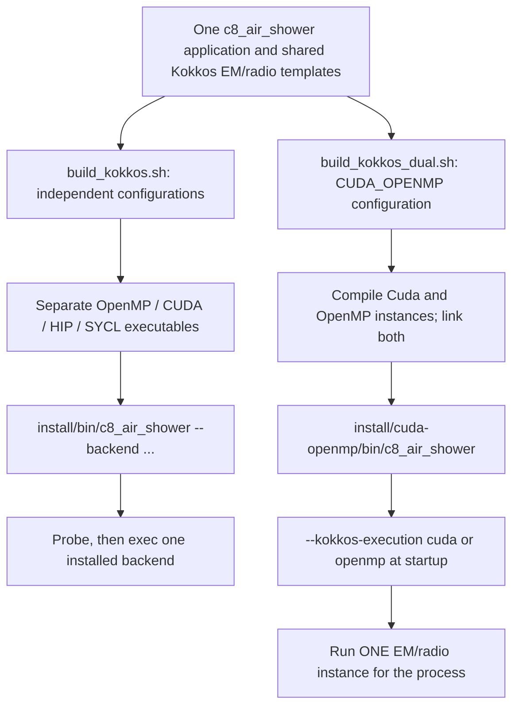
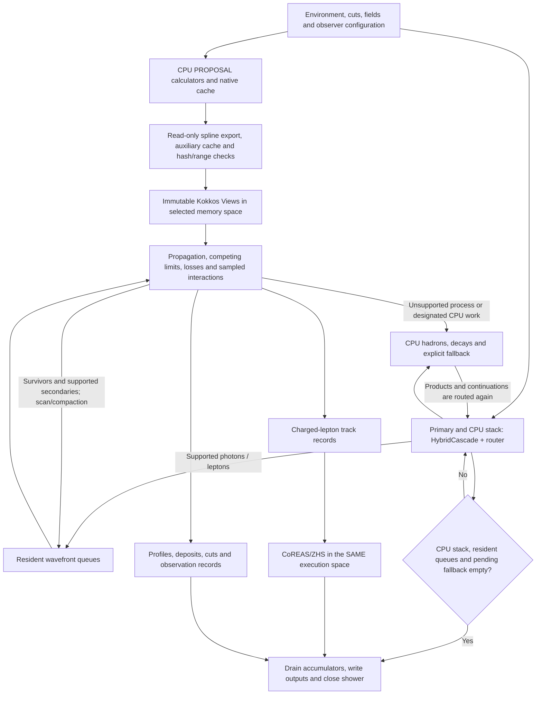

# CORSIKA 8 Kokkos beta5

[中文安装与使用手册](README_CN.md)

A standalone CORSIKA-based application for atmospheric particle showers and
CoREAS/ZHS radio signals. The same Kokkos electromagnetic-transport and radio
sources are compiled for multicore CPUs or supported GPUs. This is a research
branch, not an official CORSIKA release. Installation does not require an older
beta project, an existing build tree or manually prepared `.c8emrt` tables.

This guide starts with **Ubuntu 24.04 x86-64, Bash and an empty Conda environment**.
After the common setup, choose an independent backend or the new single-binary
experiment. OpenMP is the simplest CPU-only starting point; NVIDIA users can
proceed directly to section 8.2 for the combined executable. HIP/SYCL setup is
described separately and still needs target-hardware acceptance.

## 1. What the program does

- Kokkos transport of photons, electrons, positrons and supported muons,
  including propagation, losses, interactions, cuts, thinning and profiles.
- CoREAS/ZHS radio accumulation in the same execution backend as accelerated EM.
- Read-only export of PROPOSAL native splines, automatic auxiliary caches,
  double precision and version/medium/cut/energy-range/hash checks.
- Existing CPU hadronic models, decays and explicit unsupported-process
  fallbacks; a scalar PROPOSAL reference mode remains available.

The scientific build below uses SIBYLL-2.3d and separately licensed FLUKA.
Not every CORSIKA process runs on the GPU. One shower uses OpenMP **or** a GPU;
there is no combined OpenMP/GPU EM scheduling, MPI or multi-GPU particle stack.

## 2. Choose a build: portable installations or a single CUDA/OpenMP binary

### 2.1 Two deployment options, the same physics sources

| Need | Build helper | How to select execution |
|---|---|---|
| CPU-only server | `build_kokkos.sh openmp` | Launcher: `--backend openmp` |
| Portable CPU/GPU installations | `build_kokkos.sh openmp,cuda` (HIP/SYCL separately) | Launcher selects one installed executable |
| One executable containing CUDA **and** OpenMP | `build_kokkos_dual.sh` | Direct executable: `--kokkos-execution cuda\|openmp` |

Independent installations remain the production/deployment baseline. The new
single-executable option is an experiment for a machine with a working NVIDIA
device; it is not a universal CPU/NVIDIA/AMD/Intel executable.



Backend specialization happens at compile time. The launcher selects an
installed executable; it does not compile physics code at startup or schedule
individual particles. CPU and GPU variants may coexist on disk. Each independent
GPU binary uses a Kokkos Serial host backend, while the OpenMP binary requires no
GPU runtime. This is this project's deployment choice, not a universal Kokkos
restriction.

An **experimental single CUDA/OpenMP executable** is also available through
`tools/build_kokkos_dual.sh`. It selects one execution space at startup using
`--kokkos-execution cuda|openmp`; it does not run the two shower algorithms
concurrently. Unlike the independent OpenMP build, it currently requires a
working NVIDIA device/driver even in OpenMP mode. It installs separately under
`install/cuda-openmp` and is not selected by the normal launcher. Section 8.2
below provides the complete build/run steps after environment setup. See the
[dual-backend experiment](documentation/cuda_em_refactor/beta5_dual_cuda_openmp_experiment_CN.md)
for the detailed validation record and limitations.

### 2.2 Directory layout

```text
corsika-21cma-kokkos-beta5/
├── corsika8_kokkos_beta5/       source, recipes, examples, docs and tests
├── build/
│   ├── openmp/deps/            OpenMP build and Conan/CMake descriptors
│   ├── cuda/deps/              separate CUDA equivalents
│   ├── cuda-openmp/deps/       combined experiment's own dependency graph
│   └── ...                    HIP/SYCL or audit records
└── install/
    ├── bin/c8_air_shower       common Python launcher
    ├── openmp/                binaries, libraries, model data and manifest
    ├── cuda/                  GPU equivalents; HIP/SYCL added as needed
    └── cuda-openmp/           optional single-binary experiment, separate prefix
```

`deps` contains dependency locations and compiler settings, not another source
project or physics tables. Actual Conan packages live in the user cache.
Configured CMake trees contain absolute paths: do not copy their caches between
backends or machines. All variants use the same application source.

### 2.3 Algorithm: resident wavefront transport and online radio accumulation

The following is the **accelerated** path. Scalar `proposal/cpu` keeps the
original serial Cascade/PROPOSAL route. The arrows describe data ownership and
dependencies, not simultaneous CPU/GPU execution.



1. **Prepare once, reuse per process.** PROPOSAL remains the physics provider.
   Exported native splines, environment data and auxiliary distributions are
   placed in the selected execution space; a new shower resets event state
   through `beginShower()` while reusing compatible tables/workspaces.
2. **Advance a front, not only a final state.** Particle batches undergo
   propagation, geometry/observation checks, continuous losses, discrete
   interactions, scattering, cuts and thinning. Survivors and supported
   secondaries continue in resident queues; they do not return to the host
   individually after every reaction. Explicit fallback/checkpoints remain.
3. **One source, compile-time execution-space specialization.** Kokkos Views,
   kernels and scan/compaction run in OpenMP HostSpace or the chosen GPU memory
   space. History-keyed Philox draws do not depend on thread completion order;
   this does not promise identical shower trees across hardware.
4. **CPU work is not discarded.** Hadronic products, decays and unsupported
   accelerated processes are handled explicitly on the CPU and routed again.
   EM/radio acceleration is not multi-threaded hadronic model execution.
5. **Radio is accumulated during transport in batches**, rather than waiting
   for the full shower tree. Track precomputation and observer tiling amortize
   projection work; OpenMP uses host blocking/thread-local accumulation, while
   GPUs use device policies. Checked fixed-point accumulation preserves the
   existing determinism/overflow checks. Final waveform download/writing occurs
   after all pending work is drained. Window completeness still needs validation.

Where this logic lives:

| Responsibility | Source |
|---|---|
| Models, CLI and output lifecycle | [c8_air_shower.cpp](applications/c8_air_shower.cpp) |
| Session, native export and reuse | [KokkosEmRunSession.hpp](corsika/accelerator/em/detail/KokkosEmRunSession.hpp) |
| CPU / accelerated particle routing | [PhysicalAcceleratedEmRouter.hpp](corsika/accelerator/em/PhysicalAcceleratedEmRouter.hpp) |
| Host-side instance selection | [KokkosEmBackend.cpp](src/accelerator/em/kokkos/KokkosEmBackend.cpp) |
| Shared instantiated implementation | [KokkosBackendInstance.inl](src/accelerator/em/kokkos/KokkosBackendInstance.inl) |
| Photon/lepton transport and native tables | [Kokkos EM templates](corsika/accelerator/em/kokkos) |
| CoREAS/ZHS projection and accumulation | [KokkosRadioAccumulator.hpp](corsika/accelerator/radio/kokkos/KokkosRadioAccumulator.hpp) |

The dual build compiles `KokkosCudaBackendInstance.cpp` and
`KokkosOpenMPBackendInstance.cpp` against that same implementation, then links
both into one program. Selection/virtual dispatch is at host batch boundaries;
per-particle kernels remain statically specialized templates.

## 3. Prepare an empty development environment

You need a writable user directory, dependency-download access, and compatible
C++17/Fortran compilers. As a planning allowance, reserve 30–50 GiB for source,
dependencies and builds, with additional space for CUDA, other backends and
simulation output. This is not a measured minimum. Start with one build job.
On WSL, `free -h` shows the Linux allocation, not necessarily all physical RAM.

### 3.1 Install host tools

On Ubuntu, an administrator can install the following; this installs no GPU driver:

```bash
sudo apt-get update
sudo apt-get install -y build-essential gfortran git curl ca-certificates \
  pkg-config autoconf automake libtool bison flex patch unzip bzip2 xz-utils
```

Without sudo, ask the administrator for these tools or load the server's
compiler modules. This guide uses system GCC/G++/GFortran consistently; do not
also add a different Conda C++ toolchain. Other distributions require their own
package-manager instructions. Never replace a shared server's driver yourself.

### 3.2 Install Conda, if absent

Existing Miniconda/Anaconda users can skip this step. These Miniforge commands
are for Linux x86-64, and the installation prefix must not already exist.
See the [official Miniforge instructions](https://github.com/conda-forge/miniforge#install).

```bash
mkdir -p "$HOME/Downloads"
cd "$HOME/Downloads"
curl -fLO https://github.com/conda-forge/miniforge/releases/latest/download/Miniforge3-Linux-x86_64.sh
curl -fLO https://github.com/conda-forge/miniforge/releases/latest/download/Miniforge3-Linux-x86_64.sh.sha256
sha256sum -c Miniforge3-Linux-x86_64.sh.sha256
# Continue only after a successful checksum check:
bash Miniforge3-Linux-x86_64.sh -b -p "$HOME/miniforge3"
source "$HOME/miniforge3/etc/profile.d/conda.sh"
```

### 3.3 Create and verify the environment

These tool/particle-database versions have been used by the project. No
pre-existing `corsika_venv` is assumed:

```bash
conda create -n corsika_venv --override-channels -c conda-forge \
  python=3.11 pip cmake=3.31 ninja numpy=1.26.4 pyyaml lxml
conda activate corsika_venv
python -m pip install "conan==2.11.0" "particle==0.25.1" "hepunits==2.4.1"
export CC=/usr/bin/gcc
export CXX=/usr/bin/g++
export FC=/usr/bin/gfortran

python -c 'import particle, hepunits, numpy, yaml; print("Python dependencies OK")'
cmake --version
conan --version
gcc --version
g++ --version
gfortran --version
```

`particle` and `hepunits` generate particle-property code **during compilation**;
they are not optional plotting dependencies. Their versions affect the particle
database and should be recorded. For later Parquet analysis/plotting, optionally
install `pandas pyarrow scipy matplotlib`.

Do not overwrite an existing environment of the same name. Inspect it or use
a different name. In every new terminal, source the actual Conda installation's
`etc/profile.d/conda.sh` and activate `corsika_venv` before building or running.

## 4. Obtain complete source and configure Conan

The **beta5 source** is maintained on the `kokkos-beta5` branch of the
[private project repository](https://github.com/BossL668/corsika8-gpu-hybrid/tree/kokkos-beta5).
Obtain repository access and configure GitHub authentication before cloning.
The beta2 and beta4 branches remain separate; do not use the default branch
as a substitute for beta5.

```bash
mkdir -p "$HOME/corsika-21cma-kokkos-beta5"
cd "$HOME/corsika-21cma-kokkos-beta5"
git clone --branch kokkos-beta5 --single-branch --recurse-submodules \
  https://github.com/BossL668/corsika8-gpu-hybrid.git corsika8_kokkos_beta5
cd corsika8_kokkos_beta5
test -f CMakeLists.txt
test -f conanfile.py
test -f modules/data/CMakeLists.txt
test -f resources/GeoMag/IGRF14.COF
git submodule status --recursive
```

The model data and optional CONEX source are pinned upstream submodules, not
large files duplicated in the beta5 repository. Their absolute URLs also work
when cloning from GitHub. GitHub's automatic source ZIP does **not** include
submodule contents. If receiving an offline archive instead, ask for a complete
archive including both submodules, recipes, resources and examples. Local
build/install directories, generated caches and simulation datasets are not
part of the source repository.

Conan manages C++ dependencies; CMake configures the application. With the
previous environment and compiler selections still active, from the source directory:

```bash
conan profile detect
conan profile show -pr:h default -pr:b default
conan remote list
conan export third_party/conan/cubicinterpolation
conan export third_party/conan/proposal
conan export dependencies/kokkos
```

Inspect the profile: GCC major version must match `g++ --version`, C++17
(`gnu17` is acceptable), and `libstdc++11`. Detection is a starting point,
not a verified configuration. Do not force-overwrite an existing default
profile. Archive profiles and dependency lockfiles for production reproduction.
See the [Conan profile documentation](https://docs.conan.io/2/reference/commands/profile.html).

ConanCenter should be enabled; **only if no remote exists**, add it:

```bash
conan remote add conancenter https://center2.conan.io
```

`conan export` registers recipes, not compiled libraries. The build helper later
builds missing packages. Required references are `kokkos/4.7.03@c8gpu/stable`,
`proposal/7.6.2@c8gpu/stable` and `cubicinterpolation/0.1.5@c8gpu/stable`.
The latter two provide patched read-only spline exports. Do not mix vanilla
headers, patched libraries or old object files. Transitive dependencies also
matter for reproducing the full binary graph.

## 5. Prepare physics models

### Scientific configuration: SIBYLL and FLUKA

FLUKA has a separate license and is not distributed with this source or via
Conan. Obtain the authorized package appropriate to the system/Fortran compiler
and follow the [official installation guide](https://fluka.cern/documentation/installation).
Keep its runtime data, not just a copied static library. If installed in `~/fluka`:

```bash
export FLUPRO="$HOME/fluka"
test -r "$FLUPRO/libflukahp.a"
```

Fix installation/path problems before continuing with `WITH_FLUKA=ON`.
SIBYLL-2.3d source is included. By default, CMake downloads and builds pinned
Pythia 8.315 and TAUOLA 1.1.8 sources. **A fresh environment does not need an
existing `build/external` or another machine's model paths.** Initial builds
need ConanCenter, GitHub, Pythia's GitLab and CERN download access.

### Learning without a FLUKA license

For an installation exercise only, explicitly use `-DWITH_FLUKA=OFF` below.
The low-energy model then becomes UrQMD. It is not the SIBYLL+FLUKA configuration
and must not be pooled into that validation ensemble. Model replacement is not
merely a compilation or performance choice.

## 6. Build OpenMP first: no GPU required

In the source directory, with the environment active and FLUPRO checked:

```bash
C8_BUILD_JOBS=1 bash tools/build_kokkos.sh openmp -DWITH_FLUKA=ON
```

The helper performs:

```text
conan install --build=missing
    -> build/openmp/deps/conan_toolchain.cmake
    -> CMake Release configuration
    -> compile models, application and tests
    -> install/openmp plus the common install/bin/c8_air_shower launcher
```

Initial dependency downloads/builds can take much longer than running a shower.
`C8_BUILD_JOBS=1` limits compiler and Conan build concurrency, not simulation
threads. Increase to two or four only with sufficient memory; do not start with
`-j128`. The helper stops on errors. Read the first error, not just the final
failure message; an existing build directory does not imply installation success.

Return to the project container directory and check the installation:

```bash
cd ..
install/bin/c8_air_shower --list-backends
install/bin/c8_air_shower --backend openmp --check-backends
install/bin/c8_air_shower --backend openmp -- --help
```

Expect OpenMP `installed: true`, then probe `available: true`, `gpu=false` and
`openmp=true`. Listing reads metadata; a probe checks primitives, not full physics.

## 7. Run the first complete example

From the project container directory, use the three demonstration antennas
provided with the source; no private dataset is required:

```bash
mkdir -p "$HOME/CorsikaData"
install/bin/c8_air_shower --backend openmp --kokkos-num-threads 4 \
  -p 22 -E 10 -s 12345 -f "$HOME/CorsikaData/first_photon_openmp" \
  --antenna-file corsika8_kokkos_beta5/examples/beta5/antennas_minimal_nwu.txt
```

This runs one vertical 10 GeV photon shower, with Kokkos EM and both Kokkos
radio algorithms enabled by the launcher. **The final `-f` directory must not
already exist.** Create only its parent; use a new output name for a repeat.
Low-energy signals may be weak or absent at some observers. This example checks
installation, not GPU saturation or radio-distribution agreement.

Antenna rows contain `north_m west_m up_m`, with `#` comments allowed. The air
application places the third coordinate at `EarthRadius + up_m`: it is height
above the reference Earth radius, **not height above local ground**. The example
uses the default observation height, 2680.444195 m. Without valid antenna rows
and with `--ring 0`, there may be no radio observers; exit success alone does
not demonstrate that radio output was tested.

On first use, PROPOSAL may create its own cache before exporting native splines.
Auxiliary caches default to `~/.cache/corsika8/gpu-em-aux` or the XDG location.
PROPOSAL's own cache uses `corsika_data("PROPOSAL")`; its data directory needs
write access. `--gpu-aux-cache-dir` changes only auxiliary-cache placement.
No manual table preparation does not mean no interpolation/cache, nor automatic
support for arbitrary geometry or media.

Inspect `profile/`, `energyloss/`, `particles/`, `CoREAS/`, `ZHS/`, `gpu_em/`
and `simulation_timing/`, including their shower subdirectories. Check errors,
completion summaries and Parquet readability before launching larger campaigns.
Equal seeds do not guarantee bitwise-identical CPU/OpenMP/GPU shower trees;
process-level and ensemble acceptance are separate requirements.

## 8. Add NVIDIA CUDA

**Only execute this section where GPU use is permitted.** CPU-only users can stop
at the preceding section. A driver exposes the GPU; the Toolkit supplies `nvcc`
and development libraries. The CUDA version printed by `nvidia-smi` is not the
installed compiler version. Administrators manage drivers. WSL2 uses the Windows
NVIDIA driver; do not install a Linux display driver inside WSL.
See [NVIDIA's WSL guide](https://docs.nvidia.com/cuda/wsl-user-guide/index.html).

Skip Toolkit installation if a compatible one already exists. For an empty
development environment, CUDA 12.6.3 can be installed in Conda. This example
pairs with Ubuntu 24.04's GCC 13 family; check other combinations against the
[CUDA 12.6 compiler/install guide](https://docs.nvidia.com/cuda/archive/12.6.3/cuda-installation-guide-linux/index.html).

```bash
conda activate corsika_venv
conda install --override-channels -c nvidia/label/cuda-12.6.3 -c conda-forge cuda
nvcc --version
nvidia-smi
```

This installs developer tools, not a repaired system driver. The old runtime-only
`cudatoolkit` package is not a substitute for `nvcc`. With a system Toolkit, put
its `bin` on PATH; do not mix headers, compilers and libraries from different
Toolkit installations.

### 8.1 Independent CUDA executable (production baseline)

```bash
cd "$HOME/corsika-21cma-kokkos-beta5/corsika8_kokkos_beta5"
export CC=/usr/bin/gcc
export CXX=/usr/bin/g++
export FC=/usr/bin/gfortran
C8_BUILD_JOBS=1 bash tools/build_kokkos.sh cuda -DWITH_FLUKA=ON
```

The helper queries compute capability with `nvidia-smi` and selects a profile:

| Example target | Profile | CUDA architecture |
|---|---|---|
| Turing | `cuda-turing75` | 75 |
| A100 | `cuda-ampere80` | 80 |
| Ampere 8.6 | `cuda-ampere86` | 86 |
| RTX 4060 / Ada 8.9 | `cuda-ada89` | 89 |
| H100 | `cuda-hopper90` | 90 |

Unknown/mixed architectures are not guessed. A known target can be explicit:

```bash
C8_KOKKOS_PROFILE=cuda-ampere80 C8_BUILD_JOBS=1 \
  bash tools/build_kokkos.sh cuda -DWITH_FLUKA=ON
```

This bypasses architecture discovery, not driver validation.
`CORSIKA_ENABLE_CUDA=ON` is not a beta5 switch; select Kokkos CUDA instead.
`bash tools/build_kokkos.sh openmp,cuda -DWITH_FLUKA=ON` builds both sequentially.

After installation, from the project container directory:

```bash
cd ..
install/bin/c8_air_shower --backend cuda --check-backends
install/bin/c8_air_shower --backend cuda \
  -p 22 -E 10 -s 12345 -f "$HOME/CorsikaData/first_photon_cuda" \
  --antenna-file corsika8_kokkos_beta5/examples/beta5/antennas_minimal_nwu.txt
```

Both commands access the GPU. Do not request multiple Kokkos host threads in
GPU mode. The default memory budget is a ceiling of 70% of available device
memory at initialization, not a requirement to fill it with a small shower.

### 8.2 New option: build CUDA and OpenMP into one executable

Complete sections 3–5 and the CUDA Toolkit setup above first. You do **not**
need to build the independent OpenMP/CUDA applications before this experiment.
From the source directory, with the same environment and licensed FLUPRO:

```bash
cd "$HOME/corsika-21cma-kokkos-beta5/corsika8_kokkos_beta5"
conda activate corsika_venv
test -f tools/build_kokkos_dual.sh
test -r "$FLUPRO/libflukahp.a"
nvcc --version
nvidia-smi
C8_BUILD_JOBS=1 bash tools/build_kokkos_dual.sh -DWITH_FLUKA=ON
```

If the script is absent, obtain a source revision containing the dual-backend
experiment. Do not substitute `build_kokkos.sh openmp,cuda`: that builds **two**
independent executables. The dual helper installs its own dependency graph,
configures `CORSIKA_KOKKOS_BACKEND=CUDA_OPENMP`, compiles both EM/radio instances,
then installs to `../install/cuda-openmp`; existing installs are not overwritten.

**Target architecture is explicit for this helper.** Unlike `build_kokkos.sh
cuda`, it does not query the GPU to select an architecture: the default is
`dependencies/kokkos/profiles/cuda-openmp-ada89` (RTX 40 / Ada 8.9).
For another NVIDIA target, create a profile such as this A100 example, saved as
`~/conan-profiles/cuda-openmp-ampere80`:

```ini
include(default)

[options]
&:with_kokkos=True
&:kokkos_backend=cuda_openmp
&:kokkos_architecture=AMPERE80
```

Check its compiler/ABI against the environment and use the **dual-specific**
variable with an absolute path:

```bash
conan profile show -pr:h "$HOME/conan-profiles/cuda-openmp-ampere80" -pr:b default
C8_KOKKOS_DUAL_PROFILE="$HOME/conan-profiles/cuda-openmp-ampere80" \
  C8_BUILD_JOBS=1 bash tools/build_kokkos_dual.sh -DWITH_FLUKA=ON
```

Use the Ada command **or** the matching custom-profile command, not both in
the same existing build cache. A new machine needs a fresh build tree.
`C8_KOKKOS_PROFILE` controls the independent helper, not this helper.

After a successful build, these commands use the **same binary**, from the
project container directory. No private antenna file is needed:

```bash
cd ..
export CORSIKA_DATA="$PWD/install/cuda-openmp/share/corsika/data"
install/cuda-openmp/bin/kokkos_backend_probe --backend cuda --threads 1
install/cuda-openmp/bin/kokkos_backend_probe --backend openmp --threads 4
mkdir -p "$HOME/CorsikaData"

install/cuda-openmp/bin/c8_air_shower \
  --em-backend kokkos --radio-backend kokkos --kokkos-execution cuda \
  -p 22 -E 10 -s 12345 -f "$HOME/CorsikaData/dual_photon_cuda" \
  --antenna-file corsika8_kokkos_beta5/examples/beta5/antennas_minimal_nwu.txt

install/cuda-openmp/bin/c8_air_shower \
  --em-backend kokkos --radio-backend kokkos --kokkos-execution openmp \
  --kokkos-num-threads 4 \
  -p 22 -E 10 -s 12345 -f "$HOME/CorsikaData/dual_photon_openmp" \
  --antenna-file corsika8_kokkos_beta5/examples/beta5/antennas_minimal_nwu.txt
```

The direct application retains scalar defaults, so keep both `--em-backend
kokkos` and `--radio-backend kokkos`. Native PROPOSAL is already the only
accelerated physics source. Omitting `--kokkos-execution` in the combined build
selects CUDA **only when accelerated mode is requested**. Do not pass the
launcher's `--backend` to the application; the separate **probe** has its own
`--backend` option, as shown above.

- The combined program links/initializes CUDA even for OpenMP execution. A
  working visible NVIDIA device is required; hiding all GPUs is not a CPU-only
  deployment solution. Use `install/openmp` for that use case.
- A process chooses one execution space for EM **and** radio. It does not switch
  between showers in `-N N` or run OpenMP EM together with GPU radio. CUDA mode
  limits the compiled OpenMP host runtime to one thread; do not request 16.
- The common launcher does not register `cuda-openmp`; call this executable
  directly. HIP/SYCL remain independent target-specific builds, not members of
  this experimental executable.
- Release install, primitive/runtime gates and short `-N 2` photon/proton
  regressions passed locally against the corresponding independent backends.
  This is not a 500-event acceptance or a demonstrated speedup of the combined
  executable. See the [test record](documentation/cuda_em_refactor/beta5_dual_cuda_openmp_experiment_CN.md).

## 9. Minimal commands and important parameters

From the project container directory:

```bash
install/bin/c8_air_shower --backend cuda -p 2212 -E 1000 \
  -f "$HOME/CorsikaData/proton_1TeV_cuda" \
  --antenna-file corsika8_kokkos_beta5/examples/beta5/antennas_minimal_nwu.txt
```

Replace `--backend cuda` with `--backend openmp --kokkos-num-threads 16` for
multicore CPU execution, keeping the physics parameters. For scalar reference:

```bash
install/bin/c8_air_shower --backend openmp \
  --em-backend proposal --radio-backend cpu \
  -p 2212 -E 1000 -s 12345 -f "$HOME/CorsikaData/proton_1TeV_scalar" \
  --antenna-file corsika8_kokkos_beta5/examples/beta5/antennas_minimal_nwu.txt
```

Here the OpenMP installation supplies the executable, but `proposal/cpu` does
not run accelerated EM. Direct `install/<backend>/bin/c8_air_shower` executables
also retain scalar defaults; only the launcher adds Kokkos EM/radio defaults.
The only accelerated physics source is `proposal-native`; no selector, medium
YAML or `.c8emrt` file is needed for this application.

| Parameter | Meaning / default |
|---|---|
| `--backend openmp/cuda/hip/sycl` | Launcher only: installed executable to select; omitted means `auto` |
| `--kokkos-execution cuda\|openmp` | Combined application: select an in-binary instance; implicit CUDA in accelerated mode |
| `-p`, `-E` | PDG code and total energy in GeV; photon 22, electron 11, proton 2212 |
| `-z`, `-a` | Zenith and azimuth in degrees; 0 / 0 |
| `-s`, `-N` | Seed / sequential showers in one process; automatic seed / 1 |
| `--emthin`, `--max-weight` | `1e-6` / `0` (derive maximum weight automatically) |
| `--emcut` | Kinetic-energy cut, 0.0005 GeV |
| `--geomagnetic-model`, `--geomagnetic-year` | IGRF14 / 2027 |
| `--kokkos-num-threads N` | OpenMP threads; GPU rejects values above 1 |
| `--kokkos-device N` | One GPU index, not multi-GPU execution |
| `--gpu-min-batch` | 4096, not a shower count |
| `--gpu-memory-fraction` | 0.70 budget ceiling, not a fill target |
| `--gpu-resident-batch-limit` | 0 for automatic capacity; explicit for replay/diagnosis |
| `--radio-sampling-rate-ghz` | 1 GHz |
| `--radio-window-duration-ns`, `--radio-pretrigger-ns` | 400 ns / 10 ns |
| `--kokkos-tuning-cache`, `--kokkos-require-tuning` | Optional tuning record; require mode fails on mismatch/absence |

`auto` probes installed GPUs, then announces OpenMP if none is usable; multiple
usable GPU backends require explicit selection. It does not guarantee the
fastest device. The launcher's explicit independent OpenMP never probes a GPU;
this guarantee does not apply to the combined executable. Explicit selection failures
and shower errors never trigger backend substitution. `--list-backends` is
metadata-only; `--check-backends` and `--dry-run` run probes.

For campaigns, fix seeds, observers, models, energy, direction, cuts and windows.
Do not assume the default 400 ns window contains high-energy/inclined pulses:
plot a pilot, widen the window and check edge power and overlapping samples
before freezing settings. At low energies the automatic weight limit can be
below one, so nonzero thinning need not actually thin the shower.

Compiler jobs (`C8_BUILD_JOBS`), simulation threads (`--kokkos-num-threads`) and
sequential shower count (`-N`) are different. Bound processes times threads by
allocated resources, with memory headroom. Test `-N 1`, `-N 2` and longer RSS
trends before large batches; a primitive probe does not prove long-run stability.

## 10. HIP/SYCL on matching hardware

OpenMP/CUDA have compiled/tested configurations. HIP/SYCL still require target
compilation, process oracles, shower and radio acceptance. An AMD/Intel CPU
alone is not evidence of a supported HIP/SYCL GPU.

For HIP, install a compatible ROCm development stack/driver using
[AMD's installation guide](https://rocm.docs.amd.com/projects/install-on-linux/en/latest/index.html)
and verify `hipcc --version`. The `hip-vega90a` profile is an MI200/VEGA90A
example, not a generic Radeon profile. Match its architecture and Conan Clang
version to the actual toolkit, then build from the source directory:

```bash
C8_KOKKOS_PROFILE=hip-vega90a bash tools/build_kokkos.sh hip -DWITH_FLUKA=ON
```

For SYCL, install DPC++ plus the target runtime/driver using the
[oneAPI installation guide](https://www.intel.com/content/www/us/en/docs/oneapi/installation-guide-linux/2025-0/overview.html),
initialize that toolchain and check `icpx --version` and `sycl-ls`.
`sycl-intel-pvc` is a PVC/oneAPI example, not a universal Intel integrated-GPU profile:

```bash
C8_KOKKOS_PROFILE=sycl-intel-pvc bash tools/build_kokkos.sh sycl -DWITH_FLUKA=ON
```

Custom profiles may be absolute paths in `C8_KOKKOS_PROFILE`.
`C8_KOKKOS_OPENMP_PROFILE` overrides the CPU profile. Each helper invocation
accepts at most one GPU toolchain, optionally with OpenMP; installations from
separate invocations can coexist. Match compiler versions, ABIs and dependencies
rather than disabling gates or enabling fast-math. Rebuild source on the target
machine; a NVIDIA binary does not run on AMD hardware.

## 11. Tests, updates and troubleshooting

From the project container directory:

```bash
ctest --test-dir build/openmp -N
OMP_NUM_THREADS=4 ctest --test-dir build/openmp \
  -R 'testKokkos|Beta5' --output-on-failure
# Only where GPU use is permitted:
ctest --test-dir build/cuda -R 'testKokkos|Beta5' --output-on-failure
```

Tests may build physics caches and take time. Basic checks are not production
acceptance for every medium/energy. Seed equivalence also depends on RNG domains,
physics revision and capacity. Record executable SHA-256, settings, dependencies
and `gpu_em` metadata; the name "beta5" alone does not identify an exact binary.

| Symptom | Check/action |
|---|---|
| `conda` not found | Source the actual installation's `etc/profile.d/conda.sh` |
| Missing `particle`/`hepunits` | Activate the correct Python and install section 3.3 dependencies |
| `@c8gpu/stable` not found | Export all three recipes into the active Conan cache |
| Compiler/profile/ABI mismatch | Check CC/CXX/FC and profiles; reconfigure separately after toolchain changes |
| FLUKA missing/link error | Check licensed installation, FLUPRO and Fortran compatibility, not model substitution |
| Download failure | Inspect the dependency URL/network; offline archives need checksums, not disabled validation |
| Compiler killed/WSL restart | Use `C8_BUILD_JOBS=1`; check `free -h` and disk space |
| `nvcc` missing | Install development tools, not just a driver; check PATH |
| NVML driver/library mismatch | Administrator must reconcile driver versions; explicit architecture is not a repair |
| Manifest present, probe fails | Check environment, device permissions and shared libraries; do not combine arbitrary libraries |
| Dual OpenMP fails with GPUs hidden | Expected current limitation; use the independent OpenMP executable |
| `--backend` rejected by application | Use it on the launcher/probe; use `--kokkos-execution` on the combined application |
| Output directory exists | Choose another `-f`; preserve existing scientific data |
| Empty/clipped radio signal | Check observers, coordinate height and time window; weak low-energy signals are also possible |
| VRAM below 70% | Budget ceiling, dependent on workload/workspace and available memory |

Run the relevant build helper after source updates to rebuild and install:
`build_kokkos.sh <backend>` for independent installs, `build_kokkos_dual.sh` for
the combined experiment. Do not reconfigure one variant's cache as another.
Editing README does not update binaries. Do not move old CMake caches to a new
machine. Reusing prebuilt Pythia/TAUOLA is an advanced same-version/ABI option,
not a fresh-install prerequisite.

Implementation history and audits are separate from this guide:
[source boundaries and validation](documentation/BETA5_EXTRACTION_CN.md),
[launcher audit](documentation/BETA5_PORTABLE_ENTRY_AUDIT_CN.md).
Core license: [LICENSE](LICENSE); model/dependency licenses remain separate.
Do not commit FLUKA, build products, caches or private simulation data.
