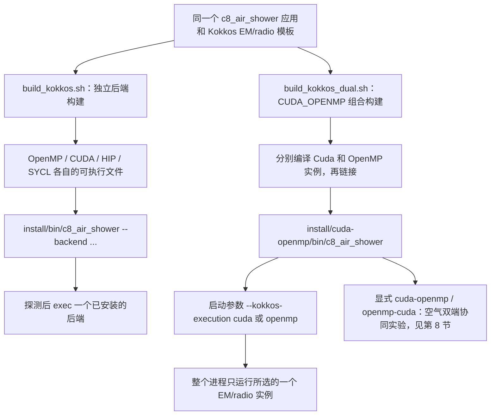
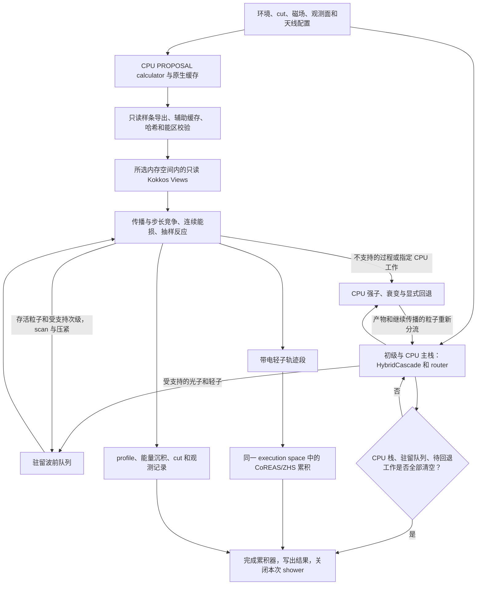

# CORSIKA8-kokkos：安装与使用

[English](README.md)

**公开仓库：[CORSIKA8-kokkos](https://github.com/BossL668/CORSIKA8-kokkos)，请使用同名的
[`CORSIKA8-kokkos` 分支](https://github.com/BossL668/CORSIKA8-kokkos/tree/CORSIKA8-kokkos)。**
该分支原名为 `kokkos-beta5`。GitHub 仓库默认首页目前仍是旧 `cuda-em-refactor` 分支，
其中的构建说明不能代替本分支教程。

本程序模拟大气粒子级联及 CoREAS/ZHS 射电信号，通过 Kokkos 让同一套电磁输运与射电算法面向多核 CPU 或不同 GPU 编译。这是基于 CORSIKA 8 的独立软件分支，不是官方发布版；安装不需要旧 beta 项目、已有构建目录或手工生成的 `.c8emrt` 表。

最近已发布更新（2026-10-08）：

- 空气应用的电磁选择器为 `--em-backend proposal`、`kokkos-proposal`、`kokkos-egs4`；物理后端与执行硬件分别选择。
- 统一 `--device`：一个 GPU 编号走单卡，多个编号由原生 C++ 协调器共同推进同一个 shower。
- 可选 EGS4 C++/Kokkos 后端已按 CORSIKA 模块结构整理；AIR-NTP 表随项目提供并在构建时内嵌，运行时不依赖 C7 安装或表路径参数。
- 主应用通过封装的 bindings 和 session 装配、复用后端；PROPOSAL 和 EGS4 共用 `c8_air_shower` 入口。

下文的缓存求逆开关仍是**本地开发候选，尚未包含在已发布分支中**。
极小批次 CPU 回退及长尾重分配也仍是实验，不属于生产默认行为；不能把模块微基准加速等同于整例 shower 加速。

空气程序更新（2026-09-23）：`c8_air_shower` 默认采用原 C8 的正向闭端点纵向计数 `--profile-crossings original-c8`。可显式选择 `forward`（仅正向半开区间）或 `both`（双向半开区间）；CUDA、OpenMP、标量 writer 共用同一规则。**不是禁止向上输运，不影响射电轨迹、cut 或能量沉积。** 旧二进制需重新 build/install，旧双向计数样本勿混用。详见 [计数选项与最简运行](documentation/profile_crossings_CN.md)。

物理更新（2026-09-20）：补全标量 CPU 与共享 Kokkos 路径中能量 cut 处的正电子停止双光子湮灭，正确保留粒子权重及介质电子静质量账项。需要重新构建；不要将此前缺少此过程的 C8 样本与新版本混合平均。实现范围与验证见 [停止湮灭说明](documentation/stopped_positron_annihilation_20260920_CN.md)。

本文面向初学者，以 **Ubuntu 24.04 x86-64、Bash、空 Conda 环境**为例：完成公共环境准备后，选择独立后端或新增单二进制实验。无 GPU 从独立 OpenMP 开始；已有可用 NVIDIA 设备也可直接按第 7.2 节构建组合程序。HIP/SYCL 工具链单独说明，不能将配置支持等同于硬件验收通过。

### 阅读顺序

1. [功能与架构](#1-功能与构建逻辑)。
2. [空环境](#2-从空环境开始)、[源码和 Conan](#3-获取源码配置-conan)、[物理模型](#4-准备物理模型)：所有构建共用。
3. [OpenMP 构建](#5-构建-openmp不需要-gpu)与[首例运行](#6-首次完整运行与输出)，或[NVIDIA / 组合构建](#7-增加-nvidia-cuda-后端)。
4. [运行参数](#8-最简命令参数与正式模拟)、[HIP/SYCL](#9-hip--sycl目标机器上的进阶构建)、[测试与排障](#10-验证维护与常见错误)。
5. 可选：[EGS4 电磁后端](#83-可选-ckokkos-egs4-电磁后端)、[山体从准备到首次运行](documentation/terrain_getting_started_CN.md)、[文档导航与验收状态](documentation/USER_GUIDE_INDEX.md)。

代码块不带 shell 提示符，可以复制。只选择需要的一条后端构建路线，不要把所有路线混在一个缓存中执行。示例路径不依赖开发者本机或旧安装。带日期的研发记录仅描述对应历史版本，不作为当前安装步骤。

## 1. 功能与构建逻辑

- Kokkos 处理光子、电子、正电子及当前支持的 muon 输运，包含传播、能损、相互作用、cut、thinning、profile 和 CoREAS/ZHS 累积。
- PROPOSAL 原生样条经只读接口导出到 Kokkos 数据结构，保留版本、介质、cut、能区和哈希检查；不要求用户先运行完整制表工具。
- 可选基于 C7 EGS4 算法的 C++/Kokkos 重写，处理电子、正电子和光子；强子与 μ 子仍复用 C8 现有模块，不是包装调用 C7 Fortran 程序。
- 强子模型、衰变及不支持的末态仍走 CPU，保留单核标量 PROPOSAL 对照。本文科研配置采用 SIBYLL-2.3d + 用户合法安装的 FLUKA。
- 默认单端模式一次 shower 选择 OpenMP **或** GPU；组合构建另有显式空气双端协同实验（第 8 节）。CUDA/组合构建支持原生 C++ 同 shower 多卡分发，每卡一个进程，不依赖 Python 协调器；这不等于强子模型内部已多线程化，也不是所有物理过程都已 GPU 化。

### 1.1 两种构建方式，共用同一套物理源码

| 使用场景 | 构建脚本 | 运行时如何选择 |
|---|---|---|
| 无 GPU 服务器 | `build_kokkos.sh openmp` | 统一入口 `--backend openmp` |
| 便于跨 CPU/GPU 机器部署 | `build_kokkos.sh openmp,cuda`；HIP/SYCL 分别构建 | 统一入口选择一个已安装的独立程序 |
| 希望同一个程序包含 CUDA **和** OpenMP | `build_kokkos_dual.sh` | 直接调用组合程序，用 `--kokkos-execution cuda\|openmp` 选择实例 |

独立后端仍是当前生产和跨设备部署基准。新增单二进制适合在有可用 NVIDIA 设备的机器上试用，**不是一个文件通吃无 GPU、NVIDIA、AMD、Intel 的通用二进制**。



默认部署是“同一源码、独立二进制、统一入口”：编译时生成后端实例，运行时选择已经安装的程序，不临时编译。OpenMP 与 GPU 可同时安装，但独立 GPU 程序使用 Kokkos Serial host，独立 OpenMP 程序不需要 GPU runtime。这是本项目的组织方式，不是声称 Kokkos 只能这样使用。

实验性的 **CUDA/OpenMP 单二进制**即上图右侧路径：它目前即使选择 OpenMP 也需要可用的 NVIDIA 设备和驱动，不能替代无 GPU 服务器上的独立 OpenMP 版。安装位置为 `install/cuda-openmp`，不会覆盖正常启动器和独立后端。从空环境准备好后，按第 7.2 节构建和运行；完整测试边界参见[实验说明与验收](documentation/cuda_em_refactor/beta5_dual_cuda_openmp_experiment_CN.md)。

### 1.2 目录结构

示例沿用历史 `beta5` 本地目录名，以保持已有 build/install 路径一致；这不是
GitHub 仓库名或分支名，已有工作目录不需要随仓库改名而搬迁。

```text
corsika-21cma-kokkos-beta5/
├── corsika8_kokkos_beta5/  源码、依赖配方、示例、文档、测试
├── build/                编译产物，不是第二份项目
│   ├── openmp/deps/       OpenMP 的 Conan/CMake 工具链
│   ├── cuda/deps/         CUDA 的独立工具链
│   ├── cuda-openmp/deps/  组合实验自己的 Conan/CMake 工具链
│   └── ...               HIP/SYCL 或审计记录
└── install/
    ├── bin/c8_air_shower  统一启动器
    ├── openmp/           CPU 二进制、库、模型数据、安装清单
    ├── cuda/             GPU 对应产物；HIP/SYCL 按需增加
    └── cuda-openmp/      可选单二进制实验的独立安装位置
```

`deps` 描述依赖位置与编译选项，实际 Conan 包在用户缓存；它不是物理插值表。配置好的 `CMakeCache.txt` 含绝对路径，不能跨后端或跨机器复制使用。所有后端使用同一个应用源码文件。

### 1.3 算法逻辑：驻留波前输运与分批在线射电累积

下图描述 **Kokkos PROPOSAL 路径**；`proposal/cpu` 标量模式仍走原来的串行 Cascade/PROPOSAL。箭头表示数据流和依赖，**不表示 CPU 多核与 GPU 同时演化一个 shower**。可选 EGS4 使用同一主应用和公共运行配置，见第 8.3 节。



1. **进程初始化时准备，后续事件复用。** PROPOSAL 仍负责物理数据；原生样条、环境快照及辅助分布进入所选后端的内存空间。新 shower 通过 `beginShower()` 重置事件状态，复用兼容的表和工作区，不重新手工制表。
2. **并行的是传播过程，不只是反应末态。** 每批粒子执行传播、几何/观测边界与步长竞争、连续能损、离散反应、散射、cut 和 thinning；存活粒子与受支持次级继续留在驻留队列。不是每次反应都逐粒子送回 CPU，但仍存在显式 fallback 和调度检查点。
3. **一份源码，在编译时指定执行空间。** Kokkos View、kernel、scan/压紧分别在 OpenMP HostSpace 或 GPU 内存空间工作。Philox 按 history 等键取数，不按线程完成先后取数；这不意味着不同硬件一定产生逐位相同的 shower tree。
4. **回退不是丢弃物理。** 强子产物、衰变、不受加速路径支持的过程交回 CPU 处理，再把产物按能力重新分流。EM/radio 多核加速不等于强子模型已经多线程化。
5. **射电随输运分批累积，不等待整棵 shower tree 完成。** 轨迹预计算与天线分块复用计算；GPU 用设备执行策略，OpenMP 用主机分块及线程私有累积。带溢出检查的定点累积保留可重复性约束，清空待处理工作后再汇总/写出波形。时间窗是否完整仍需单独检查。

源码对应关系：

| 职责 | 位置 |
|---|---|
| 参数、模型装配与输出生命周期 | [c8_air_shower.cpp](applications/c8_air_shower.cpp) |
| 封装的空气应用适配层与分组 bindings | [KokkosAirShowerApplication.hpp](applications/detail/air_shower_kokkos/KokkosAirShowerApplication.hpp)、[KokkosAirShowerBindings.hpp](applications/detail/air_shower_kokkos/KokkosAirShowerBindings.hpp) |
| 应用会话生命周期 | [KokkosRunSession.hpp](applications/detail/air_shower_kokkos/KokkosRunSession.hpp) |
| session、原生表准备与跨 shower 复用 | [KokkosEmRunSession.hpp](corsika/accelerator/em/detail/KokkosEmRunSession.hpp) |
| CPU 与加速粒子分流 | [PhysicalAcceleratedEmRouter.hpp](corsika/accelerator/em/PhysicalAcceleratedEmRouter.hpp) |
| 主机侧选择/转发到实例 | [KokkosEmBackend.cpp](src/accelerator/em/kokkos/KokkosEmBackend.cpp) |
| 被各执行空间实例化的共享实现 | [KokkosBackendInstance.inl](src/accelerator/em/kokkos/KokkosBackendInstance.inl) |
| 光子、轻子、驻留队列与原生表模板 | [Kokkos EM 模块](corsika/accelerator/em/kokkos) |
| CoREAS/ZHS 投影和累积 | [KokkosRadioAccumulator.hpp](corsika/accelerator/radio/kokkos/KokkosRadioAccumulator.hpp) |
| 可选 EGS4 模块公共接口、实现与编译源文件 | [EGS4.hpp](corsika/modules/EGS4.hpp)、[API](corsika/modules/egs4/)、[实现](corsika/detail/modules/egs4/)、[编译源文件](src/modules/egs4/) |
| 原生同 shower 多卡协调 | [air_shower_multigpu](applications/detail/air_shower_multigpu/) |

组合版的 `KokkosCudaBackendInstance.cpp` 和 `KokkosOpenMPBackendInstance.cpp` 分别编译同一实现，再链接到同一程序。实例选择/虚函数转发只在主机批次边界发生，逐粒子 kernel 仍由模板静态实例化。

## 2. 从空环境开始

需要可写的用户目录、联网下载依赖的条件和兼容的 C++17/Fortran 编译器。建议为源码、缓存及构建预留 30–50 GiB 空间，这是规划建议而非严格最低值；CUDA、多后端及模拟数据另需空间。首次编译使用 1 个任务，确认内存余量后再增加。WSL 用 `free -h` 检查 Linux 的实际可用内存，不要直接按电脑物理内存估算。

### 2.1 系统开发工具

以下只安装主机开发工具，不安装 GPU 驱动：

```bash
sudo apt-get update
sudo apt-get install -y build-essential gfortran git curl ca-certificates \
  pkg-config autoconf automake libtool bison flex patch unzip bzip2 xz-utils
```

无 `sudo` 请管理员提供这些工具或加载服务器已有编译器模块。不要自行替换共享服务器驱动。教程使用系统 GCC/G++/GFortran，不再混装另一套 Conda C++ 编译器；其他 Linux 发行版使用对应包管理器。

### 2.2 安装 Conda（已有则跳过）

下面用 Miniforge 提供 `conda`。命令仅适用 Linux x86-64，目标安装目录必须不存在；已有 Miniconda/Anaconda 用户直接使用自己的安装。[Miniforge 官方说明](https://github.com/conda-forge/miniforge#install)

```bash
mkdir -p "$HOME/Downloads"
cd "$HOME/Downloads"
curl -fLO https://github.com/conda-forge/miniforge/releases/latest/download/Miniforge3-Linux-x86_64.sh
curl -fLO https://github.com/conda-forge/miniforge/releases/latest/download/Miniforge3-Linux-x86_64.sh.sha256
sha256sum -c Miniforge3-Linux-x86_64.sh.sha256
# 只有校验成功后才执行：
bash Miniforge3-Linux-x86_64.sh -b -p "$HOME/miniforge3"
source "$HOME/miniforge3/etc/profile.d/conda.sh"
```

### 2.3 新建环境与检查

以下选择项目已使用的工具/粒子数据库版本，不要求已有 `corsika_venv`：

```bash
conda create -n corsika_venv --override-channels -c conda-forge \
  python=3.11 pip cmake=3.31 ninja numpy=1.26.4 pyyaml lxml
conda activate corsika_venv
python -m pip install "conan==2.11.0" "particle==0.25.1" "hepunits==2.4.1"
export CC=/usr/bin/gcc
export CXX=/usr/bin/g++
export FC=/usr/bin/gfortran

python -c 'import particle, hepunits, numpy, yaml; print("Python dependencies OK")'
cmake --version
conan --version
gcc --version
g++ --version
gfortran --version
```

`particle` 和 `hepunits` 用于**构建时生成粒子属性代码**，不是可省略的绘图包。粒子数据库版本会影响物理常数，需要记录。分析结果时可额外安装 `pandas pyarrow scipy matplotlib`，不必先运行分析程序才能编译。

已有同名环境不要覆盖，先检查或换环境名。每次新终端都需 `source` 实际 Conda 的 `etc/profile.d/conda.sh`，然后 `conda activate corsika_venv`。

## 3. 获取源码，配置 Conan

源码位于[公开仓库的 `CORSIKA8-kokkos` 分支](https://github.com/BossL668/CORSIKA8-kokkos/tree/CORSIKA8-kokkos)。
HTTPS 只读克隆无需 GitHub 认证；旧版本仍保留在其他分支，不要把默认分支当作当前分支。
仓库公开不改变 FLUKA 等第三方模型各自的许可要求。

如使用 SSH，配置 GitHub SSH key 后将 clone 地址换为
`git@github.com:BossL668/CORSIKA8-kokkos.git`。推送修改才需要认证及写权限；
不要把 token 写入 URL、脚本或文档。

```bash
mkdir -p "$HOME/corsika-21cma-kokkos-beta5"
cd "$HOME/corsika-21cma-kokkos-beta5"
git clone --branch CORSIKA8-kokkos --single-branch --recurse-submodules \
  https://github.com/BossL668/CORSIKA8-kokkos.git corsika8_kokkos_beta5
cd corsika8_kokkos_beta5
test -f CMakeLists.txt
test -f conanfile.py
test -f modules/data/CMakeLists.txt
test -f resources/GeoMag/IGRF14.COF
git submodule status --recursive
```

已有 clone 先检查 `git status` 和 `git branch --show-current`，不要覆盖。
子模块缺失可执行 `git submodule update --init --recursive`；状态行开头 `-` 表示未初始化，`+` 表示与当前源码锁定的子模块版本不一致。

模型数据和可选 CONEX 源码以锁定版本的上游子模块提供，不将大文件重复放进 beta5 仓库；子模块使用绝对地址，可从 GitHub 正常定位。GitHub 自动生成的源码 ZIP **不包含子模块内容**。若采用离线归档，应向维护者索取包含两个子模块、依赖配方、资源及示例的完整包。源码仓库不包含本机的 build/install、自动生成的缓存或模拟数据集。

Conan 负责 C++ 依赖，CMake 负责装配应用。保持第 2 节环境和编译器设置，在源码目录执行：

```bash
conan profile detect
conan profile show -pr:h default -pr:b default
conan remote list
conan export third_party/conan/cubicinterpolation
conan export third_party/conan/proposal
conan export dependencies/kokkos
```

核对 profile：`compiler=gcc`、主版本号与 `g++ --version` 一致，C++ 标准 17（`gnu17` 也可）、`compiler.libcxx=libstdc++11`。`detect` 只是候选配置，需要核对；已有 `default` 不要随意 `--force` 覆盖。生产复现需保存 profile 和依赖锁文件。[Conan profile 文档](https://docs.conan.io/2/reference/commands/profile.html)

默认 ConanCenter 应已启用；**只有远程列表为空时**才添加：

```bash
conan remote add conancenter https://center2.conan.io
```

三个 `export` 注册配方，依赖编译由下一节自动完成。项目使用 `kokkos/4.7.03@c8gpu/stable`、`proposal/7.6.2@c8gpu/stable`、`cubicinterpolation/0.1.5@c8gpu/stable`；后两者带只读样条导出补丁，不能与无补丁库/旧头文件混用。完整二进制图仍受间接依赖版本影响。

## 4. 准备物理模型

### 4.1 SIBYLL + FLUKA 科研配置

FLUKA 有独立许可，不通过源码或 Conan 分发。先按 [FLUKA 官方安装说明](https://fluka.cern/documentation/installation)取得匹配系统/Fortran 编译器的授权包并完整安装，保留其运行数据，不是只复制一个库。假设安装到 `~/fluka`：

```bash
export FLUPRO="$HOME/fluka"
test -r "$FLUPRO/libflukahp.a"
```

检查失败先修正安装或路径。高能 SIBYLL-2.3d 源码已在项目内；Pythia 8.315 和 TAUOLA 1.1.8 默认由 CMake 下载固定来源并编译。**空环境不用先准备 `build/external`，不要复制旧机器的 Pythia/TAUOLA 绝对路径。** 首次需访问 ConanCenter、GitHub、Pythia GitLab 和 CERN 下载站点。

### 4.2 暂无 FLUKA 许可

仅为学习安装，可以在下节显式改用 `-DWITH_FLUKA=OFF`，低能模型变为 UrQMD。它不等价于 SIBYLL+FLUKA，不能混入后者的科研验收样本。不要将更换物理模型视为单纯的编译/性能调整。

## 5. 构建 OpenMP（不需要 GPU）

当前在源码目录，已激活环境、检查 `FLUPRO`：

```bash
C8_BUILD_JOBS=1 bash tools/build_kokkos.sh openmp -DWITH_FLUKA=ON
```

脚本顺序执行：

```text
conan install --build=missing
    → build/openmp/deps/conan_toolchain.cmake
    → CMake Release 配置
    → 编译模型、应用和测试
    → 安装 install/openmp 和统一入口 install/bin/c8_air_shower
```

首次下载和编译可能较久，不是单个 shower 的时间。`C8_BUILD_JOBS=1` 限制编译和 Conan 构建并行，不限制模拟线程数；内存充足可改为 2 或 4，不建议初次 `-j128`。脚本遇错停止，先看第一条错误，不将“出现 build 目录”当作成功。

构建成功后，回到项目根目录检查：

```bash
cd ..
install/bin/c8_air_shower --list-backends
install/bin/c8_air_shower --backend openmp --check-backends
install/bin/c8_air_shower --backend openmp -- --help
```

OpenMP 应显示 `installed: true`，探针 `available: true`、`gpu=false`、`openmp=true`。清单只读安装信息，探针验证基础操作，不是完整 shower 验收。

## 6. 首次完整运行与输出

仍在项目根目录，使用随源码提供的三个演示天线，不依赖私人数据：

```bash
mkdir -p "$HOME/CorsikaData"
install/bin/c8_air_shower --backend openmp --kokkos-num-threads 4 \
  -p 22 -E 10 -s 12345 -f "$HOME/CorsikaData/first_photon_openmp" \
  --antenna-file corsika8_kokkos_beta5/examples/beta5/antennas_minimal_nwu.txt
```

这是 10 GeV 垂直光子、一个 shower；统一入口默认开启 Kokkos EM 和 Kokkos CoREAS/ZHS。**`-f` 最终目录必须不存在**，只创建上级目录。重复运行请换名称，不删除旧科研数据。低能信号可能很弱或个别天线无有效脉冲，此例用于安装检查而非性能评估。

天线每行 `north_m west_m up_m`，允许 `#` 开头注释。当前空气应用将第三列放在 `EarthRadius + up_m`，所以它是相对参考地球半径的高度，**不是离当地地面的高度**；示例使用默认观测高度 `2680.444195`。没有有效天线且 `--ring 0` 时可能没有射电观测点，退出成功并不代表验证了射电输出。

首次配置 PROPOSAL 仍可生成自身缓存，再导出样条复用。辅助缓存默认在 `~/.cache/corsika8/gpu-em-aux` 或 XDG 目录；PROPOSAL 自身缓存来自 `corsika_data("PROPOSAL")`，对应目录需要可写。`--gpu-aux-cache-dir` 只改辅助缓存，不改所有缓存。无需手工制表不等于没有插值/缓存，也不自动扩大介质、几何支持范围。

检查 `profile/`、`energyloss/`、`particles/`、`CoREAS/`、`ZHS/`、`gpu_em/`、`simulation_timing/`；内容可能位于各自 shower 子目录。确认日志无异常、summary 完成、Parquet 可读，再扩大样本。CPU/OpenMP/GPU 同 seed 不保证整个 shower 逐位相同，需要逐过程与统计验收。

| 输出类别 | 应检查的内容 |
|---|---|
| `profile`、`particles` | 纵向组分、观测粒子；读取实际 Parquet 字段和事件编号 |
| `energyloss` | 区分各能量类别；总账可能含 cut/不可见能量，不等于纯量热沉积 |
| `CoREAS`、`ZHS` | 天线位置、时间轴、单位和端点，先确认没有裁掉真实脉冲 |
| `gpu_em` | 实际后端、表格标识、输运/回退计数、完成状态 |
| `simulation_timing` | 确认事件与计时口径，不混用 kernel 时间与墙钟时间 |

可选安装分析依赖，用下面命令只读取文件元数据，不把整组结果读进内存：

```bash
python -m pip install pandas pyarrow scipy matplotlib
python - <<'PY'
from pathlib import Path
import pyarrow.parquet as pq
root = Path.home() / "CorsikaData/first_photon_openmp"
files = sorted(root.rglob("*.parquet"))
assert files, "No Parquet files: inspect the run log and output path"
for path in files:
    data = pq.ParquetFile(path)
    print(path.relative_to(root), data.metadata.num_rows, data.schema.names)
PY
```

低能下部分粒子表为空可能合理。文件可读不等于已通过物理验收。

## 7. 增加 NVIDIA CUDA 后端

**只在获准使用 GPU 的机器执行本节**；无 GPU 用户完成上节即可。驱动让系统访问显卡，Toolkit 提供 `nvcc` 和开发库；`nvidia-smi` 的 CUDA 版本不是已安装的 `nvcc` 版本。驱动由管理员配置；WSL2 使用 Windows NVIDIA 驱动，不能在 WSL 安装 Linux 显示驱动。[NVIDIA WSL 说明](https://docs.nvidia.com/cuda/wsl-user-guide/index.html)

已有可用 Toolkit 不重复安装。空开发环境可在 Conda 中安装 CUDA 12.6.3，示例与 Ubuntu 24.04 的 GCC 13 系列配套；其他组合需核对 [CUDA 12.6 编译器支持及安装说明](https://docs.nvidia.com/cuda/archive/12.6.3/cuda-installation-guide-linux/index.html)。

```bash
conda activate corsika_venv
conda install --override-channels -c nvidia/label/cuda-12.6.3 -c conda-forge cuda
nvcc --version
nvidia-smi
```

这不安装/修复系统驱动。不要用只有运行库的老 `cudatoolkit` 包代替完整开发工具。已有系统 Toolkit 时将其 `bin` 放入 PATH，别混用不同版本头文件和库。

### 7.1 独立 CUDA 二进制（当前生产基准）

```bash
cd "$HOME/corsika-21cma-kokkos-beta5/corsika8_kokkos_beta5"
export CC=/usr/bin/gcc
export CXX=/usr/bin/g++
export FC=/usr/bin/gfortran
C8_BUILD_JOBS=1 bash tools/build_kokkos.sh cuda -DWITH_FLUKA=ON
```

脚本通过 `nvidia-smi` 查询 compute capability，选择对应 profile：

| 目标示例 | profile | CUDA 架构 |
|---|---|---|
| Turing | `cuda-turing75` | 75 |
| A100 | `cuda-ampere80` | 80 |
| Ampere 8.6 | `cuda-ampere86` | 86 |
| RTX 4060 等 Ada 8.9 | `cuda-ada89` | 89 |
| H100 | `cuda-hopper90` | 90 |

混合/未知架构不猜测；已知目标可显式选择，例如 A100：

```bash
C8_KOKKOS_PROFILE=cuda-ampere80 C8_BUILD_JOBS=1 \
  bash tools/build_kokkos.sh cuda -DWITH_FLUKA=ON
```

这只绕过架构探测，不修复驱动。`CORSIKA_ENABLE_CUDA=ON` 不是 beta5 开关，应选择 Kokkos CUDA。也可以 `bash tools/build_kokkos.sh openmp,cuda -DWITH_FLUKA=ON` 顺序构建安装两套。

```bash
cd ..
install/bin/c8_air_shower --backend cuda --check-backends
install/bin/c8_air_shower --backend cuda \
  -p 22 -E 10 -s 12345 -f "$HOME/CorsikaData/first_photon_cuda" \
  --antenna-file corsika8_kokkos_beta5/examples/beta5/antennas_minimal_nwu.txt
```

这两条命令会访问 GPU。GPU 模式不要加 `--kokkos-num-threads 16`。默认显存预算为初始化时可用显存的 70% 上限，不要求小事件占满。

### 7.2 新方式：CUDA 和 OpenMP 编译进同一个可执行文件

先完成第 2–4 节和本节开头的 CUDA Toolkit 配置。**不必先编译独立 OpenMP/CUDA 应用**，可以直接构建组合版。保持相同 Conda 环境与已授权的 `FLUPRO`：

```bash
cd "$HOME/corsika-21cma-kokkos-beta5/corsika8_kokkos_beta5"
conda activate corsika_venv
test -f tools/build_kokkos_dual.sh
test -r "$FLUPRO/libflukahp.a"
nvcc --version
nvidia-smi
C8_BUILD_JOBS=1 bash tools/build_kokkos_dual.sh -DWITH_FLUKA=ON
```

若没有该脚本，需要取得包含单二进制实验的源码版本；不要用 `build_kokkos.sh openmp,cuda` 替代，它生成的是**两个独立程序**。组合脚本建立自己的依赖图，设置 `CORSIKA_KOKKOS_BACKEND=CUDA_OPENMP`，分别编译两套 EM/radio 实例再链接，完整构建所有已配置产物后再安装到 `../install/cuda-openmp`，不覆盖独立后端。与独立脚本一样，可能同时编译测试和可选界面库，不再仅编译空气目标就执行全局安装。

**组合脚本现在会自动检测 GPU 架构。** 它通过 `nvidia-smi` 查询计算能力，并选择随源码提供的对应组合 profile：7.5（Turing/RTX 20）、8.0（A100）、8.6（RTX 30）、8.9（Ada/RTX 40、L20）、9.0（H100）。因此正常情况下只需执行上面的构建命令，无须自行创建 Conan profile。可先检查目标 GPU：

```bash
nvidia-smi --query-gpu=compute_cap --format=csv,noheader
```

如果同时可见不同架构的显卡或无法自动检测，脚本会停止而不是猜测。此时显式指定目标架构对应的内置组合 profile，例如 A100：

```bash
C8_KOKKOS_DUAL_PROFILE="$PWD/dependencies/kokkos/profiles/cuda-openmp-ampere80" \
  C8_BUILD_JOBS=1 bash tools/build_kokkos_dual.sh -DWITH_FLUKA=ON
```

独立 CUDA 构建也会自动识别，但其手动覆盖变量是 `C8_KOKKOS_PROFILE`。不同架构不能复用旧的 CMake 构建缓存；换目标机器时重新构建。

构建成功后回到项目根目录，以下两条 shower 命令调用的是**完全相同的可执行文件**。使用源码附带的演示天线，不依赖私人数据：

```bash
cd ..
export CORSIKA_DATA="$PWD/install/cuda-openmp/share/corsika/data"
install/cuda-openmp/bin/kokkos_backend_probe --backend cuda --threads 1
install/cuda-openmp/bin/kokkos_backend_probe --backend openmp --threads 4
mkdir -p "$HOME/CorsikaData"

install/cuda-openmp/bin/c8_air_shower \
  --em-backend kokkos-proposal --radio-backend kokkos --kokkos-execution cuda \
  -p 22 -E 10 -s 12345 -f "$HOME/CorsikaData/dual_photon_cuda" \
  --antenna-file corsika8_kokkos_beta5/examples/beta5/antennas_minimal_nwu.txt

install/cuda-openmp/bin/c8_air_shower \
  --em-backend kokkos-proposal --radio-backend kokkos --kokkos-execution openmp \
  --kokkos-num-threads 4 \
  -p 22 -E 10 -s 12345 -f "$HOME/CorsikaData/dual_photon_openmp" \
  --antenna-file corsika8_kokkos_beta5/examples/beta5/antennas_minimal_nwu.txt
```

空气簇射应用的 `--em-backend` 统一使用以下名称：

| 参数值 | 输运路径 |
| --- | --- |
| `proposal` | 原版标量 CPU PROPOSAL，直接调用应用的默认值 |
| `kokkos-proposal` | Kokkos PROPOSAL，原名 `kokkos` |
| `kokkos-egs4` | Kokkos EGS4，原名 `egs4`，需在构建时启用 EGS4 |

此次仅改 EM 选择器名称；`--kokkos-execution`、`--device`、`--kokkos-num-threads`、
`--radio-backend cpu|kokkos` 及物理默认值不变。重新构建后，旧脚本中的 EM 名称也需
相应更新；不要混用新启动器/协调器与旧 worker 可执行文件。
EGS4 的构建开关、内嵌表与运行示例见第 8.3 节。

直接调用应用仍保留标量默认值，因此要显式保留 `--em-backend kokkos-proposal --radio-backend kokkos`。PROPOSAL 加速路径的物理源仍为 `proposal-native`，不需另给制表参数。组合版**在请求加速时**省略 `--kokkos-execution` 默认 CUDA；没有请求加速则仍是标量路径。不要把启动器的 `--backend` 传给应用；上面的独立**探针**有自己的 `--backend` 参数。

- 组合程序即使选 OpenMP，也会加载/初始化 CUDA，要求可见且可用的 NVIDIA 设备。不能通过隐藏全部 GPU 把它变成 CPU-only 安装；无 GPU 机器用独立 `install/openmp`。
- 每个进程的 EM 和射电共同选择一个执行空间；不在 `-N N` 的事件之间切换，也不混用 OpenMP EM 与 GPU 射电。选择 CUDA 时，已编译的 OpenMP host runtime 限为1线程，不要请求16线程。
- 统一启动器不注册 `cuda-openmp`；组合版直接调用其路径。HIP/SYCL 仍是目标平台独立构建，不在本实验的单程序中。
- 已在本机完成 Release 安装、基础/运行时门禁及短程 `-N 2` 光子/质子回归，与各自对应的独立旧版比较通过。**不等于组合版已完成500例统计或高能性能验收**；详见[验收记录](documentation/cuda_em_refactor/beta5_dual_cuda_openmp_experiment_CN.md)。

## 8. 最简命令、参数与正式模拟

### 8.1 可选空气双端协同

只有组合程序的 `kokkos-proposal` 路径接受 `cuda-openmp`（GPU 优先）和 `openmp-cuda`（CPU 优先）。
两端通过独立子级联队列使用共享 EM/射电算法；协调器管理标量 fallback 与最终定点
profile/射电合并。这不是强子并行，也不是山体调度器；须显式启用，不是默认或保证加速的选项。

完成第 2–4 节和第 7.2 节后，在项目根目录：

```bash
install/cuda-openmp/bin/c8_air_shower \
  --em-backend kokkos-proposal --radio-backend kokkos \
  --kokkos-execution cuda-openmp --kokkos-num-threads 4 \
  -p 2212 -E 1000 -s 12345 -f "$HOME/CorsikaData/proton_cooperative" \
  --antenna-file corsika8_kokkos_beta5/examples/beta5/antennas_minimal_nwu.txt
```

CPU 优先只需将 `cuda-openmp` 改为 `openmp-cuda`，并换一个输出目录。
`--hadronic-workers` 保留默认 1，线程不超过分配资源，仍要求可用 NVIDIA GPU。
CPU 优先不能混用 `--kokkos-cooperative-policy adaptive`。
小测试不能说明高能性能；正式选择策略前，在目标硬件上固定物理配置和计时口径比较。

[独立队列记录](documentation/cuda_em_refactor/beta5_independent_subshower_queues_CN.md)
和[CPU 优先短测](documentation/cuda_em_refactor/beta5_priority_endpoints_v2_simple_20260912_CN.md)
对应特定代码和硬件，不能将历史短测或编译成功当作物理修复后版本的性能/统计验收。
动态调度也不承诺同 seed 得到相同 shower tree。

### 8.2 单端与标量对照

项目根目录的最简加速调用：

```bash
install/bin/c8_air_shower --backend cuda -p 2212 -E 1000 \
  -f "$HOME/CorsikaData/proton_1TeV_cuda" \
  --antenna-file corsika8_kokkos_beta5/examples/beta5/antennas_minimal_nwu.txt
```

换成 `--backend openmp --kokkos-num-threads 16` 就用多核 CPU，其他物理参数不变。标量对照用 OpenMP 安装的程序，但不开 Kokkos EM：

```bash
install/bin/c8_air_shower --backend openmp \
  --em-backend proposal --radio-backend cpu \
  -p 2212 -E 1000 -s 12345 -f "$HOME/CorsikaData/proton_1TeV_scalar" \
  --antenna-file corsika8_kokkos_beta5/examples/beta5/antennas_minimal_nwu.txt
```

`proposal/cpu` 不是 OpenMP 加速。直接调用 `install/<backend>/bin/c8_air_shower` 的默认值也仍是标量；统一入口才补上 `--em-backend kokkos-proposal --radio-backend kokkos`。`kokkos-proposal` 使用 `proposal-native` 物理源，不用另填物理源选择器、YAML 或 `.c8emrt`；可选 `kokkos-egs4` 路径见第 8.3 节。

| 参数 | 含义 / 默认 |
|---|---|
| `--backend openmp/cuda/hip/sycl` | 统一启动器参数：选择已安装程序；省略为 `auto` |
| `--em-backend proposal\|kokkos-proposal\|kokkos-egs4` | 电磁物理路径，与硬件选择分开；直接调用应用默认 `proposal` |
| `--egs4-stepfc` | EGS4 专用步长因子，默认 `1`；需在构建时启用 EGS4 |
| `--kokkos-execution cuda\|openmp\|cuda-openmp\|openmp-cuda` | 组合空气应用：选择单实例或显式 GPU/CPU 优先协同；加速模式下省略默认 CUDA |
| `-p`、`-E` | 初级 PDG、总能量 GeV；光子 22、电子 11、质子 2212 |
| `-z`、`-a` | 天顶角/方位角，度；默认 0/0 |
| `-s`、`-N` | seed / 同进程顺序事件数；默认自动 seed / 1 |
| `--emthin`、`--max-weight` | 默认 `1e-6` / `0`（自动计算权重上限） |
| `--emcut` | 默认动能 cut `0.0005` GeV |
| `--geomagnetic-model`、`--geomagnetic-year` | 默认 IGRF14 / 2027 |
| `--kokkos-num-threads N` | OpenMP/协同线程数；单 GPU 模式不接受大于 1 |
| `--device 0` / `--device 0,1,2,3` | NVIDIA 物理编号/UUID：一个编号走单卡，多个编号同 shower 多卡并行；也支持空格分隔 |
| `--kokkos-loss-solver original\|cached` | 仅本地候选、尚未发布：连续能损求逆，默认 `original`；`cached` 保留原迭代及容差 |
| `--gpu-min-batch` | 默认 4096，不是 shower 数量 |
| `--gpu-memory-fraction` | 单卡默认 0.70，多卡默认 0.50；预算上限非填充目标 |
| `--gpu-resident-batch-limit` | 默认 0 自动容量；固定容量用于回放/诊断 |
| `--radio-sampling-rate-ghz` | 默认 1 GHz |
| `--radio-window-duration-ns`、`--radio-pretrigger-ns` | 默认 400 ns / 10 ns |
| `--kokkos-tuning-cache`、`--kokkos-require-tuning` | 可选调优缓存；require 模式下不匹配即失败 |

CUDA/组合构建中，`--device 0` 自动选择单卡 CUDA，`--device 0 1 2 3`
或 `--device 0,1,2,3` 自动选择原生 C++ 多卡协调器。编号与 `nvidia-smi`
一致；也接受完整 UUID。`--devices` 保留为兼容别名，但单编号现在直接运行，
不再创建单 worker 协调目录。旧 `--kokkos-device` 可见设备序号保留给旧脚本和
内部 worker，不能与新参数混用。CPU-only 构建不传 GPU 编号。
详见[单卡/多卡入口](documentation/native_multigpu_CN.md)。

**仅本地开发候选——缓存求逆（截至 2026-10-08 尚未发布）：** 下述选项与回归文件
需要本地候选代码；从公开分支重新克隆尚不能使用。构建候选及测试后，在 `kokkos-proposal`
OpenMP、CUDA 或多编号 `--device`
多卡命令上增加 `--kokkos-loss-solver cached`；省略或改为 `original` 即回到
原求逆。没有接入中点法，没有改变物理表、外层步长、cut、散射或随机数。
这是单次查询内的复用，不增加磁盘缓存，也不跨粒子保存状态。
`--em-backend proposal` 的原生 CPU 求逆以及多卡 CPU 前缀/标量回退保持原样。
选项写入 Kokkos 配置和 summary、多卡 CONFIG.json；请用同条件生产样本做最终对照，
不要把单次查询加速比直接当作整个 shower 加速比。构建后不要混用新旧头文件/静态库。

2026-10-01 本地回归：独立 OpenMP、组合 OpenMP/CUDA 各 33,017 条查询的
值、状态及迭代次数逐位一致；各两例 100 GeV 电子的七类物理输出文件逐字节一致，
射电非空。四 worker 参数传递通过协调器 fixture；真实协调入口完成单 GPU 两例对照。
这不是四 L20 实机或大样本性能验收。可复用测试位于
`tests/accelerator/testProposalCachedLoss.cpp` 和 `validation/accelerator/cached_loss/`；
本次结果位于本地 `validation/cached_loss_20261001/ACCEPTANCE.json`，不随当前公开分支提供。

`auto` 探测已装 GPU，不可用时提示并选 OpenMP；多个可用 GPU 后端要求明确选择，不保证自动找最快者。**启动器显式选择独立 OpenMP** 不探测 GPU，这项隔离保证不适用于组合版。显式后端失败不换后端重跑。`--list-backends` 只读清单，`--check-backends` 和 `--dry-run` 会运行探针。跨机器迁移的是源码，不是让 NVIDIA 二进制直接在 AMD 上运行。

正式实验固定 seed 清单、天线、模型、能量、角度、cut、窗口。高能/倾斜事件不能假设默认 400 ns 足够：先画脉冲，扩大窗口检查边缘能量及重叠区收敛，再冻结设置。低能自动最大权重可能小于 1，非零 `--emthin` 不一定实际薄化。

`C8_BUILD_JOBS` 控制编译；`--kokkos-num-threads` 控制 OpenMP 计算；`-N` 控制同进程顺序事件数，三者不同。多进程 × 线程数不超过分配资源并留内存余量；长批次先验证 `-N 1`、`-N 2` 和 RSS 趋势，一次探针不证明长期稳定性。

2026-09-07 已完成组合程序的同进程 `N=16/64/256` 补测：输运分配趋于稳定，但主机 RSS 仍随写出缓冲和逐事件报告增加，**不代表任意大 N 下内存恒定**。内存紧张时使用带保护的小批次或逐事件独立进程；详见[内存实测、原因与限制](documentation/cuda_em_refactor/beta5_nmulti_memory_acceptance_20260907_CN.md)。

随后加入[逐事件内存释放修复](documentation/cuda_em_refactor/beta5_event_memory_release_20260907_CN.md)：每个 shower 结束后将 YAML 报告流式写入磁盘、提交 Parquet 缓冲、释放已消费的强子计时明细；原生 PROPOSAL 表及有界的输运/射电工作区继续复用。**修复需重新编译才生效，不会改变正在运行的归档程序。** Parquet 分块会改变，但物理数据列、数值和事件顺序保持不变。长批次仍需内存保护：分配器缓存和文件 footer 元数据可能继续小幅增长。

另加入 [ZHS 窗口边界修复](documentation/cuda_em_refactor/beta5_zhs_window_edge_fix_20260907_CN.md)：标量 observer 与 Kokkos 射电公共代码均先完整累积首末矢势 bin，再求导，避免旧时间戳裁剪制造第一个/最后一个电场离群点。这不是平滑波形或删掉端点；真实脉冲、输出时间轴和点数保留，CoREAS 时间门禁及粒子输运不变。重新编译后生效；历史数据和正在运行的归档程序不自动改变。真实脉冲超出记录范围的问题仍需用加宽时间窗检查。

2026-09-17 加入[光子 CPU 回退顶点修复](documentation/cuda_em_refactor/beta5_photon_fallback_vertex_fix_20260917_CN.md)：选中需要 CPU 完成的过程后，必须先传播至真实反应顶点，不能在步前位置直接生成末态。旧路径会使光核/μ 对源项在大气层界附近人为集中，影响强子、正负 μ 子以及后续 EM/射电。需重新编译；旧加速样本不能靠平滑 profile 修复，应保留版本标签并重新做物理统计验收。

### 8.3 可选 C++/Kokkos EGS4 电磁后端

EGS4 仅替换电子、正电子和光子的电磁输运；强子及 μ 子仍使用 C8 现有模块。
默认不编译该模块。准备好公共依赖及物理模型后，在 OpenMP、CUDA 或 CUDA/OpenMP
构建中增加 `-DCORSIKA_ENABLE_EGS4=ON`。例如在源码目录执行：

```bash
C8_BUILD_JOBS=1 bash tools/build_kokkos.sh openmp \
  -DWITH_FLUKA=ON -DCORSIKA_ENABLE_EGS4=ON
```

独立 CUDA 将 `openmp` 换成 `cuda`；组合程序改用 `tools/build_kokkos_dual.sh`，
保留相同 CMake 开关。FLUKA 仍需按第 4 节单独准备合法安装。

构建后，从项目外层目录运行一个小型 CPU 示例：

```bash
cd ..
mkdir -p "$HOME/CorsikaData"
install/bin/c8_air_shower --backend openmp \
  --em-backend kokkos-egs4 --radio-backend kokkos --kokkos-num-threads 4 \
  --egs4-stepfc 1 -p 22 -E 10 -s 12345 \
  --antenna-file corsika8_kokkos_beta5/examples/beta5/antennas_minimal_nwu.txt \
  -f "$HOME/CorsikaData/egs4_photon_openmp"
```

完成 CUDA 构建后，对应四卡入口为：

```bash
install/bin/c8_air_shower --backend cuda \
  --em-backend kokkos-egs4 --radio-backend kokkos \
  --device 0,1,2,3 --gpu-memory-fraction 0.90 \
  --egs4-stepfc 1 -p 22 -E 10 -s 12345 \
  --antenna-file corsika8_kokkos_beta5/examples/beta5/antennas_minimal_nwu.txt \
  -f "$HOME/CorsikaData/egs4_photon_four_gpu"
```

单卡只需改成 `--device 0`。这些低能示例用于检查入口，不是 GPU 加速比测试；
显存比例是预算上限，不保证分配或利用率达到 90%。组合程序通过
`--kokkos-execution cuda|openmp` 选择执行空间；EGS4 暂不支持
`cuda-openmp`/`openmp-cuda` 双端协同，也不支持 HIP/SYCL 构建。

`--egs4-stepfc` 默认 **1**。大气、磁场、cuts、薄化、观测几何、穿界统计及射电
沿用主应用公共参数，不另设 Fe 参考预设或 μ 子后端参数。仅选择 EGS4 并不自动
复现某批 C7 对照条件，科学比较仍需显式冻结这些公共设置。

冻结的 [AIR-NTP 表](resources/c7_egs4/EGSDAT6_.4) 已在项目内，构建时内嵌；
不再需要 C7 运行目录或命令行表路径。输出 `native_egs4/config.yaml` 记录表 SHA256，
来源及许可见[资源说明](resources/c7_egs4/README.md)。`CORSIKA_EGS4_TABLE` 仅保留
为高级 **CMake 构建期**覆盖项。旧构建缓存若仍指向外部 C7，可在兼容的构建目录中执行
`cmake -S /path/to/source -B /path/to/build -U CORSIKA_EGS4_TABLE`，恢复项目默认表。

模块回归测试另加 `-DCORSIKA_EGS4_BUILD_TESTS=ON`：

```bash
cmake --build /path/to/build --target test_c8_egs4_embedded
ctest --test-dir /path/to/build -R c8_egs4_embedded_tables --output-on-failure
```

核心代码位置见第 1.3 节；独立 Fortran 参考驱动、Python 诊断脚本及历史测试覆盖层
已与生产模块分离。实现、测试范围及限制见 [EGS4 模块说明](documentation/egs4_CN.md)。

## 9. HIP / SYCL：目标机器上的进阶构建

OpenMP/CUDA 有已编译测试的配置；HIP/SYCL 仍需目标机器的编译、逐过程 oracle、shower 和射电验收。AMD/Intel CPU 不等于拥有 HIP/SYCL 可用 GPU。

HIP：按 [ROCm 安装说明](https://rocm.docs.amd.com/projects/install-on-linux/en/latest/index.html)检查 GPU/系统兼容性并装好开发工具与驱动，检查 `hipcc --version`。`hip-vega90a` 是 MI200/VEGA90A 模板，不是任意 Radeon 配置。先匹配其架构和 Conan Clang 版本，在源码目录执行：

```bash
C8_KOKKOS_PROFILE=hip-vega90a bash tools/build_kokkos.sh hip -DWITH_FLUKA=ON
```

SYCL：按 [oneAPI 安装说明](https://www.intel.com/content/www/us/en/docs/oneapi/installation-guide-linux/2025-0/overview.html)安装 DPC++ 和目标设备 runtime/驱动，初始化工具链，检查 `icpx --version`、`sycl-ls`。`sycl-intel-pvc` 是 PVC/oneAPI 模板，不适合原样套到任意 Intel 核显：

```bash
C8_KOKKOS_PROFILE=sycl-intel-pvc bash tools/build_kokkos.sh sycl -DWITH_FLUKA=ON
```

自定义 profile 可用绝对路径传给 `C8_KOKKOS_PROFILE`，OpenMP 的覆盖变量为 `C8_KOKKOS_OPENMP_PROFILE`。每次调用最多一种 GPU 工具链，可附加 OpenMP；不同调用的安装可共存。工具链版本、ABI、依赖一起匹配，不关闭门禁或启用 fast-math 绕过错误。

## 10. 验证、维护与常见错误

项目根目录先列测试，再运行对应后端：

```bash
ctest --test-dir build/openmp -N
OMP_NUM_THREADS=4 ctest --test-dir build/openmp \
  -R 'testKokkos|Beta5' --output-on-failure
# 仅在允许使用 GPU 时：
ctest --test-dir build/cuda -R 'testKokkos|Beta5' --output-on-failure
```

测试可能生成缓存并耗时；通过基础测试不是所有能量/介质的生产验收。同 seed 的结果还取决于 RNG 域、物理修订和容量，记录二进制 SHA-256、参数、依赖和 `gpu_em` 元数据，不能仅凭“beta5”文件名认定相同版本。

| 现象 | 检查/处理 |
|---|---|
| `conda` 找不到 | source 实际 Conda 安装下的 `etc/profile.d/conda.sh` |
| 缺少 `particle` / `hepunits` | 激活环境、检查 python，按 2.3 节安装，不用系统 pip |
| 找不到 `@c8gpu/stable` | 检查三个配方已导出到当前 Conan 缓存 |
| profile/编译器/ABI 不匹配 | 核对 CC/CXX/FC 与 profile，换工具链后独立重配 |
| FLUKA 找不到或链接失败 | 检查授权安装、FLUPRO、Fortran 兼容性，不静默换模型 |
| 下载失败 | 检查日志 URL/网络；离线需受控依赖归档，不能关闭哈希验证 |
| 编译被 Killed / WSL 重启 | `C8_BUILD_JOBS=1`，检查 `free -h` 和磁盘空间 |
| nvcc 找不到 | 需要开发工具而不只是驱动，检查 PATH |
| NVML driver/library mismatch | 管理员协调驱动；指定架构不能修复运行时 |
| 清单存在但探针失败 | 检查环境、设备权限、动态库，不随意拼接陌生库 |
| 组合版 OpenMP 在隐藏 GPU 后失败 | 当前预期限制；改用独立 OpenMP 程序 |
| 应用不接受 `--backend` | 它是启动器/探针参数；组合应用选择实例用 `--kokkos-execution` |
| 输出目录已存在 | 换 `-f`，不要删除科研数据为测试让路 |
| 射电为空/截断 | 检查有效天线数、高度、时间窗口；低能本身也可能无信号 |
| 显存不到 70% | 是上限，取决于粒子量、工作区和当时可用显存 |

更新源码后，独立版重跑对应 `build_kokkos.sh <backend>`，组合实验重跑 `build_kokkos_dual.sh` 才会编译安装；不要把一种构建的缓存改配置成另一种。编辑 README 不改变二进制。新机器重新构建，不复制旧 CMakeCache。复用预构建 Pythia/TAUOLA 仅限同版本/ABI 的高级部署，不是从零安装前提。

已保存本地修改、确认在 beta5 分支后，可以从对应远端更新；新 clone 的远端名为 `origin`：

```bash
cd "$HOME/corsika-21cma-kokkos-beta5/corsika8_kokkos_beta5"
git status --short
git branch --show-current
# 只在 CORSIKA8-kokkos 且本地修改已妥善保存后继续：
git pull --ff-only origin CORSIKA8-kokkos
git submodule update --init --recursive
conan export third_party/conan/cubicinterpolation
conan export third_party/conan/proposal
conan export dependencies/kokkos
C8_BUILD_JOBS=1 bash tools/build_kokkos.sh openmp -DWITH_FLUKA=ON
```

最后一条换为自己的后端脚本及参数，保留需要的山体构建选项。不要替换正在被生产任务使用的二进制；旧程序、配置和数据单独归档标注。编译器、架构或后端改变时用新构建目录，不复制另一机器的缓存。模拟数据应放到空间充足的磁盘，不能把科研原始结果当作可再生构建缓存删除。

实现/审计另见[目录边界与验收记录](documentation/BETA5_EXTRACTION_CN.md)、[统一入口审查](documentation/BETA5_PORTABLE_ENTRY_AUDIT_CN.md)。核心许可见 [LICENSE](LICENSE)，模型与依赖许可独立；不向仓库提交 FLUKA、构建产物、缓存和私人数据。

## 11. 可选地形与中微子应用

前面的空气程序不是 DEM 导航器。beta5 提供独立应用，默认构建不开启这些应用目标：

| 可执行文件 | 用途 |
|---|---|
| `c8_terrain_environment` | 检查闭合 DEM、天线位置及原生 USStdBK 标准大气嵌入 |
| `c8_terrain_cascade` | 多介质山体/空气输运、CPU 中微子/强子及 Kokkos EM；可选界面 CoREAS/ZHS |
| `c8_mountain_neutrino` | 较早的有限凸体示例，使用不同配置与边界语义 |

请按 **[山体从零配置、准备与首例运行](documentation/terrain_getting_started_CN.md)**
（[English](documentation/terrain_getting_started.md)）操作。补充教程包含 FLUKA 头文件、
CMake 开关、Python 安装、DEM 下载、地理天线、原生几何验证和小 shower。
不需要另一个 mountain 项目或已有 `build/external`。

当前 DEM 应用已有常驻介质界面 session、分介质 PROPOSAL bank，默认空气使用局地
IGRF14/2027，嵌入介质磁场为零；已支持可选 Kokkos 界面射电。旧文档中“DEM 射电全关闭”
描述的是早期版本，不再代表当前入口。已发布射电路径使用有限阶矩和受限传播模型，
**不是已验收的通用全波求解器或任意多界面追迹器**。启用前阅读
[射电实现与边界](documentation/interface_kokkos_radio_CN.md)。

CC/NC、τ 衰变和再生中微子路由已在模型适用范围内接通，不意味着已覆盖完整低能弱物理、
事件级 CC 极化或介质退极化；能力门禁会拒绝模型无法满足的要求。强制顶点是条件诊断，
不能直接当作自然事件率。山体与空气具有不同的几何/输出约定，不能混用命令行参数；
空气双端协同不等于山体支持协同。模块教程和各版本验收记录见
[文档导航](documentation/USER_GUIDE_INDEX.md)。
