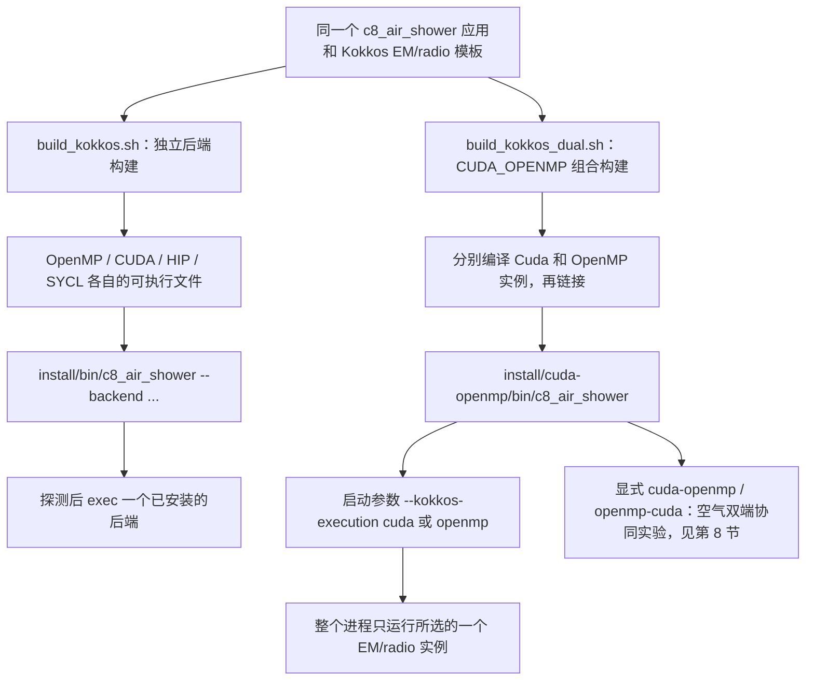
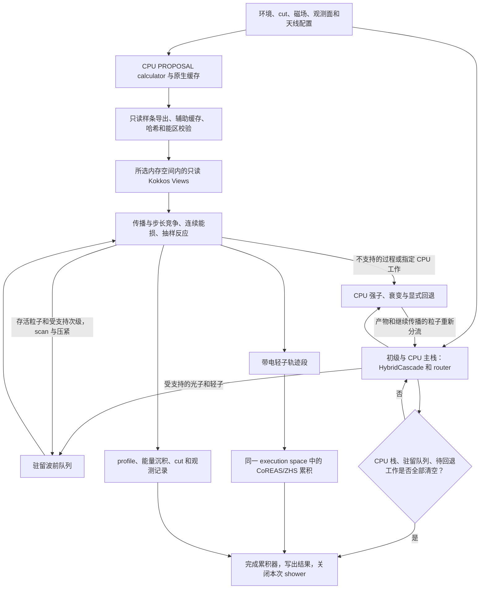

# CORSIKA 8 Kokkos beta5：安装与使用

[English](README.md)

本程序模拟大气粒子级联及 CoREAS/ZHS 射电信号，通过 Kokkos 让同一套电磁输运与射电算法面向多核 CPU 或不同 GPU 编译。这是基于 CORSIKA 8 的独立软件分支，不是官方发布版；安装不需要旧 beta 项目、已有构建目录或手工生成的 `.c8emrt` 表。

本文面向初学者，以 **Ubuntu 24.04 x86-64、Bash、空 Conda 环境**为例：完成公共环境准备后，选择独立后端或新增单二进制实验。无 GPU 从独立 OpenMP 开始；已有可用 NVIDIA 设备也可直接按第 7.2 节构建组合程序。HIP/SYCL 工具链单独说明，不能将配置支持等同于硬件验收通过。

## 1. 功能与构建逻辑

- Kokkos 处理光子、电子、正电子及当前支持的 muon 输运，包含传播、能损、相互作用、cut、thinning、profile 和 CoREAS/ZHS 累积。
- PROPOSAL 原生样条经只读接口导出到 Kokkos 数据结构，保留版本、介质、cut、能区和哈希检查；不要求用户先运行完整制表工具。
- 强子模型、衰变及不支持的末态仍走 CPU，保留单核标量 PROPOSAL 对照。本文科研配置采用 SIBYLL-2.3d + 用户合法安装的 FLUKA。
- 默认单端模式一次 shower 选择 OpenMP **或** GPU；组合构建另有显式空气双端协同实验（第 8 节）。不叠加多核强子调度，不做 MPI/多卡粒子栈分发。不是所有物理过程都已 GPU 化。

### 1.1 两种构建方式，共用同一套物理源码

| 使用场景 | 构建脚本 | 运行时如何选择 |
|---|---|---|
| 无 GPU 服务器 | `build_kokkos.sh openmp` | 统一入口 `--backend openmp` |
| 便于跨 CPU/GPU 机器部署 | `build_kokkos.sh openmp,cuda`；HIP/SYCL 分别构建 | 统一入口选择一个已安装的独立程序 |
| 希望同一个程序包含 CUDA **和** OpenMP | `build_kokkos_dual.sh` | 直接调用组合程序，用 `--kokkos-execution cuda\|openmp` 选择实例 |

独立后端仍是当前生产和跨设备部署基准。新增单二进制适合在有可用 NVIDIA 设备的机器上试用，**不是一个文件通吃无 GPU、NVIDIA、AMD、Intel 的通用二进制**。



默认部署是“同一源码、独立二进制、统一入口”：编译时生成后端实例，运行时选择已经安装的程序，不临时编译。OpenMP 与 GPU 可同时安装，但独立 GPU 程序使用 Kokkos Serial host，独立 OpenMP 程序不需要 GPU runtime。这是本项目的组织方式，不是声称 Kokkos 只能这样使用。

实验性的 **CUDA/OpenMP 单二进制**即上图右侧路径：它目前即使选择 OpenMP 也需要可用的 NVIDIA 设备和驱动，不能替代无 GPU 服务器上的独立 OpenMP 版。安装位置为 `install/cuda-openmp`，不会覆盖正常启动器和独立后端。从空环境准备好后，按第 7.2 节构建和运行；完整测试边界参见[实验说明与验收](documentation/cuda_em_refactor/beta5_dual_cuda_openmp_experiment_CN.md)。

### 1.2 目录结构

```text
corsika-21cma-kokkos-beta5/
├── corsika8_kokkos_beta5/  源码、依赖配方、示例、文档、测试
├── build/                编译产物，不是第二份项目
│   ├── openmp/deps/       OpenMP 的 Conan/CMake 工具链
│   ├── cuda/deps/         CUDA 的独立工具链
│   ├── cuda-openmp/deps/  组合实验自己的 Conan/CMake 工具链
│   └── ...               HIP/SYCL 或审计记录
└── install/
    ├── bin/c8_air_shower  统一启动器
    ├── openmp/           CPU 二进制、库、模型数据、安装清单
    ├── cuda/             GPU 对应产物；HIP/SYCL 按需增加
    └── cuda-openmp/      可选单二进制实验的独立安装位置
```

`deps` 描述依赖位置与编译选项，实际 Conan 包在用户缓存；它不是物理插值表。配置好的 `CMakeCache.txt` 含绝对路径，不能跨后端或跨机器复制使用。所有后端使用同一个应用源码文件。

### 1.3 算法逻辑：驻留波前输运与分批在线射电累积

下图描述**加速路径**；`proposal/cpu` 标量模式仍走原来的串行 Cascade/PROPOSAL。箭头表示数据流和依赖，**不表示 CPU 多核与 GPU 同时演化一个 shower**。



1. **进程初始化时准备，后续事件复用。** PROPOSAL 仍负责物理数据；原生样条、环境快照及辅助分布进入所选后端的内存空间。新 shower 通过 `beginShower()` 重置事件状态，复用兼容的表和工作区，不重新手工制表。
2. **并行的是传播过程，不只是反应末态。** 每批粒子执行传播、几何/观测边界与步长竞争、连续能损、离散反应、散射、cut 和 thinning；存活粒子与受支持次级继续留在驻留队列。不是每次反应都逐粒子送回 CPU，但仍存在显式 fallback 和调度检查点。
3. **一份源码，在编译时指定执行空间。** Kokkos View、kernel、scan/压紧分别在 OpenMP HostSpace 或 GPU 内存空间工作。Philox 按 history 等键取数，不按线程完成先后取数；这不意味着不同硬件一定产生逐位相同的 shower tree。
4. **回退不是丢弃物理。** 强子产物、衰变、不受加速路径支持的过程交回 CPU 处理，再把产物按能力重新分流。EM/radio 多核加速不等于强子模型已经多线程化。
5. **射电随输运分批累积，不等待整棵 shower tree 完成。** 轨迹预计算与天线分块复用计算；GPU 用设备执行策略，OpenMP 用主机分块及线程私有累积。带溢出检查的定点累积保留可重复性约束，清空待处理工作后再汇总/写出波形。时间窗是否完整仍需单独检查。

源码对应关系：

| 职责 | 位置 |
|---|---|
| 参数、模型装配与输出生命周期 | [c8_air_shower.cpp](applications/c8_air_shower.cpp) |
| session、原生表准备与跨 shower 复用 | [KokkosEmRunSession.hpp](corsika/accelerator/em/detail/KokkosEmRunSession.hpp) |
| CPU 与加速粒子分流 | [PhysicalAcceleratedEmRouter.hpp](corsika/accelerator/em/PhysicalAcceleratedEmRouter.hpp) |
| 主机侧选择/转发到实例 | [KokkosEmBackend.cpp](src/accelerator/em/kokkos/KokkosEmBackend.cpp) |
| 被各执行空间实例化的共享实现 | [KokkosBackendInstance.inl](src/accelerator/em/kokkos/KokkosBackendInstance.inl) |
| 光子、轻子、驻留队列与原生表模板 | [Kokkos EM 模块](corsika/accelerator/em/kokkos) |
| CoREAS/ZHS 投影和累积 | [KokkosRadioAccumulator.hpp](corsika/accelerator/radio/kokkos/KokkosRadioAccumulator.hpp) |

组合版的 `KokkosCudaBackendInstance.cpp` 和 `KokkosOpenMPBackendInstance.cpp` 分别编译同一实现，再链接到同一程序。实例选择/虚函数转发只在主机批次边界发生，逐粒子 kernel 仍由模板静态实例化。

## 2. 从空环境开始

需要可写的用户目录、联网下载依赖的条件和兼容的 C++17/Fortran 编译器。建议为源码、缓存及构建预留 30–50 GiB 空间，这是规划建议而非严格最低值；CUDA、多后端及模拟数据另需空间。首次编译使用 1 个任务，确认内存余量后再增加。WSL 用 `free -h` 检查 Linux 的实际可用内存，不要直接按电脑物理内存估算。

### 2.1 系统开发工具

以下只安装主机开发工具，不安装 GPU 驱动：

```bash
sudo apt-get update
sudo apt-get install -y build-essential gfortran git curl ca-certificates \
  pkg-config autoconf automake libtool bison flex patch unzip bzip2 xz-utils
```

无 `sudo` 请管理员提供这些工具或加载服务器已有编译器模块。不要自行替换共享服务器驱动。教程使用系统 GCC/G++/GFortran，不再混装另一套 Conda C++ 编译器；其他 Linux 发行版使用对应包管理器。

### 2.2 安装 Conda（已有则跳过）

下面用 Miniforge 提供 `conda`。命令仅适用 Linux x86-64，目标安装目录必须不存在；已有 Miniconda/Anaconda 用户直接使用自己的安装。[Miniforge 官方说明](https://github.com/conda-forge/miniforge#install)

```bash
mkdir -p "$HOME/Downloads"
cd "$HOME/Downloads"
curl -fLO https://github.com/conda-forge/miniforge/releases/latest/download/Miniforge3-Linux-x86_64.sh
curl -fLO https://github.com/conda-forge/miniforge/releases/latest/download/Miniforge3-Linux-x86_64.sh.sha256
sha256sum -c Miniforge3-Linux-x86_64.sh.sha256
# 只有校验成功后才执行：
bash Miniforge3-Linux-x86_64.sh -b -p "$HOME/miniforge3"
source "$HOME/miniforge3/etc/profile.d/conda.sh"
```

### 2.3 新建环境与检查

以下选择项目已使用的工具/粒子数据库版本，不要求已有 `corsika_venv`：

```bash
conda create -n corsika_venv --override-channels -c conda-forge \
  python=3.11 pip cmake=3.31 ninja numpy=1.26.4 pyyaml lxml
conda activate corsika_venv
python -m pip install "conan==2.11.0" "particle==0.25.1" "hepunits==2.4.1"
export CC=/usr/bin/gcc
export CXX=/usr/bin/g++
export FC=/usr/bin/gfortran

python -c 'import particle, hepunits, numpy, yaml; print("Python dependencies OK")'
cmake --version
conan --version
gcc --version
g++ --version
gfortran --version
```

`particle` 和 `hepunits` 用于**构建时生成粒子属性代码**，不是可省略的绘图包。粒子数据库版本会影响物理常数，需要记录。分析结果时可额外安装 `pandas pyarrow scipy matplotlib`，不必先运行分析程序才能编译。

已有同名环境不要覆盖，先检查或换环境名。每次新终端都需 `source` 实际 Conda 的 `etc/profile.d/conda.sh`，然后 `conda activate corsika_venv`。

## 3. 获取源码，配置 Conan

**beta5 源码**位于[项目私有仓库的 `kokkos-beta5` 分支](https://github.com/BossL668/corsika8-gpu-hybrid/tree/kokkos-beta5)。先取得仓库访问权限并配置 GitHub 认证。beta2、beta4 保留在其他分支；不要把仓库默认分支当作 beta5。

```bash
mkdir -p "$HOME/corsika-21cma-kokkos-beta5"
cd "$HOME/corsika-21cma-kokkos-beta5"
git clone --branch kokkos-beta5 --single-branch --recurse-submodules \
  https://github.com/BossL668/corsika8-gpu-hybrid.git corsika8_kokkos_beta5
cd corsika8_kokkos_beta5
test -f CMakeLists.txt
test -f conanfile.py
test -f modules/data/CMakeLists.txt
test -f resources/GeoMag/IGRF14.COF
git submodule status --recursive
```

模型数据和可选 CONEX 源码以锁定版本的上游子模块提供，不将大文件重复放进 beta5 仓库；子模块使用绝对地址，可从 GitHub 正常定位。GitHub 自动生成的源码 ZIP **不包含子模块内容**。若采用离线归档，应向维护者索取包含两个子模块、依赖配方、资源及示例的完整包。源码仓库不包含本机的 build/install、自动生成的缓存或模拟数据集。

Conan 负责 C++ 依赖，CMake 负责装配应用。保持第 2 节环境和编译器设置，在源码目录执行：

```bash
conan profile detect
conan profile show -pr:h default -pr:b default
conan remote list
conan export third_party/conan/cubicinterpolation
conan export third_party/conan/proposal
conan export dependencies/kokkos
```

核对 profile：`compiler=gcc`、主版本号与 `g++ --version` 一致，C++ 标准 17（`gnu17` 也可）、`compiler.libcxx=libstdc++11`。`detect` 只是候选配置，需要核对；已有 `default` 不要随意 `--force` 覆盖。生产复现需保存 profile 和依赖锁文件。[Conan profile 文档](https://docs.conan.io/2/reference/commands/profile.html)

默认 ConanCenter 应已启用；**只有远程列表为空时**才添加：

```bash
conan remote add conancenter https://center2.conan.io
```

三个 `export` 注册配方，依赖编译由下一节自动完成。项目使用 `kokkos/4.7.03@c8gpu/stable`、`proposal/7.6.2@c8gpu/stable`、`cubicinterpolation/0.1.5@c8gpu/stable`；后两者带只读样条导出补丁，不能与无补丁库/旧头文件混用。完整二进制图仍受间接依赖版本影响。

## 4. 准备物理模型

### 4.1 SIBYLL + FLUKA 科研配置

FLUKA 有独立许可，不通过源码或 Conan 分发。先按 [FLUKA 官方安装说明](https://fluka.cern/documentation/installation)取得匹配系统/Fortran 编译器的授权包并完整安装，保留其运行数据，不是只复制一个库。假设安装到 `~/fluka`：

```bash
export FLUPRO="$HOME/fluka"
test -r "$FLUPRO/libflukahp.a"
```

检查失败先修正安装或路径。高能 SIBYLL-2.3d 源码已在项目内；Pythia 8.315 和 TAUOLA 1.1.8 默认由 CMake 下载固定来源并编译。**空环境不用先准备 `build/external`，不要复制旧机器的 Pythia/TAUOLA 绝对路径。** 首次需访问 ConanCenter、GitHub、Pythia GitLab 和 CERN 下载站点。

### 4.2 暂无 FLUKA 许可

仅为学习安装，可以在下节显式改用 `-DWITH_FLUKA=OFF`，低能模型变为 UrQMD。它不等价于 SIBYLL+FLUKA，不能混入后者的科研验收样本。不要将更换物理模型视为单纯的编译/性能调整。

## 5. 构建 OpenMP（不需要 GPU）

当前在源码目录，已激活环境、检查 `FLUPRO`：

```bash
C8_BUILD_JOBS=1 bash tools/build_kokkos.sh openmp -DWITH_FLUKA=ON
```

脚本顺序执行：

```text
conan install --build=missing
    → build/openmp/deps/conan_toolchain.cmake
    → CMake Release 配置
    → 编译模型、应用和测试
    → 安装 install/openmp 和统一入口 install/bin/c8_air_shower
```

首次下载和编译可能较久，不是单个 shower 的时间。`C8_BUILD_JOBS=1` 限制编译和 Conan 构建并行，不限制模拟线程数；内存充足可改为 2 或 4，不建议初次 `-j128`。脚本遇错停止，先看第一条错误，不将“出现 build 目录”当作成功。

构建成功后，回到项目根目录检查：

```bash
cd ..
install/bin/c8_air_shower --list-backends
install/bin/c8_air_shower --backend openmp --check-backends
install/bin/c8_air_shower --backend openmp -- --help
```

OpenMP 应显示 `installed: true`，探针 `available: true`、`gpu=false`、`openmp=true`。清单只读安装信息，探针验证基础操作，不是完整 shower 验收。

## 6. 首次完整运行与输出

仍在项目根目录，使用随源码提供的三个演示天线，不依赖私人数据：

```bash
mkdir -p "$HOME/CorsikaData"
install/bin/c8_air_shower --backend openmp --kokkos-num-threads 4 \
  -p 22 -E 10 -s 12345 -f "$HOME/CorsikaData/first_photon_openmp" \
  --antenna-file corsika8_kokkos_beta5/examples/beta5/antennas_minimal_nwu.txt
```

这是 10 GeV 垂直光子、一个 shower；统一入口默认开启 Kokkos EM 和 Kokkos CoREAS/ZHS。**`-f` 最终目录必须不存在**，只创建上级目录。重复运行请换名称，不删除旧科研数据。低能信号可能很弱或个别天线无有效脉冲，此例用于安装检查而非性能评估。

天线每行 `north_m west_m up_m`，允许 `#` 开头注释。当前空气应用将第三列放在 `EarthRadius + up_m`，所以它是相对参考地球半径的高度，**不是离当地地面的高度**；示例使用默认观测高度 `2680.444195`。没有有效天线且 `--ring 0` 时可能没有射电观测点，退出成功并不代表验证了射电输出。

首次配置 PROPOSAL 仍可生成自身缓存，再导出样条复用。辅助缓存默认在 `~/.cache/corsika8/gpu-em-aux` 或 XDG 目录；PROPOSAL 自身缓存来自 `corsika_data("PROPOSAL")`，对应目录需要可写。`--gpu-aux-cache-dir` 只改辅助缓存，不改所有缓存。无需手工制表不等于没有插值/缓存，也不自动扩大介质、几何支持范围。

检查 `profile/`、`energyloss/`、`particles/`、`CoREAS/`、`ZHS/`、`gpu_em/`、`simulation_timing/`；内容可能位于各自 shower 子目录。确认日志无异常、summary 完成、Parquet 可读，再扩大样本。CPU/OpenMP/GPU 同 seed 不保证整个 shower 逐位相同，需要逐过程与统计验收。

## 7. 增加 NVIDIA CUDA 后端

**只在获准使用 GPU 的机器执行本节**；无 GPU 用户完成上节即可。驱动让系统访问显卡，Toolkit 提供 `nvcc` 和开发库；`nvidia-smi` 的 CUDA 版本不是已安装的 `nvcc` 版本。驱动由管理员配置；WSL2 使用 Windows NVIDIA 驱动，不能在 WSL 安装 Linux 显示驱动。[NVIDIA WSL 说明](https://docs.nvidia.com/cuda/wsl-user-guide/index.html)

已有可用 Toolkit 不重复安装。空开发环境可在 Conda 中安装 CUDA 12.6.3，示例与 Ubuntu 24.04 的 GCC 13 系列配套；其他组合需核对 [CUDA 12.6 编译器支持及安装说明](https://docs.nvidia.com/cuda/archive/12.6.3/cuda-installation-guide-linux/index.html)。

```bash
conda activate corsika_venv
conda install --override-channels -c nvidia/label/cuda-12.6.3 -c conda-forge cuda
nvcc --version
nvidia-smi
```

这不安装/修复系统驱动。不要用只有运行库的老 `cudatoolkit` 包代替完整开发工具。已有系统 Toolkit 时将其 `bin` 放入 PATH，别混用不同版本头文件和库。

### 7.1 独立 CUDA 二进制（当前生产基准）

```bash
cd "$HOME/corsika-21cma-kokkos-beta5/corsika8_kokkos_beta5"
export CC=/usr/bin/gcc
export CXX=/usr/bin/g++
export FC=/usr/bin/gfortran
C8_BUILD_JOBS=1 bash tools/build_kokkos.sh cuda -DWITH_FLUKA=ON
```

脚本通过 `nvidia-smi` 查询 compute capability，选择对应 profile：

| 目标示例 | profile | CUDA 架构 |
|---|---|---|
| Turing | `cuda-turing75` | 75 |
| A100 | `cuda-ampere80` | 80 |
| Ampere 8.6 | `cuda-ampere86` | 86 |
| RTX 4060 等 Ada 8.9 | `cuda-ada89` | 89 |
| H100 | `cuda-hopper90` | 90 |

混合/未知架构不猜测；已知目标可显式选择，例如 A100：

```bash
C8_KOKKOS_PROFILE=cuda-ampere80 C8_BUILD_JOBS=1 \
  bash tools/build_kokkos.sh cuda -DWITH_FLUKA=ON
```

这只绕过架构探测，不修复驱动。`CORSIKA_ENABLE_CUDA=ON` 不是 beta5 开关，应选择 Kokkos CUDA。也可以 `bash tools/build_kokkos.sh openmp,cuda -DWITH_FLUKA=ON` 顺序构建安装两套。

```bash
cd ..
install/bin/c8_air_shower --backend cuda --check-backends
install/bin/c8_air_shower --backend cuda \
  -p 22 -E 10 -s 12345 -f "$HOME/CorsikaData/first_photon_cuda" \
  --antenna-file corsika8_kokkos_beta5/examples/beta5/antennas_minimal_nwu.txt
```

这两条命令会访问 GPU。GPU 模式不要加 `--kokkos-num-threads 16`。默认显存预算为初始化时可用显存的 70% 上限，不要求小事件占满。

### 7.2 新方式：CUDA 和 OpenMP 编译进同一个可执行文件

先完成第 2–4 节和本节开头的 CUDA Toolkit 配置。**不必先编译独立 OpenMP/CUDA 应用**，可以直接构建组合版。保持相同 Conda 环境与已授权的 `FLUPRO`：

```bash
cd "$HOME/corsika-21cma-kokkos-beta5/corsika8_kokkos_beta5"
conda activate corsika_venv
test -f tools/build_kokkos_dual.sh
test -r "$FLUPRO/libflukahp.a"
nvcc --version
nvidia-smi
C8_BUILD_JOBS=1 bash tools/build_kokkos_dual.sh -DWITH_FLUKA=ON
```

若没有该脚本，需要取得包含单二进制实验的源码版本；不要用 `build_kokkos.sh openmp,cuda` 替代，它生成的是**两个独立程序**。组合脚本建立自己的依赖图，设置 `CORSIKA_KOKKOS_BACKEND=CUDA_OPENMP`，分别编译两套 EM/radio 实例再链接，安装到 `../install/cuda-openmp`，不覆盖已有后端。

**组合脚本目前不会自动探测 GPU 架构。** 它默认使用 `dependencies/kokkos/profiles/cuda-openmp-ada89`，针对 RTX 40 / Ada 8.9；这与独立版 `build_kokkos.sh cuda` 的自动架构选择不同。其他 NVIDIA 机器需要匹配的组合 profile，例如将下面 A100 配置保存为 `~/conan-profiles/cuda-openmp-ampere80`：

```ini
include(default)

[options]
&:with_kokkos=True
&:kokkos_backend=cuda_openmp
&:kokkos_architecture=AMPERE80
```

核对 default 中的编译器/ABI 与本机一致，再使用**组合版专用变量**及绝对路径：

```bash
conan profile show -pr:h "$HOME/conan-profiles/cuda-openmp-ampere80" -pr:b default
C8_KOKKOS_DUAL_PROFILE="$HOME/conan-profiles/cuda-openmp-ampere80" \
  C8_BUILD_JOBS=1 bash tools/build_kokkos_dual.sh -DWITH_FLUKA=ON
```

根据机器选择默认 Ada 命令或自定义架构命令，不在同一个已有缓存中交替执行两种架构构建；换机器重新构建。独立版使用的 `C8_KOKKOS_PROFILE` 不控制这个组合脚本。

构建成功后回到项目根目录，以下两条 shower 命令调用的是**完全相同的可执行文件**。使用源码附带的演示天线，不依赖私人数据：

```bash
cd ..
export CORSIKA_DATA="$PWD/install/cuda-openmp/share/corsika/data"
install/cuda-openmp/bin/kokkos_backend_probe --backend cuda --threads 1
install/cuda-openmp/bin/kokkos_backend_probe --backend openmp --threads 4
mkdir -p "$HOME/CorsikaData"

install/cuda-openmp/bin/c8_air_shower \
  --em-backend kokkos --radio-backend kokkos --kokkos-execution cuda \
  -p 22 -E 10 -s 12345 -f "$HOME/CorsikaData/dual_photon_cuda" \
  --antenna-file corsika8_kokkos_beta5/examples/beta5/antennas_minimal_nwu.txt

install/cuda-openmp/bin/c8_air_shower \
  --em-backend kokkos --radio-backend kokkos --kokkos-execution openmp \
  --kokkos-num-threads 4 \
  -p 22 -E 10 -s 12345 -f "$HOME/CorsikaData/dual_photon_openmp" \
  --antenna-file corsika8_kokkos_beta5/examples/beta5/antennas_minimal_nwu.txt
```

直接调用应用仍保留标量默认值，因此要显式保留 `--em-backend kokkos --radio-backend kokkos`。原生 PROPOSAL 已是唯一加速物理源，不需另给制表参数。组合版**在请求加速时**省略 `--kokkos-execution` 默认 CUDA；没有请求加速则仍是标量路径。不要把启动器的 `--backend` 传给应用；上面的独立**探针**有自己的 `--backend` 参数。

- 组合程序即使选 OpenMP，也会加载/初始化 CUDA，要求可见且可用的 NVIDIA 设备。不能通过隐藏全部 GPU 把它变成 CPU-only 安装；无 GPU 机器用独立 `install/openmp`。
- 每个进程的 EM 和射电共同选择一个执行空间；不在 `-N N` 的事件之间切换，也不混用 OpenMP EM 与 GPU 射电。选择 CUDA 时，已编译的 OpenMP host runtime 限为1线程，不要请求16线程。
- 统一启动器不注册 `cuda-openmp`；组合版直接调用其路径。HIP/SYCL 仍是目标平台独立构建，不在本实验的单程序中。
- 已在本机完成 Release 安装、基础/运行时门禁及短程 `-N 2` 光子/质子回归，与各自对应的独立旧版比较通过。**不等于组合版已完成500例统计或高能性能验收**；详见[验收记录](documentation/cuda_em_refactor/beta5_dual_cuda_openmp_experiment_CN.md)。

## 8. 最简命令、参数与正式模拟

空气程序另有显式 `--kokkos-execution cuda-openmp` 的**协同实验**：
独立 CUDA 驱动与 OpenMP 协调线程复用两端原物理实现。新的独立子级联队列
让次级留在本端，只领取已完成的 CUDA 结果；OpenMP 可以连续推进多段，
不再每批等待另一端。标量 fallback 和最终定点 profile/射电合并仍由协调器管理。
它不同于上面的单端模式，不是生产默认，也不用于山体输运。
隔离构建、回归结果和性能限制见[独立子级联队列验收记录](documentation/cuda_em_refactor/beta5_independent_subshower_queues_CN.md)。

组合空气程序新增实验性的 **`openmp-cuda`（CPU 优先）**。`cuda-openmp`
省略策略参数时保留原 GPU 优先独立队列及实测吞吐分配，并非固定比例。
`openmp-cuda` 保留 CPU 的批量容量，GPU 作为辅助。当前的
`cpu-primary-v2-simple` 保留两端各自的完整工作区容量，只按实测吞吐学习
输入分配比例，在空闲且安全的边界再平衡；不预测完成时间，也不按吞吐比
缩小输入容量。两种模式都使用同一套 EM/CoREAS/ZHS 物理内核；强子仍由单线程
协调器处理，不保证两端在每个阶段持续满载。

重新构建组合程序后直接调用（不是统一启动器）：

```bash
# GPU 优先，OpenMP 独立演化分配到的子级联。
install/cuda-openmp/bin/c8_air_shower -p 2212 -E 100000 \
  --em-backend kokkos --radio-backend kokkos \
  --kokkos-execution cuda-openmp --kokkos-num-threads 20 \
  --antenna-file antennas.txt -f output_gpu_primary

# CPU 优先，GPU 辅助；同一个二进制、同样的物理参数。
install/cuda-openmp/bin/c8_air_shower -p 2212 -E 100000 \
  --em-backend kokkos --radio-backend kokkos \
  --kokkos-execution openmp-cuda --kokkos-num-threads 130 \
  --antenna-file antennas.txt -f output_cpu_primary
```

线程数按机器实际资源填写。执行名称顺序只选择调度优先级，不选择另一套
物理算法。禁止 `--hadronic-workers > 1`，也不允许 `openmp-cuda` 混用
另一个实验性的 `--kokkos-cooperative-policy adaptive`。CPU 优先模式仍需要
可用 NVIDIA GPU；没有 GPU 的服务器应使用独立 OpenMP 构建。
本地GPU优先和PSR CPU优先各五种子短测已完成，均未证明净加速。PSR的
CPU优先有效OpenMP吞吐下降；保留完整容量不等于保住单端性能，仍需隔离诊断。这些模式
仍属实验选项，没有自动替换安装目录或默认模式。详见
[v1 两机比较](documentation/cuda_em_refactor/beta5_priority_endpoints_v1_20260912_CN.md)
和[简化策略与验收进度](documentation/cuda_em_refactor/beta5_priority_endpoints_v2_simple_20260912_CN.md)。

项目根目录的最简加速调用：

```bash
install/bin/c8_air_shower --backend cuda -p 2212 -E 1000 \
  -f "$HOME/CorsikaData/proton_1TeV_cuda" \
  --antenna-file corsika8_kokkos_beta5/examples/beta5/antennas_minimal_nwu.txt
```

换成 `--backend openmp --kokkos-num-threads 16` 就用多核 CPU，其他物理参数不变。标量对照用 OpenMP 安装的程序，但不开 Kokkos EM：

```bash
install/bin/c8_air_shower --backend openmp \
  --em-backend proposal --radio-backend cpu \
  -p 2212 -E 1000 -s 12345 -f "$HOME/CorsikaData/proton_1TeV_scalar" \
  --antenna-file corsika8_kokkos_beta5/examples/beta5/antennas_minimal_nwu.txt
```

`proposal/cpu` 不是 OpenMP 加速。直接调用 `install/<backend>/bin/c8_air_shower` 的默认值也仍是标量；统一入口才补上 `--em-backend kokkos --radio-backend kokkos`。加速物理源只有 `proposal-native`，不用另填 YAML 或 `.c8emrt`。

| 参数 | 含义 / 默认 |
|---|---|
| `--backend openmp/cuda/hip/sycl` | 统一启动器参数：选择已安装程序；省略为 `auto` |
| `--kokkos-execution cuda\|openmp\|cuda-openmp\|openmp-cuda` | 组合空气应用：选择单实例或显式 GPU/CPU 优先协同；加速模式下省略默认 CUDA |
| `-p`、`-E` | 初级 PDG、总能量 GeV；光子 22、电子 11、质子 2212 |
| `-z`、`-a` | 天顶角/方位角，度；默认 0/0 |
| `-s`、`-N` | seed / 同进程顺序事件数；默认自动 seed / 1 |
| `--emthin`、`--max-weight` | 默认 `1e-6` / `0`（自动计算权重上限） |
| `--emcut` | 默认动能 cut `0.0005` GeV |
| `--geomagnetic-model`、`--geomagnetic-year` | 默认 IGRF14 / 2027 |
| `--kokkos-num-threads N` | OpenMP 线程数；GPU 不接受大于 1 |
| `--kokkos-device N` | GPU 编号，不是多卡并行 |
| `--gpu-min-batch` | 默认 4096，不是 shower 数量 |
| `--gpu-memory-fraction` | 默认 0.70，预算上限非填充目标 |
| `--gpu-resident-batch-limit` | 默认 0 自动容量；固定容量用于回放/诊断 |
| `--radio-sampling-rate-ghz` | 默认 1 GHz |
| `--radio-window-duration-ns`、`--radio-pretrigger-ns` | 默认 400 ns / 10 ns |
| `--kokkos-tuning-cache`、`--kokkos-require-tuning` | 可选调优缓存；require 模式下不匹配即失败 |

`auto` 探测已装 GPU，不可用时提示并选 OpenMP；多个可用 GPU 后端要求明确选择，不保证自动找最快者。**启动器显式选择独立 OpenMP** 不探测 GPU，这项隔离保证不适用于组合版。显式后端失败不换后端重跑。`--list-backends` 只读清单，`--check-backends` 和 `--dry-run` 会运行探针。跨机器迁移的是源码，不是让 NVIDIA 二进制直接在 AMD 上运行。

正式实验固定 seed 清单、天线、模型、能量、角度、cut、窗口。高能/倾斜事件不能假设默认 400 ns 足够：先画脉冲，扩大窗口检查边缘能量及重叠区收敛，再冻结设置。低能自动最大权重可能小于 1，非零 `--emthin` 不一定实际薄化。

`C8_BUILD_JOBS` 控制编译；`--kokkos-num-threads` 控制 OpenMP 计算；`-N` 控制同进程顺序事件数，三者不同。多进程 × 线程数不超过分配资源并留内存余量；长批次先验证 `-N 1`、`-N 2` 和 RSS 趋势，一次探针不证明长期稳定性。

2026-09-07 已完成组合程序的同进程 `N=16/64/256` 补测：输运分配趋于稳定，但主机 RSS 仍随写出缓冲和逐事件报告增加，**不代表任意大 N 下内存恒定**。内存紧张时使用带保护的小批次或逐事件独立进程；详见[内存实测、原因与限制](documentation/cuda_em_refactor/beta5_nmulti_memory_acceptance_20260907_CN.md)。

随后加入[逐事件内存释放修复](documentation/cuda_em_refactor/beta5_event_memory_release_20260907_CN.md)：每个 shower 结束后将 YAML 报告流式写入磁盘、提交 Parquet 缓冲、释放已消费的强子计时明细；原生 PROPOSAL 表及有界的输运/射电工作区继续复用。**修复需重新编译才生效，不会改变正在运行的归档程序。** Parquet 分块会改变，但物理数据列、数值和事件顺序保持不变。长批次仍需内存保护：分配器缓存和文件 footer 元数据可能继续小幅增长。

另加入 [ZHS 窗口边界修复](documentation/cuda_em_refactor/beta5_zhs_window_edge_fix_20260907_CN.md)：标量 observer 与 Kokkos 射电公共代码均先完整累积首末矢势 bin，再求导，避免旧时间戳裁剪制造第一个/最后一个电场离群点。这不是平滑波形或删掉端点；真实脉冲、输出时间轴和点数保留，CoREAS 时间门禁及粒子输运不变。重新编译后生效；历史数据和正在运行的归档程序不自动改变。真实脉冲超出记录范围的问题仍需用加宽时间窗检查。

2026-09-17 加入[光子 CPU 回退顶点修复](documentation/cuda_em_refactor/beta5_photon_fallback_vertex_fix_20260917_CN.md)：选中需要 CPU 完成的过程后，必须先传播至真实反应顶点，不能在步前位置直接生成末态。旧路径会使光核/μ 对源项在大气层界附近人为集中，影响强子、正负 μ 子以及后续 EM/射电。需重新编译；旧加速样本不能靠平滑 profile 修复，应保留版本标签并重新做物理统计验收。

## 9. HIP / SYCL：目标机器上的进阶构建

OpenMP/CUDA 有已编译测试的配置；HIP/SYCL 仍需目标机器的编译、逐过程 oracle、shower 和射电验收。AMD/Intel CPU 不等于拥有 HIP/SYCL 可用 GPU。

HIP：按 [ROCm 安装说明](https://rocm.docs.amd.com/projects/install-on-linux/en/latest/index.html)检查 GPU/系统兼容性并装好开发工具与驱动，检查 `hipcc --version`。`hip-vega90a` 是 MI200/VEGA90A 模板，不是任意 Radeon 配置。先匹配其架构和 Conan Clang 版本，在源码目录执行：

```bash
C8_KOKKOS_PROFILE=hip-vega90a bash tools/build_kokkos.sh hip -DWITH_FLUKA=ON
```

SYCL：按 [oneAPI 安装说明](https://www.intel.com/content/www/us/en/docs/oneapi/installation-guide-linux/2025-0/overview.html)安装 DPC++ 和目标设备 runtime/驱动，初始化工具链，检查 `icpx --version`、`sycl-ls`。`sycl-intel-pvc` 是 PVC/oneAPI 模板，不适合原样套到任意 Intel 核显：

```bash
C8_KOKKOS_PROFILE=sycl-intel-pvc bash tools/build_kokkos.sh sycl -DWITH_FLUKA=ON
```

自定义 profile 可用绝对路径传给 `C8_KOKKOS_PROFILE`，OpenMP 的覆盖变量为 `C8_KOKKOS_OPENMP_PROFILE`。每次调用最多一种 GPU 工具链，可附加 OpenMP；不同调用的安装可共存。工具链版本、ABI、依赖一起匹配，不关闭门禁或启用 fast-math 绕过错误。

## 10. 验证、维护与常见错误

项目根目录先列测试，再运行对应后端：

```bash
ctest --test-dir build/openmp -N
OMP_NUM_THREADS=4 ctest --test-dir build/openmp \
  -R 'testKokkos|Beta5' --output-on-failure
# 仅在允许使用 GPU 时：
ctest --test-dir build/cuda -R 'testKokkos|Beta5' --output-on-failure
```

测试可能生成缓存并耗时；通过基础测试不是所有能量/介质的生产验收。同 seed 的结果还取决于 RNG 域、物理修订和容量，记录二进制 SHA-256、参数、依赖和 `gpu_em` 元数据，不能仅凭“beta5”文件名认定相同版本。

| 现象 | 检查/处理 |
|---|---|
| `conda` 找不到 | source 实际 Conda 安装下的 `etc/profile.d/conda.sh` |
| 缺少 `particle` / `hepunits` | 激活环境、检查 python，按 2.3 节安装，不用系统 pip |
| 找不到 `@c8gpu/stable` | 检查三个配方已导出到当前 Conan 缓存 |
| profile/编译器/ABI 不匹配 | 核对 CC/CXX/FC 与 profile，换工具链后独立重配 |
| FLUKA 找不到或链接失败 | 检查授权安装、FLUPRO、Fortran 兼容性，不静默换模型 |
| 下载失败 | 检查日志 URL/网络；离线需受控依赖归档，不能关闭哈希验证 |
| 编译被 Killed / WSL 重启 | `C8_BUILD_JOBS=1`，检查 `free -h` 和磁盘空间 |
| nvcc 找不到 | 需要开发工具而不只是驱动，检查 PATH |
| NVML driver/library mismatch | 管理员协调驱动；指定架构不能修复运行时 |
| 清单存在但探针失败 | 检查环境、设备权限、动态库，不随意拼接陌生库 |
| 组合版 OpenMP 在隐藏 GPU 后失败 | 当前预期限制；改用独立 OpenMP 程序 |
| 应用不接受 `--backend` | 它是启动器/探针参数；组合应用选择实例用 `--kokkos-execution` |
| 输出目录已存在 | 换 `-f`，不要删除科研数据为测试让路 |
| 射电为空/截断 | 检查有效天线数、高度、时间窗口；低能本身也可能无信号 |
| 显存不到 70% | 是上限，取决于粒子量、工作区和当时可用显存 |

更新源码后，独立版重跑对应 `build_kokkos.sh <backend>`，组合实验重跑 `build_kokkos_dual.sh` 才会编译安装；不要把一种构建的缓存改配置成另一种。编辑 README 不改变二进制。新机器重新构建，不复制旧 CMakeCache。复用预构建 Pythia/TAUOLA 仅限同版本/ABI 的高级部署，不是从零安装前提。

实现/审计另见[目录边界与验收记录](documentation/BETA5_EXTRACTION_CN.md)、[统一入口审查](documentation/BETA5_PORTABLE_ENTRY_AUDIT_CN.md)。核心许可见 [LICENSE](LICENSE)，模型与依赖许可独立；不向仓库提交 FLUKA、构建产物、缓存和私人数据。

## 独立有限山体应用

### 一站式真实地形准备（2026-09-09）

在源码目录安装 Python 准备工具，只给经纬度即可下载/复用 DEM 与高度基准网格，
生成供 `c8_terrain_cascade` 读取的原生 USStdBK 五层大气 + 闭合山体场景：

```bash
conda activate corsika_venv
python -m pip install ./python
c8-terrain --bounds 86.700 42.930 86.710 42.940 \
  --output "$HOME/CorsikaData/terrain/demo"
```

未给天线时只有一个 DEM 上方 1 m 的**演示观测点**，不是实际阵列。
实际站位用 `--antennas-csv FILE` 或 `--station-directory DIR`；
`--estimate-only` 不下载，`--offline` 只用校验过的缓存。
`--check-with /path/to/c8_terrain_environment` 检查 C++ 场景，
`--run --application /path/to/c8_terrain_cascade -- ...` 显式接入标量/Kokkos 输运。
应用仍需按山体说明单独构建；安装 Python 包不生成 C++ 二进制。

该入口复用从 mountain 迁移的地形模块，不修改空气应用。
当前只支持局部、海拔 0–7 km 内的有限 SiO₂ 岩体，不是全球固体地球；
**DEM 应用跨界射电仍未接通**。
详见[准备、天线高度、完整命令与实测](documentation/terrain_preparation_workflow_CN.md)，
以及[21CMA 准备配置](configs/mountain/terrain_region_21cma.yaml)。

新增仅用于 shower 的[通用双侧介质界面接口](documentation/generic_material_interface_transport_CN.md)：
分离闭合网格求交、逻辑区域编号、native PROPOSAL 材料 bank 与 HybridCascade 路由。
山体默认仍为 SiO₂，应用另接受 `Water`、`Ice`；不支持的快照或 calculator 键冲突明确报错。
这不是任意多体积导航器，本轮不包含跨界射电。

### 有限凸体与多介质输运范围

新增可选 `c8_mountain_neutrino`，在有限凸、均匀 SiO₂ 山体中复用 beta5 的 Kokkos EM
输运与 CoREAS/ZHS 累积，另提供标量 PROPOSAL 对照。它使用独立 YAML 和输出，不改变
原大气应用；编译要求 FLUKA。首版仅 CC、出山吸收/记录、内部 observer 射电，不含
岩石—空气折射传播，也不提供中微子事件率权重；功能接入不代表大样本验收已完成。
详见[山体应用使用与示例](documentation/mountain_neutrino_user_guide_CN.md)及
[通用几何 API](documentation/mountain_geometry_CN.md)。

另已开始迁移原 mountain 的真实非凸 DEM/地理天线/USStdBK 场景，提供
`c8_terrain_environment`（场景门禁）、`c8_terrain_cascade`（CPU/有界 Kokkos 跨界输运）和
`c8_terrain_device_probe`（Kokkos 几何 oracle）。真实 21CMA 场景与百万射线已测试，
现已接通两套 native PROPOSAL 表下的岩气 γ/e± 输运、CPU 中微子/强子与指定回退，
完成 OpenMP/CUDA 小事例检查。现默认空气使用局地均匀 IGRF14/2027 磁场，岩石 B=0，
CPU/Kokkos 均接入 leapfrog 曲线/DEM 求交；`--magnetic-field none` 保留零场参考。
带磁场集成测试已完成，但严格逐行浮点比较尚未全部通过。
共享顶点直线求交与曲线路径中点审计现已修复；正式 CPU/Kokkos 接线、
百万几何查询和 24 个小型配置 + 2 次重复的结果见[索引边界输运验收](documentation/terrain_indexed_transport_acceptance_CN.md)。
非零曲率的共顶点、近切线双根、面内判定和最小步长问题也已修复；
算法、真实 DEM 探针及验收边界见[曲线边界修复与验收](documentation/terrain_curved_boundary_acceptance_CN.md)。
**此 DEM 应用仍关闭射电；跨界射电及大样本物理验收尚未完成**。
新增模块、应用调用关系及验收限制见[空气磁场与山体边界验收](documentation/terrain_magnetic_application_validation_CN.md)。
2026-09-09 的[常数与磁传播对齐](documentation/terrain_scalar_constants_alignment_CN.md)
统一了当前标量 CPU / Kokkos 的磁偏系数，并修正 DEM 求交与实际推进的质量约定；
常数版本写入输出，旧归档二进制和已有数据不会自动改变。
实现、显存限制、逐轨迹差异和使用方法见[多介质 Kokkos 输运验收](documentation/terrain_multimaterial_kokkos_transport_validation_CN.md)。
该独立示例不修改大气生产应用，也不替换生产安装目录。
真实 DEM 应用现已补入六种中微子和 μ±/τ± 初级入口，并在 CC 顶点局部保留 τ，
交给原生输运/衰变；详见[ντ 粒子支持、原 mountain 控制与诊断图](documentation/terrain_nutau_particle_support_CN.md)。
后续已加入 CC+NC 竞争、NC 中微子续传及再生链 history 审计，并提供显式纵向
τ 极化衰变控制，见[NC、再生与极化扩展验收](documentation/terrain_neutrino_CC_NC_regeneration_polarization_CN.md)。
进一步参考原版后，DEM 应用默认采用 TAUOLA 处理 τ、Pythia 处理其他衰变；
新增专用随机流接线、高能 TAUOLA 稳定变换及弱反应能区审计。
旧结果用 `--tau-decay-model pythia` 复现；`--require-neutrino-model-coverage`
可拒绝超出物理模型能区的次级。详见[原版模块对齐与实际测试](documentation/terrain_original_neutrino_alignment_CN.md)。
**不能标记为完整中微子物理已验收**：低于 10 TeV 的弱输运、CC 自旋密度矩阵、
穿岩退极化和自然再生通量的独立参考对照仍未完成；DEM 跨界射电仍关闭。
构建、结果和未完成项见[真实山体迁移记录](documentation/terrain_native_scene_build_CN.md)。
后续常驻几何会话、逻辑侧边界候选已通过 OpenMP 参考测试；最新结果及 PSR 显卡驱动阻塞见
[常驻会话与 PSR 验收](documentation/terrain_resident_session_psr_validation_CN.md)。
