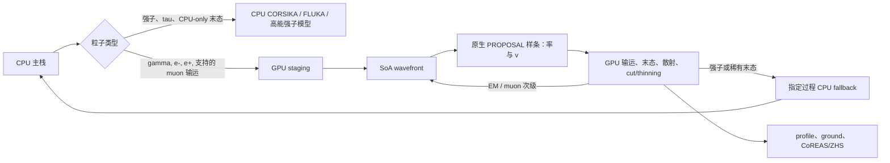
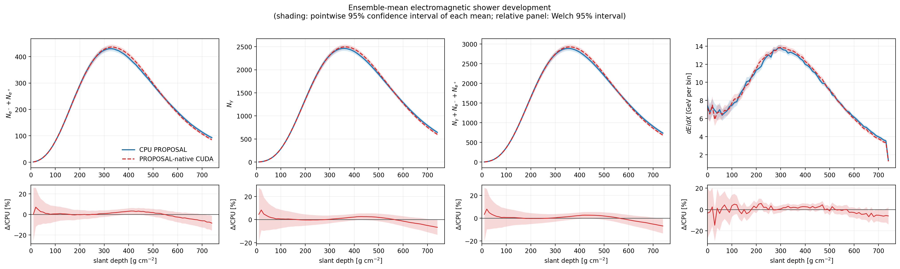
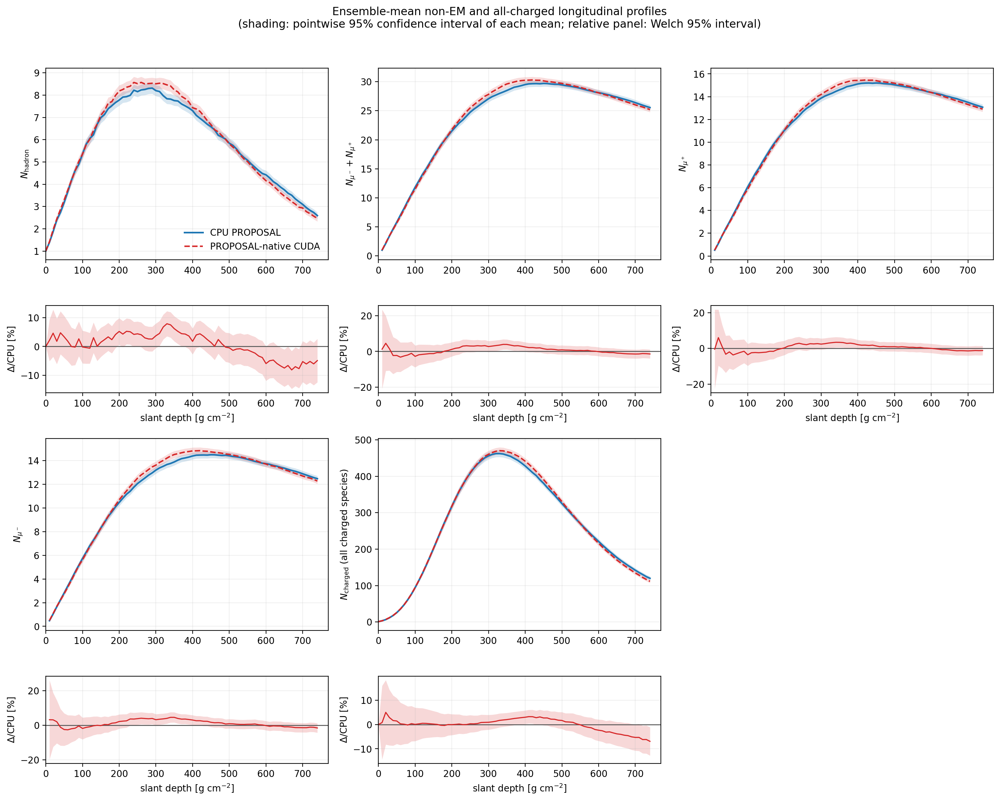
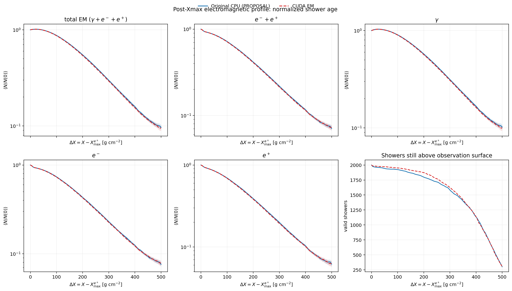
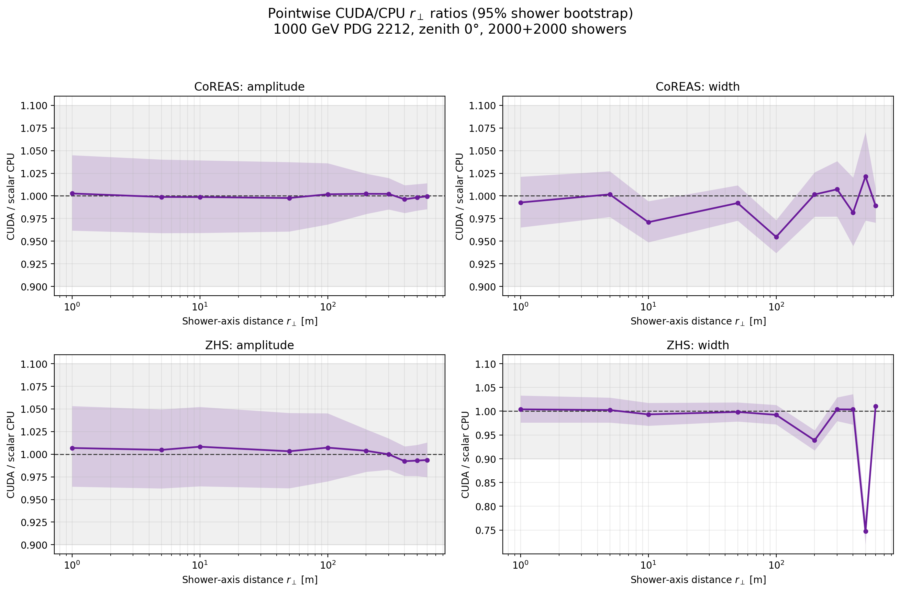
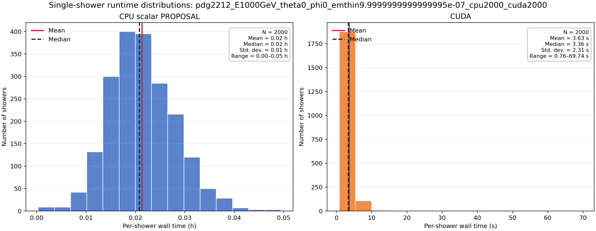

# CORSIKA 8 Beta4：PROPOSAL-native CUDA 后端

**代码审计与阶段验收汇报｜2026-08-31**

> 阅读方式：每个 `---` 之间可视为一页幻灯片。图中数据均来自实际模拟，不是示意结果。

---

## 1. 当前结论

| 问题 | 审计结论 |
|---|---|
| 是否使用了与 CPU 相同的 PROPOSAL calculator？ | **是**：直接导出当前 CORSIKA 环境已经构造的只读插值对象 |
| 是否发现漏过程、错介质或静默忽略？ | **未发现**：未知过程、介质和能区不兼容均 fail-closed |
| 过程与目标组分选择是否一致？ | **通过**：生产介质百万点测试中 5 个 PID 均为 0 错配 |
| 能否声称 CPU/GPU 逐事例完全相同？ | **不能**：随机流、调度顺序和部分数值核不同 |
| 2000 vs 2000 shower profile 是否一致？ | **主要纵向曲线通过**，均值差异位于 shower 涨落范围内 |
| 是否已达到无条件生产验收？ | **尚未**：地面 EM 尾部、$X_{\max}$ 方差和部分射电脉冲宽度仍需复核 |

**阶段判断：**主体物理架构成立，未发现会系统性删除物理通道的代码错误；
`proposal-native` 仍应保留为实验后端，当前默认生产后端继续使用 `c8emrt`。

---

## 2. 为什么增加 PROPOSAL-native

旧 `c8emrt` 路径需要把 PROPOSAL 再采样成第二套 GPU 表：

```text
PROPOSAL 插值对象 → 离线重采样 → .c8emrt → GPU
```

新路径直接复用 PROPOSAL 原生插值：

```text
CORSIKA 环境
  → InteractionModel / ContinuousProcess 构造 PROPOSAL calculator
  → 只读导出原生样条、过程身份、cut 和坐标变换
  → 规范化哈希
  → 一次上传并常驻 GPU
```

目标不是改变物理模型，而是去掉“二次制表”这一层近似和手工准备步骤。

---

## 3. CPU 与 CUDA 的共同物理来源

CPU 路径：

1. `InteractionModel` 按 CORSIKA 介质和粒子构造 PROPOSAL cross sections；
2. `SampleLoss` 用一次随机数选择过程、目标组分和能损 $v$；
3. PROPOSAL 生成末态，CORSIKA 继续 cut、thinning、输出和强子处理。

PROPOSAL-native CUDA 路径：

1. 从同一批 calculator 导出 `dN/dX`、`dE/dX`、range 和 inverse-range 样条；
2. GPU 保留 PROPOSAL 的过程顺序、组分顺序、坐标变换和累加顺序；
3. GPU 选择过程、组分和 $v$，支持的末态在设备端生成；
4. 稀有或未设备化末态携带已选定的身份返回 CPU，不重新抽过程。

**审计结果：**新路径不是根据文件名猜表，也没有重新拟合一套介质物理。

---

## 4. 混合级联架构



- GPU 采用双缓冲 SoA wavefront，每个线程推进一个粒子到最近限制；
- history-keyed Philox 随机数不依赖线程执行顺序；
- 纵向 profile、能量沉积和射电累积可驻留 GPU；
- CPU 主栈和既有强子/衰变模块保持串行语义。

---

## 5. 当前物理过程覆盖

| 粒子/过程 | 率与过程选择 | 末态/输运 |
|---|---|---|
| $\gamma\rightarrow e^-e^+$ | GPU 原生 PROPOSAL 表 | GPU |
| Compton、光电效应 | GPU 原生 PROPOSAL 表 | GPU |
| $e^\pm$ bremsstrahlung | GPU 原生 PROPOSAL 表 | GPU |
| $e^\pm$ pair production | GPU 原生 PROPOSAL 表 | GPU；条件 $\rho$ 使用辅助采样器 |
| 离散/连续 ionization | GPU 原生 PROPOSAL 表 | GPU |
| $e^+$ annihilation | GPU 原生 PROPOSAL 表 | GPU |
| Molière multiple scattering | 连续输运 | GPU 高精度实现 |
| brems/pair/epair LPM | PROPOSAL 参数导出 | GPU；指定回退可由 CPU 完成 |
| photonuclear、photoproduction、$\gamma\to\mu^+\mu^-$ | GPU 选择准确过程 | CPU 指定末态 |
| 产生强子、$\mu$、$\tau$ 的未设备化末态 | GPU 保留身份 | CPU 指定末态 |
| 强子级联与低能强子 | CPU | 既有高能模型与 FLUKA |

未知 process ID 不会自动变成普通 CPU 模式，而是直接终止当前 shower。

---

## 6. 生产安全门禁

- 上传前重新计算规范化 SHA-256，内存对象被修改时拒绝启动；
- 锁定 `PROPOSAL 7.6.2` 和 `CubicInterpolation 0.1.5`；
- 启动时检查所有路由 PID 的共同能区、transport cut 和 stochastic cut；
- 表中保留 PID、process、component、cross-section、介质及参数化身份；
- CPU fallback 必须复用 GPU 已选过程、组分和 $v$；
- 未注册的 step process、非法 PID、NaN、队列溢出和 CUDA error 均 fail-closed；
- metadata 记录表哈希、辅助缓存哈希、实际依赖版本、回退原因和反解统计。

当前 1 TeV 正式样本使用的原生表：

```text
SHA-256: 7d618286c1acf3832ac8f6a4c8219ed02b94a204eea9b0cd16775d473b9ba72f
nodes:   550000
VRAM:    78,129,000 bytes
```

---

## 7. 代码级逐过程 oracle

使用与正式 shower 完全相同的干空气组成、cut 和 calculator：

- $\gamma,e^-,e^+,\mu^-,\mu^+$ 各抽取 $10^6$ 次完整过程决策；
- 58 个原生相互作用列分别抽取 $10^6$ 个率/累计率/逆采样点；
- 连续 $dE/dX$、range 和 inverse-range 分别做百万点比较；
- 表哈希与正式 2000-event 数据完全相同。

| 指标 | 结果 |
|---|---:|
| process mismatch | `0 / 5,000,000` |
| component mismatch | `0 / 5,000,000` |
| 最大 rate 归一化误差 | $2.51\times10^{-14}$ |
| 最大 cumulative-rate 归一化误差 | $3.82\times10^{-14}$ |
| 最大 inverse-loss 相对误差 | $2.21\times10^{-12}$ |
| 最大 $dE/dX$ 相对误差 | $6.18\times10^{-16}$ |
| 最大 range / inverse-range 误差 | $3.92\times10^{-14}$ / $2.23\times10^{-13}$ |

严格门禁仍记录到 **1 个** photon Compton $v$ 超限点：

```text
1 / 5,000,000 decisions
relative difference in v = 4.57e-10
process/component mismatch = 0
```

来源是总率末位舍入改变了过程内 residual quantile，随后被逆 CDF 放大；
它不是漏过程，但高于预设 $10^{-10}$ 的严格门槛，因此当前 oracle 总状态为 **warning/fail**。

---

## 8. Shower 验收配置

正式比较使用两个独立系综：

| 参数 | CPU PROPOSAL | CUDA proposal-native |
|---|---:|---:|
| primary | proton | proton |
| energy | 1 TeV | 1 TeV |
| zenith / azimuth | $0^\circ/0^\circ$ | $0^\circ/0^\circ$ |
| events | 2000 | 2000 |
| EM thinning | $10^{-6}$ | $10^{-6}$ |
| EM cut | 0.5 MeV | 0.5 MeV |
| magnetic field | IGRF14, 2027 | IGRF14, 2027 |
| maximum weight | CLI 未指定，使用程序默认 | 相同 |

两个系综使用不同种子，因此检验的是分布一致性，不是事件一一配对。

---

## 9. 纵向 profile：主要验收通过



- 所有主要纵向 curve gate 通过；
- EM profile relative $L_1=1.53\%$，所有 active bins 通过统计门；
- $e^-+e^+$ profile integral 均值差 `+0.51%`，$z=0.55$；
- photon profile integral 均值差 `+0.35%`，$z=0.37$；
- 能量沉积总和均值差 `+0.37%`，$z=0.70$；
- 能量闭合均值差 `-0.18%`，$z=0.39$。

固定深度 profile 的整体 permutation 检验：`p=0.187`；没有发现显著均值曲线差异。

---

## 10. 非电磁组分与 shower 尾部





- hadron 与 muon profile curve gate 均通过；
- 对齐到每个 shower 的 $X_{\max}$ 后，$\Delta X=0,50,100\ \mathrm{g/cm^2}$ 的 EM 比值均与 1 相容；
- 共同覆盖区间的 EM 尾部积分差 `-0.36%`，bootstrap 95% 区间跨过 0；
- 归一化 $e^-+e^+$ 尾部积分为 `-0.75%`，出现轻微统计警告。

**需要继续检查：**charged $X_{\max}$ 标准差为 `125.8 / 114.1 g/cm²`，
Brown–Forsythe `p=0.0064`，提示 CUDA 系综的宽度偏窄。

---

## 11. 地面粒子与射电结果



通过项：

- CoREAS 与 ZHS 的地磁振幅径向曲线均与 1 相容；
- 默认分析半径上，CoREAS 振幅比约 `1.002`，ZHS 振幅检验通过；
- 固定同一批 53,550 条 $e^\pm$ 轨迹时，CUDA/CPU waveform relative $L_2$：
  CoREAS $1.14\times10^{-7}$、ZHS $1.91\times10^{-7}$。

警告项：

- ground EM weighted count 均值 `-7.14%`；
- ground EM kinetic energy 均值 `-12.61%`；
- CoREAS 10 m/100 m 和 ZHS 200 m/500 m 的部分 pulse-width 门未通过；
- 500 m 处信号弱且容易受固定窗口边界影响，但不能据此直接忽略差异。

这些警告更集中在高涨落 shower 尾部和脉冲宽度，而不是主纵向能量流或射电振幅。

---

## 12. 性能结果



1 TeV、2000 事例：

| 后端 | mean | median |
|---|---:|---:|
| scalar CPU PROPOSAL | 76.81 s | 74.92 s |
| CUDA proposal-native | 3.63 s | 3.36 s |
| 描述性时间比 | $21.2\times$ | $22.3\times$ |

CPU 与 GPU 来自不同机器，因此这里只报告生产周转时间比，不将其解释为同机硬件 benchmark。

与既有 1 TeV `c8emrt` 数据相比，proposal-native 的 median 基本相同，mean 没有出现性能回退；
同时取消了用户手工生成完整 `.c8emrt` 表的步骤。

---

## 13. 为什么相同 seed 不能得到同一棵 shower tree

CPU 与 GPU 当前追求的是同一概率分布，不是相同随机事件：

```text
CPU：顺序栈 + 全局顺序 RNG
GPU：wavefront + (seed, shower, history, step, process, draw) Philox
```

此外，下列模块为高精度重实现而非逐位复制：

- Epair 条件 $\rho$ 采样；
- GPU Molière scattering；
- GPU 数学函数与逆 CDF 迭代；
- CPU fallback 中的部分 LPM rejection draw。

因此相同 seed 会在早期产生不同轨迹，混沌级联随后迅速分叉。要验证“同一事件”，应使用
decision-tape 固定每个语义随机数、过程、$v$ 和末态 draw，而不是比较普通独立运行的 seed。

---

## 14. 当前建议与下一步

### 当前建议

- 正式生产继续默认 `--gpu-physics-source c8emrt`；
- `proposal-native` 用于验证、介质快速接入和后续优化；
- 可以声明“主要 shower profile 和射电振幅达到统计一致”，不能声明“全部 observable 已通过”。

### 进入生产前的三项优先工作

1. 对唯一 Compton $v$ 超限点做定点诊断，使选择总率与 CPU 的舍入顺序严格一致；
2. 对 ground EM 和 $X_{\max}$ 方差做独立 seed 分层、尾部稳健统计和过程归因；
3. 对 pulse width 使用更长窗口、带宽扫描和同轨迹投影，区分射电投影误差与 shower 输入差异。

**总体评价：**原生 PROPOSAL CUDA 接口已经完成从“架构原型”到“大样本可审计后端”的关键一步，
但现阶段最准确的状态是 **主体通过、少数高精度与尾部 observable 待关闭**。
