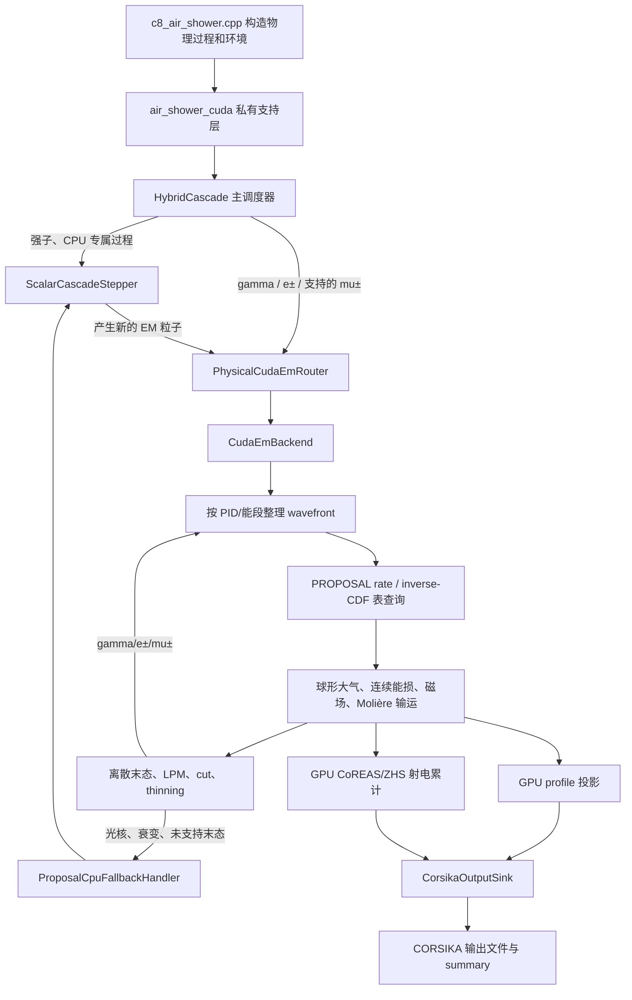

# CORSIKA 8 beta4 CUDA/GPU 模块源码导读

本文面向第一次阅读 CUDA 和 CORSIKA 8 源码的读者，解释 beta4 中 GPU 电磁输运、GPU 射电计算、PROPOSAL 制表、CPU 回退和 `HybridCascade` 调度的构建思路与代码行为。重点不是逐行翻译语法，而是回答三个问题：每个文件负责什么、数据怎样流过这些文件、为什么要这样拆分。

本文对应的源码根目录是 `corsika8_gpu_refactor_beta4/`。相对路径均以该目录为起点。

## 1. 阅读范围和推荐顺序

本文覆盖以下代码：

- `corsika/gpu/em/`：GPU 电磁模块的公共接口、设备可调用物理函数和数据结构；
- `corsika/gpu/radio/`：GPU CoREAS/ZHS 的公共接口和配置快照；
- `src/gpu/em/`：真正编译成 CUDA 内核的 `.cu` 文件，以及表格和 Molière 的主机端实现；
- `applications/` 中的 CUDA 运行入口、制表工具、replay 工具和 FLUKA worker；
- `HybridCascade`、`ScalarCascadeStepper`：CORSIKA 主栈和 GPU 队列之间的调度边界；
- `tests/gpu/`：每个测试文件究竟验证什么。

推荐第一次按下面顺序阅读：

1. `Types.hpp`：先认识 GPU 粒子和各种记录；
2. `HybridCascade.inl` 与 `PhysicalCudaEmRouter.hpp`：理解粒子怎样被送入 GPU；
3. `CudaEmBackend.hpp/.cu`：理解 GPU 后端的生命周期和 resident wavefront；
4. `CudaInteractionSelector.cu`、`CudaPhotonTransport.cu`、`CudaLeptonTransport.cu`：理解一次传播；
5. `CudaPhotonPairFinalState.cu`、`CudaBremsFinalState.cu`：理解一次反应怎样产生次级粒子；
6. `RateTable.*`、`FlatRateTable.*`、`CudaRateTable.cu`：理解 PROPOSAL 表怎样被查询；
7. `CudaProfileProjection.cu`、`CudaRadioAccumulator.cu`：理解输出怎样在 GPU 上累计。

## 2. 一张图理解整个架构



这里最重要的设计不是“把一个 CPU 函数加上 `__global__`”，而是改变调度粒度：CPU 原版一次沿深度优先栈推进一个粒子；GPU 版本收集大量同类粒子，把它们组成 wavefront，让一个 CUDA thread 负责一个粒子的当前步骤。每个 thread 只推进到最近的物理限制，然后重新分类，形成下一层 wavefront。

## 3. 构建系统为什么拆成两个库

### 3.1 `src/gpu/em/tables/CMakeLists.txt`

该文件构建纯 C++ 静态库 `CORSIKA8GpuEmTables`。它包含 YAML 介质解析、PROPOSAL 介质构造、表格序列化、扁平化和 SHA-256。这个库不要求执行 CUDA kernel，因此 `gpu_em_tablegen` 和 `gpu_em_table_prepare` 可以在没有可用 GPU 的制表节点上运行。

核心依赖是：

```cmake
target_link_libraries (
  CORSIKA8GpuEmTables
  PUBLIC PROPOSAL::PROPOSAL yaml-cpp::yaml-cpp)
```

这体现了第一层解耦：PROPOSAL 负责提供参考物理，表格库负责把参考物理变成可版本化的数据文件。

### 3.2 `src/gpu/em/CMakeLists.txt`

该文件构建真正的 CUDA 静态库 `CORSIKA8GpuEm`，把所有 `.cu` 内核和 `MoliereInterpolation.cpp` 编译在一起，并链接 `CORSIKA8GpuEmTables` 与 CUDA runtime。

```cmake
add_library(CORSIKA8GpuEm STATIC
  CudaEmBackend.cu
  CudaInteractionSelector.cu
  CudaPhotonTransport.cu
  CudaLeptonTransport.cu
  CudaRadioAccumulator.cu
  ...)
```

`CUDA_SEPARABLE_COMPILATION ON` 允许设备代码跨翻译单元链接；`CUDA_RESOLVE_DEVICE_SYMBOLS ON` 在静态库阶段解析设备符号；`CORSIKA8_WITH_CUDA=1` 则给普通 C++ 调用者提供编译期能力标志。没有使用 `--use_fast_math`，所以表查询和输运保持 double 精度路径。

### 3.3 顶层 `CMakeLists.txt` 与 `applications/CMakeLists.txt`

顶层的 `CORSIKA_ENABLE_CUDA` 决定是否启用 CUDA 语言和 GPU 库。`applications/CMakeLists.txt` 建立应用私有的 `c8_air_shower_support` 静态目标：CPU 构建只编译 CLI 支持，CUDA 构建才追加 session 实现并链接 `CORSIKA8GpuEm`。`c8_air_shower` 与 parent-profile 验证程序共享这个目标；制表工具仍只依赖 `CORSIKA8GpuEmTables`。因此 CPU 默认构建不需要 CUDA toolkit，这些应用适配代码也不会被安装成 CORSIKA 公共 API。

## 4. 最底层的数据契约

### 4.1 `corsika/gpu/em/Types.hpp`

这是整个模块最重要的文件。它定义 host 和 device 共同理解的 POD 数据结构。GPU 不能直接高效使用 CORSIKA 的带单位模板、虚函数节点和复杂栈迭代器，所以在 CPU/GPU 边界把粒子转换成固定单位的平坦结构：

```cpp
struct alignas(16) EmParticleState {
  std::int32_t pid;
  std::int32_t medium_id;
  std::uint32_t generation;
  double energy_GeV;
  double position_m[3];
  double direction[3];
  double time_s;
  double weight;
  std::uint64_t history_id;
  std::uint64_t parent_history_id;
  std::uint64_t step_id;
};
```

固定单位为 GeV、m、s、g/cm²、Tesla。`history_id` 标识一条物理历史，`step_id` 标识这条历史的当前步骤；它们不只是输出标签，也是确定性随机数的输入。

这个文件还定义四类重要记录：

- `EmInteractionRecord`：已经抽到的过程、靶组分、相互作用 grammage、随机数键和能损分数；
- `PhotonTransportRecord` / `LeptonTransportRecord`：从起点到最近限制的一段传播；
- `ProposalFallbackEvent`：GPU 不能完成但物理身份已经确定的事件；
- `PhotonFinalStateRecord` / `BremsFinalStateRecord`：反应末态、次级粒子区间和 thinning 决策。

`EnvironmentSnapshot` 保存五层球形大气、磁场和真实观测平面。`GpuEmConfig` 是初始化期配置，`GpuEmShowerConfig` 是每个 shower 改变的 seed、shower ID、thinning 和定点累计范围。`GpuEmStatistics` 汇总 wavefront、fallback、内核时间、显存、profile 和 radio 统计。

文件结尾的大量 `static_assert(std::is_trivially_copyable_v<...>)` 是 ABI 门禁：如果后来有人给结构加入 `std::vector`、虚函数或非平凡构造，它就不能再安全地 `cudaMemcpy`，编译会直接失败。

### 4.2 `corsika/gpu/em/Philox.hpp`

该文件实现 Random123 Philox4x32-10 的无状态随机数接口。传统 RNG 保存“当前状态”，线程执行顺序变化会改变后续 shower；Philox 根据身份键直接计算随机数：

```cpp
RandomNumberKey{
  seed, shower_id, history_id, step_id,
  process_id, draw_id
};
```

`randomWords()` 把 history/step 放进 counter，把 seed/shower/process 混合成 key；`uniformOpen()` 把 32 位整数映射到开区间附近的均匀数。这样同一粒子的某个物理抽样不依赖它排在 batch 的第几个位置，也不依赖 CUDA block 的调度顺序。

### 4.3 `corsika/gpu/em/ProcessCapabilities.hpp`

这个文件是“哪种末态由谁计算”的唯一能力映射。它复制 PROPOSAL 7.6.2 的过程 ID，避免 nvcc 包含 PROPOSAL 的 host-only 头文件。

- photon pair、Compton、photoelectric：GPU 末态；
- e± brems、ionization、annihilation、electron-pair production：GPU 末态；
- μ± 可在 GPU 上传播和电离，但 brems/epair 的复杂末态仍由指定 CPU PROPOSAL 生成；
- photonuclear、photoproduction、衰变和产生强子/μ/τ 的稀有过程：CPU 末态。

`gpuProcessCapability(pid, process_id)` 返回枚举而不是一个简单布尔值，是为了区分“有意的 CPU-only 物理”与“本应支持却缺失的实现”。后者在严格模式下应当报错。

### 4.4 `corsika/gpu/em/ProposalFallback.hpp`

这里把表查询错误映射为可审计的 `ProposalFallbackReason`，并构造带完整身份的 fallback 事件。关键原则是：如果 GPU 已经选中了过程、靶核和 (v)，CPU 只能生成这个指定末态，不能重新抽一次过程。

### 4.5 `corsika/gpu/em/ProposalFallbackAdapter.hpp`

这是设备记录到 PROPOSAL C++ API 的适配层。它验证 PID、medium hash、interaction hash、component hash、quantile 和随机数键，然后创建 `ProposalInteractionRecord`，最后调用“指定末态”接口。`makeFallbackRandomNumbers()` 仍使用 history-keyed Philox 生成 PROPOSAL 所需的末态随机数，因此 CPU fallback 不依赖到达顺序。

### 4.6 `corsika/gpu/em/RouterParticleConversion.hpp`

负责 CORSIKA 栈粒子与 `EmParticleState` 双向转换：读取 PID、总能量、位置、方向、时间、权重和 history；返回 CPU 栈时恢复带单位的 CORSIKA 量。模板 traits `HasGetWeight`/`HasSetWeight` 允许没有 thinning 权重接口的栈仍能编译。

## 5. CPU 主栈与 GPU 队列如何连接

### 5.1 `corsika/framework/core/ScalarCascadeStepper.hpp`

该头文件从原 `Cascade` 中抽出“推进一个粒子一步”的接口。`advance(particle)` 的结果是完成，或某个强子末态被延迟给 worker。它保留 `forceInteraction()`、`forceDecay()` 和详细 CPU 阶段计时。

### 5.2 `corsika/detail/framework/core/ScalarCascadeStepper.inl`

这里保存原版标量输运的核心算法：计算总截面，指数抽取相互作用 grammage，抽取衰变时间，向 tracking 查询几何边界，取得连续过程步长，然后选择最短限制：

```cpp
auto min_discrete = std::min(distance_interact, distance_decay);
auto min_non_continuous = std::min(min_discrete, geomMaxLength);
auto min_distance = std::min(min_non_continuous, continuous_max_dist);
```

随后构造 `Step`，依次调用 `doContinuous()`、边界/相互作用/衰变和 `doSecondaries()`。CUDA 路径的输运顺序和竞争关系必须以这个文件为标尺，而不是仅让最终能量“看起来差不多”。

### 5.3 `corsika/framework/core/HybridCascade.hpp`

该头文件声明混合调度器。它同时持有：

- 原 CORSIKA stack；
- `CpuOnlyWavefrontScheduler`；
- `ScalarCascadeStepper`；
- `TEmRouter`；
- 可选的强子进程池与延迟队列；
- `HybridCascadeTimingStatistics`。

模板化 router 让 CPU-only 构建仍可用 `DisabledHybridEmRouter`，不会让基础 Cascade 强依赖 CUDA 类型。

### 5.4 `corsika/detail/framework/core/HybridCascade.inl`

`run()` 是全局状态机。每次从 CPU scheduler 取出粒子后：

1. 先处理一次性的强制初级相互作用/衰变；
2. 询问 `em_router_->canRoute()`；
3. 可路由则调用 `stage()`、从 CPU stack 擦除并推进 GPU；
4. 不可路由则调用 `ScalarCascadeStepper::advance()`；
5. GPU/CPU 产生的新粒子重新进入相应队列；
6. 所有离散队列排空后才执行 cascade equations。

`readyForScalarInterleave()` 允许 GPU front 在 CPU 栈尚未完全排空时启动，降低“CPU 一直生产而 GPU 等待”的问题。强制初级动作故意先走标量路径，避免一个立即可路由的 gamma/e/μ 绕过用户请求的 `forceInteraction()` 或 `forceDecay()`。

### 5.5 `corsika/framework/core/CpuOnlyWavefrontScheduler.hpp`

这是对原 stack 的兼容调度封装，不把 stack 改造成并发容器。它管理 acquire/complete、step ID 和临时挂起的强子粒子。GPU 使用自己的设备队列，因此 CPU 栈仍保持 CORSIKA 原有所有权语义。

### 5.6 `corsika/gpu/em/PhysicalCudaEmRouter.hpp`

这是最关键的 host 适配器。它不做大量数值物理，而是负责路由和所有权：

- `canRoute()` 检查 PID、表能区、环境、强制 CPU 步骤和已有 fallback 标记；
- `stage()` 把 CORSIKA 粒子转换为 POD 并加入 host staging；
- `advanceOneWavefrontAndReturn()` 把 photon/lepton 分组，调用 backend resident cascade；
- GPU 生成的同类 EM 次级继续驻留或重新 staging；
- CPU-only 末态进入延迟 fallback 队列；
- 观测面记录、step、profile 和 radio 记录交给 output sink；
- `endOfShower()` 排空队列并下载最终 profile/radio。

这里采用“先排空有效 GPU 工作，再批量处理 deferred fallback”的策略。也就是说，氩等稀有靶或光核末态不会在每次出现时立即切碎当前 wavefront。`cpu_fallback_steps_`、`forced_decay_steps_` 和 `cpu_memory_spill_steps_` 防止同一个 history/step 被重复处理。

### 5.7 `corsika/gpu/em/ToyCudaEmRouter.hpp`

这是早期基础设施验证适配器，仅连接 toy branching kernel，不代表生产物理。它保留的价值是用最简单的“一变零/一/二粒子”模型验证队列增长、history 分配和 HybridCascade 路由。

## 6. GPU 后端总控

### 6.1 `corsika/gpu/em/CudaEmBackend.hpp`

这是稳定的公共 API。PImpl 隐藏 CUDA runtime、device pointer、stream 和 CUB 临时空间，使调用者只看到普通 C++ 类型。

生产生命周期是：

```cpp
CudaEmBackend backend;
backend.initialize(environment, table_descriptor, config);
backend.beginShower(shower_config); // 复用同一后端时
backend.enqueue(particle);
auto result = backend.advanceWavefront();
backend.drain();
```

头文件还暴露 resident photon/lepton cascade 和若干 `ForValidation` 接口。后者上传小批 AoS、执行某一个阶段再下载完整记录，方便测试；生产路径则尽量不下载中间数组。

### 6.2 `src/gpu/em/CudaEmBackend.cu`

这是设备后端的总装文件，也是最大的实现文件。`CudaEmBackend::Impl` 管理：

- CUDA device、内存预算和 device properties；
- PROPOSAL 扁平表、Molière 表、profile/radio 常驻数据；
- photon/lepton 跨物种 resident 队列；
- 双 workspace、CUDA stream/event 和 staging 缓冲；
- 每 shower 重置与跨 shower 复用；
- 所有统计量和 hard-fail 检查。

初始化时它读取 `.c8emrt`，检查格式、内容 SHA-256、PROPOSAL 版本、介质、cut、能区和误差，再上传 `CudaRateTable`。`memory_fraction` 不是立即分配这么多显存，而是用可用显存乘比例得到硬预算，再为 resident queue、workspace、profile、radio 按需增长。

生产的两个核心循环是 resident photon cascade 和 resident lepton cascade。每轮大致做：

1. 对 front 分桶并选择相互作用；
2. 输运到最近限制；
3. 在顶点重新选择需要重选的带电过程；
4. 生成末态；
5. 直接把同物种 continuation 写入下一设备队列；
6. 把跨物种次级写入 pending photon/lepton 队列；
7. 异步累计 profile/radio；
8. 只下载 observation、fallback 和必要 checkpoint。

`ensureCapacity()` 采用增长式预分配；`DeviceWorkspace` 避免 shower 中频繁 `cudaMalloc`。若预算不能容纳全 front，代码明确 checkpoint/spill 并记录统计，而不是越界或静默丢粒子。

### 6.3 `corsika/gpu/em/detail/DeviceWorkspace.hpp`

这是一个线性显存 arena。调用者先用 `WorkspaceSize` 按类型和对齐计算字节数，再 `prepare()` 扩容，最后通过 `acquire<T>(count)` 顺序切片。每轮只重置 offset，不释放显存。`highWaterBytes()` 提供峰值诊断，超过配置上限立即抛异常。

### 6.4 `corsika/gpu/em/detail/DeviceBatchStages.hpp`

定义内核之间传递的 device-only 视图：interaction selection、transport、vertex selection、final-state summary、endpoint 分类、跨物种 secondary sink 等。它的作用类似 GPU pipeline 的“接线板”：所有数组都只是 pointer+count，不拥有内存，实际内存来自 `DeviceWorkspace`。

### 6.5 `corsika/gpu/em/detail/DeviceWavefrontBucketing.hpp`

定义分桶输入输出视图和验证结果。实际排序在 `CudaWavefrontBucketing.cu` 中完成。

## 7. 表格系统：从 PROPOSAL 对象到 GPU 数组

### 7.1 `corsika/gpu/em/tables/MediumConfig.hpp`

定义 YAML 介质 schema：介质名、PROPOSAL 电离参数、参考密度和每个核组分的 PID、(Z)、摩尔质量、数目比例。公开 `loadMediumConfig()`、规范化、规范 YAML 和介质 SHA-256。

### 7.2 `src/gpu/em/tables/MediumConfig.cpp`

实现严格 YAML 解析。未知字段、缺字段、非有限数、重复核、比例和不为 1 都会失败。组分按稳定键排序后再序列化，因此同一个物理介质即使 YAML 原始顺序不同，也得到相同规范哈希。写缓存时采用临时文件加 rename，避免半写文件被当成有效介质。

### 7.3 `corsika/gpu/em/tables/ProposalMedium.hpp` 与 `ProposalMedium.cpp`

把规范化 `MediumConfig` 转成 PROPOSAL `Medium` 和 `Component` 对象，并检查 PROPOSAL 计算出的 component hash 与 CORSIKA PID 映射。它是“用户 YAML”到“PROPOSAL 参考物理”的唯一转换点。

### 7.4 `corsika/gpu/em/tables/RateTable.hpp`

定义富语义、host-owned 的表格模型：

- `RateTableMetadata`：版本、介质、cut、能区、误差、LPM/Molière 参数；
- `ParticleRateTable`：某个 PID 的公共能量网格和过程列；
- `RateColumn`：`process_id × component_hash` 的 (dN/dX)；
- `InverseCdfTable`：二维 (v(E,u))；
- `ContinuousEnergyTable`：range、inverse range、连续能损；
- `EpairRhoInverseCdfTable`：可选的三维 Epair 末态表。

`validateCompatibility()` 是运行前物理门禁，检查的不是“文件能否打开”，而是它是否适用于当前 PROPOSAL 版本、介质、cut、能区和容差。

### 7.5 `src/gpu/em/tables/RateTable.cpp`

实现插值、严格验证和 `.c8emrt` 二进制格式。文件采用 envelope + payload + SHA-256：读取时先检查 magic/version/长度，再校验 payload hash，最后验证所有网格单调性、列长度、非负率、inverse-CDF 和 metadata。写入后可重新编码得到相同内容哈希。

这里的 host 插值函数同时是 GPU 插值的参考 oracle：rate 通常在 log-energy/log-rate 空间插值，loss 对 energy 和 quantile 使用与表 metadata 一致的坐标变换。

### 7.6 `corsika/gpu/em/tables/FlatRateTable.hpp`

富语义 C++ 表含有 `std::vector` 和字符串，不能直接复制到 GPU。该文件定义 `FlatRateTable` 所有权对象与 `FlatRateTableView` 指针视图，把嵌套结构压成连续数组和 offset。

大量 `__host__ __device__` 查询函数直接放在头文件中，包括：

- 查找 particle/column；
- rate 插值；
- inverse-CDF 查询；
- continuous range 与 inverse range；
- Epair rho 查询。

每次查询返回 `TableLookupStatus`，设备代码不会用 C++ exception；失败被转换成显式 fallback 或 hard error。

### 7.7 `src/gpu/em/tables/FlatRateTable.cpp`

实现 `flattenRateTable()` 和 host 端完整验证。它计算所有 offset，把 strings 留在 host metadata，把数值数组拼接成可上传布局，并保证每个 offset/count 不超过 32 位设备索引上限。

### 7.8 `corsika/gpu/em/tables/CudaRateTable.hpp` 与 `src/gpu/em/CudaRateTable.cu`

`CudaRateTable` 拥有上传后的 device arrays，并返回只含设备指针的 `FlatRateTableView`。初始化时一次性分配和复制；`queryForValidation()` 启动小 kernel，将 GPU 查询结果与 host oracle 比较。生产内核直接接收 `deviceView()`，不经过虚函数或 PROPOSAL 对象。

### 7.9 `corsika/gpu/em/tables/Sha256.hpp` 与 `Sha256.cpp`

提供独立 SHA-256 和 hex 编码，不依赖系统命令。它同时用于介质规范哈希、制表请求哈希和二进制内容哈希，保证“介质相同”“制表参数相同”“文件内容未损坏”是三个不同且可验证的概念。

## 8. 相互作用选择与传播内核

### 8.1 `corsika/gpu/em/CudaInteractionSelector.hpp`

声明随机数 process ID/draw ID 和验证桥。距离、过程列、loss quantile 使用不同键，防止以后某个过程多抽一个数导致其他过程随机流整体偏移。

### 8.2 `src/gpu/em/CudaInteractionSelector.cu`

`selectDiscreteInteractionsKernel` 对每个粒子：

1. 查询所有有效列的总 rate；
2. 用 (X=-\ln u/\lambda) 抽相互作用 grammage；
3. 用第二个均匀数在累计 rate 中选择 `process_id × component_hash`；
4. 用第三个数查询 inverse-CDF 得到 (v)；
5. 写 `EmInteractionRecord` 或 `ProposalFallbackEvent`。

随后用 CUB scan/compaction 稳定地分离成功记录与 fallback。稳定的含义是输出保持输入相对次序，而不是由 atomic append 的先后决定。

### 8.3 `corsika/gpu/em/CudaPhotonTransport.hpp`

声明 photon 一步输运的验证接口。输入已经带有抽好的相互作用 grammage，输出恰好是一条 transport record 或显式 fallback。

### 8.4 `src/gpu/em/CudaPhotonTransport.cu`

光子不受磁场偏转，也没有连续电离损失。kernel 比较：离散相互作用位置、大气层边界、观测平面和逃逸边界，推进到最近者，更新位置/时间/层号/step ID。到 layer boundary 后保留粒子并在新层重新抽 grammage；到 observation/escape/cut 后产生终止记录。

### 8.5 `corsika/gpu/em/CudaLeptonTransport.hpp`

声明 e±/μ± 直线验证输运，并固定 Molière 与 μ 衰变随机数 ID。生产路径使用更完整的 fused pipeline，这个接口主要用于逐阶段 CPU/GPU 比较。

### 8.6 `src/gpu/em/CudaLeptonTransport.cu`

带电轻子需要同时竞争更多限制：

- 抽样离散相互作用；
- 连续能损最大 grammage；
- 大气层边界和观测平面；
- 最大磁偏转步长；
- μ 衰变距离；
- particle cut 和 10 ms 物理时间 cut。

kernel 用 continuous range 表把 grammage 转成末能量，累计沉积能量，然后调用 Molière 和均匀磁场函数更新方向/弦长。若连续能损改变了顶点能量，记录状态设为 `RequiresReselection`，不能沿用步前各过程的相对 rate。

### 8.7 `corsika/gpu/em/CudaLeptonVertexSelector.hpp`

声明顶点重选。关键物理细节是：标量路径先在步前总 rate 范围内抽一个 threshold，连续能损后若顶点总 rate 已低于这个 threshold，本次应成为 no-interaction continuation，而不是强行归一化后选一个过程。

### 8.8 `src/gpu/em/CudaLeptonVertexSelector.cu`

实现上述顶点 rate 重算、过程/组分重选和 (v) 查询，然后稳定分为 interaction、continuation、fallback 三类。

### 8.9 `corsika/gpu/em/CudaPhotonSelectionTransport.hpp`

定义 photon fused pipeline 的 host 可见结果。`selectAndTransport...` 把 selection 和 transport 连起来；`runPhotonDevicePipeline...` 进一步连接 final state。中间 interaction 数组不下载回 host。

### 8.10 `src/gpu/em/CudaPhotonSelectionTransport.cu`

实现 photon pipeline 的设备接线和 endpoint 分类。它把 boundary continuation、LPM 抑制后 photon、Compton photon、observation、fallback 分散到各自稳定数组。CUB scan 先计算 offset，再由线程写入确定位置，避免全局 atomic push 造成非确定顺序。

### 8.11 `corsika/gpu/em/CudaLeptonSelectionTransport.hpp`

定义完整 charged-lepton wavefront 结果：transport records、vertex interaction、末态、next leptons、generated photons、observation、decay candidates 和分阶段 fallback。

### 8.12 `src/gpu/em/CudaLeptonSelectionTransport.cu`

把 selection → continuous/magnetic transport → vertex reselection → final-state → endpoint classification 串在一个 device pipeline 中。它还把 e± 产生的 photon 直接写入跨物种设备队列，从而减少 host 同步与 PCIe round trip。

### 8.13 `corsika/gpu/em/detail/DeviceBatchStages.hpp`

该文件与上述两个 fused `.cu` 文件共同定义每个阶段的 pointer/count 视图。修改 pipeline 时应先在这里明确“谁拥有数组、谁写 count、下个 kernel 读什么”，再改 kernel；否则最容易出现粒子被重复入队或遗漏。

## 9. 离散末态、LPM 和 thinning

### 9.1 `corsika/gpu/em/PhotonPairFinalState.hpp`

提供 photon pair 的 Koch–Motz/Sauter 接受拒绝采样函数，可同时在 host/device 编译。它根据靶核 (Z)、光子能量和候选随机数计算能量分裂权重，并返回明确 status；最大尝试次数由 CUDA wrapper 控制。

### 9.2 `corsika/gpu/em/PhotonPairKinematics.hpp`

把能量分裂和极角/方位角转换为 e−/e+ 的三维方向，负责动量学而不负责抽取过程。把“截面采样”和“几何运动学”分开便于单独做能量动量守恒测试。

### 9.3 `corsika/gpu/em/PhotonPairLpm.hpp`

实现 photon pair 的 LPM 存活概率。`PhotonPairLpmSnapshot` 保存介质常数和每个 N/O/Ar 组分参数；设备函数根据顶点密度、能量分裂和 component hash 返回 probability/status。

### 9.4 `corsika/gpu/em/CudaPhotonPairFinalState.hpp`

规定 pair、Compton、photoelectric 的 draw ID，并声明批量末态接口。固定 draw ID 是 replay 和跨调度确定性的组成部分。

### 9.5 `src/gpu/em/CudaPhotonPairFinalState.cu`

两个主要 kernel 分工：

- `classifyPhotonPairFinalStatesKernel`：判断能力、LPM 接受、末态是否有效、thinning 后需要几个孩子；
- `writePhotonPairFinalStatesKernel`：根据 scan 得到的 offset 写 e−/e+、Compton photon/electron 或 photoelectric electron。

它还捕获 generation-zero projectile 的未薄化首相互作用快照，以复刻标量 `InteractionWriter` 位于 thinning 之前的语义。

### 9.6 `corsika/gpu/em/BremsLpm.hpp`

实现 e±/μ± brems 的 LPM 概率。`prepareBremsLpmSnapshotForCuda()` 会把只依赖介质的量预计算，减少每个 thread 重复的昂贵函数。

### 9.7 `corsika/gpu/em/EpairLpm.hpp`

实现 charged-lepton electron-pair production 的 LPM 抑制，输入 (E,v,\rho,Z) 和介质参数，输出概率或明确错误状态。

### 9.8 `corsika/gpu/em/EpairFinalState.hpp`

这是 KKP Epair 末态的 host/device 数学实现，包含 differential weight、rho 接受拒绝采样、角度和三粒子末态构造。文件较长是因为把 PROPOSAL 参数化所需数学函数移成无虚函数、无动态分配的设备代码。任何 envelope 超界都返回 `EpairRejectionEnvelopeExceeded`，不能静默截断概率。

### 9.9 `corsika/gpu/em/CudaBremsFinalState.hpp`

规定 brems、annihilation、ionization、Epair 各自的 draw ID，并声明统一 charged-lepton final-state 接口。

### 9.10 `src/gpu/em/CudaBremsFinalState.cu`

统一实现四类末态：

- brems：保留轻子并产生 photon，之后做 Brems LPM；
- positron annihilation：产生两个 photon；
- discrete ionization：保留主轻子并产生 delta electron；
- electron-pair production：保留主轻子并产生 e−/e+，之后做 Epair LPM。

`classify...` 先确定 child count 和 fallback，CUB exclusive scan 分配 `secondary_offset`，`write...` 再写次级。这样不同过程有 2 或 3 个孩子时仍能一次准确分配连续数组。

### 9.11 `corsika/gpu/em/EmThinning.hpp`

实现与 CORSIKA EM thinning 对齐的 host/device 函数。输入父能量、两个子能量、权重与随机数，返回 keep mask 和新权重；既支持 Hillas 必保规则，也支持统计保留与 maximum weight 限制。它作为纯函数被 photon 和 lepton 末态内核共同调用。

## 10. 大气、观测平面、磁场与多重散射

### 10.1 `corsika/gpu/em/EnvironmentSnapshotBuilder.hpp`

从 CORSIKA 环境构造五层设备快照。它把层边界半径、指数/均匀密度参数、medium ID、地心、磁场和独立观测平面转成固定单位，并立即调用环境验证函数。构造失败应在 shower 启动前暴露，而不是让 kernel 读坏参数。

### 10.2 `corsika/gpu/em/SphericalAtmosphere.hpp`

纯 host/device 球形大气数学：

- 查当前层和局部密度；
- 射线与球面边界求交；
- 沿弦积分 grammage；
- 给定 grammage 反求弦长；
- 判断逃逸和边界方向。

指数密度沿一般斜弦没有简单闭式解，代码采用受控数值积分/反演，并返回 `AtmosphereStatus`。kernel 收到失败状态后生成可诊断 fallback。

### 10.3 `corsika/gpu/em/ObservationPlane.hpp`

实现直线与真实局部观测平面求交。beta4 不再用“观测半径球面”替代 CPU 的平面，因此高倾角事件也使用相同终止几何。平行、背向和超出当前 step 的求交都返回明确状态。

### 10.4 `corsika/gpu/em/UniformMagneticField.hpp`

实现均匀磁场中的带电轨迹、最大偏转步长和曲线与球面/平面的交点。轨迹用有界 leapfrog/弦近似推进，同时保留 gyroradius、bend parameter、chord length 诊断。磁场为零时退化为直线，避免数值除零。

### 10.5 `corsika/gpu/em/MoliereScattering.hpp`

实现 Molière 多重散射的物理数学、Newton 求解、角度分布和方向旋转。`MoliereSnapshot` 来自表 metadata；`MoliereInterpolationView` 提供预计算初值/累计分布，减少每步迭代。状态和 iteration count 被写进 transport record，既可统计性能也可定位异常尾部。

### 10.6 `src/gpu/em/MoliereInterpolation.cpp`

在 host 上构建并缓存 Molière 插值表。它求解 (B) 参数、计算分布积分和 cubic polynomial，再写版本化 cache。cache header 含源参数身份；损坏或不匹配时重建。这个文件用 C++ 而不是 `.cu`，因为它是初始化期工作，不需要每个 shower 在 GPU 上重复计算。

## 11. Wavefront 分桶、profile 与输出

### 11.1 `src/gpu/em/CudaWavefrontBucketing.cu`

为每个粒子生成由 PID、medium 和 energy bin 组成的 64 位 key，用 CUB radix sort 稳定排序，再 gather 成连续 batch。同类粒子相邻能减少一个 warp 内的过程分支和表访问离散性。小 batch 会单独计数，帮助判断 GPU occupancy 不足究竟来自物理 front 太小还是调度切碎。

### 11.2 `corsika/gpu/em/detail/ProfileProjection.hpp`

定义 GPU profile 的定点直方图布局、投影参数和计数器。`DeviceProfileAccumulator` 包含多个粒子组分、能量沉积和溢出计数的设备指针。

### 11.3 `src/gpu/em/CudaProfileProjection.cu`

把 transport step 投影到与 CPU `ShowerAxis` 相同的 slant-depth bin，累计 photon、e−、e+、μ−、μ+、muon-parent production 和能量沉积。生产模式使用 checked 64 位定点原子加法：整数加法与线程顺序无关，最后统一乘 scale 转回 double。超出预留范围会增加 overflow 计数，并使 shower 失败，而不是允许整数回绕。

### 11.4 `corsika/gpu/em/CorsikaOutputSink.hpp`

这是 GPU 记录到现有 CORSIKA writer 的适配器：

- `onStep()`/`onProjectedStep()` 更新 energy-loss 和 longitudinal writer；
- `onGpuProfile()` 合并最终设备直方图；
- `onRadioTrack()` 在 CPU radio 模式下把轨迹交给原 CoREAS/ZHS；
- `onGpuRadioWaveforms()` 把 GPU 波形并入 observer；
- `onObservation()` 写 ground/observation 输出；
- `onFirstInteraction()` 恢复未薄化首相互作用 writer 语义。

它还负责单位恢复和记录合法性检查，是 GPU POD 世界回到 CORSIKA 对象世界的输出边界。

### 11.5 `corsika/gpu/em/GpuEmRunOutput.hpp`

实现 CORSIKA `BaseOutput`，把 GPU 配置和 summary 写入输出系统。它按 shower 保存后端统计，并在 library 结束时关闭。运行时性能、fallback 次数和表格身份最终通过这个对象进入可追溯 metadata。

## 12. GPU CoREAS/ZHS 射电模块

### 12.1 `corsika/gpu/radio/Types.hpp`

定义 observer、折射率传播表、GPU radio 配置、波形和统计。CoREAS 数组存电场；ZHS 数组存 vector potential，结束时仍由原 `RadioProcess::endOfShower()` 做相同有限差分。

`GpuRadioConfig::deterministic` 默认开启定点累计。`fixed_point_field_limit_V_per_m` 决定动态范围，溢出是 hard error。

### 12.2 `corsika/gpu/radio/RadioSnapshotBuilder.hpp`

从现有 detector observer 和 `TabulatedFlatAtmospherePropagator` 对应环境构造设备快照。它保留原实现的最近 bin 查找、矩形积分和端点外推，不另造一套折射率模型；这是同轨迹 CPU/GPU 射电一致性的基础。

### 12.3 `corsika/gpu/radio/CudaRadioAccumulator.hpp`

公开 GPU 射电累加器的生命周期。它可直接消费 device-resident lepton transport records，也可从 host 轨迹输入用于验证；支持输入 slot、drain、download 和跨 shower reset。

### 12.4 `src/gpu/em/CudaRadioAccumulator.cu`

该文件包含实际 CoREAS/ZHS 设备算法：

- `precomputeRadioTracksKernel()` 对每条 e± step 只调用一次
  `makeRadioTrackKinematics()`，得到位置、时间、β、长度和 charge×weight；
- `propagate()` 查询折射率和积分折射率，计算到 observer 的传播时间；
- `accumulateCoREAS()` 写端点形式的电场贡献，并保留近 Cherenkov 奇点处的标量近似分支；
- `accumulateZHS()` 根据 Fraunhofer 条件细分轨迹，累计 vector potential；
- `coreasZhsTiledKernel` 用 `8 tracks × 32 observers` 二维 tile，在 shared memory
  中复用预计算 track 和 observer，并在一次遍历中同时算两种算法；
- `addFixedPoint()` 使用 checked integer atomic，保证调度顺序不改变累计结果。

每个 thread 的基本工作单位仍是一个有效的“轨迹段 × observer”组合，但与 observer
无关的运动学量不会在每个天线线程中重复计算。每个双缓冲输入槽拥有独立、受统一
显存预算约束的预计算 workspace。波形留在显存中，shower 末尾才下载，因此不会
为每条 e± 轨迹产生 PCIe 往返。

## 13. CPU fallback 和兼容性门禁

### 13.1 `corsika/gpu/em/ProposalCpuFallbackHandler.hpp`

该模板把 `ProposalFallbackEvent` 恢复为临时 CORSIKA stack particle，调用指定交互/指定末态适配器，再把生成的 EM 次级送回 router、其他粒子送入主 stack。它累计按 reason/process 的 fallback 统计，并拒绝缺少指定过程身份的“模糊回退”。

### 13.2 `corsika/gpu/em/ProcessSequenceCompatibility.hpp`

GPU 绕过了标量 `ProcessSequence::doContinuous/doSecondaries`，所以自定义过程可能被意外跳过。这个文件通过模板递归遍历 `ProcessSequence` 和 `SwitchProcessSequence`，要求每个过程登记一种策略：

- `ReplacedOnDevice`：已在 GPU 重写；
- `ReplayedFromDeviceRecord`：根据 GPU 记录在 host 重放；
- `DeferredToCpu`：明确回 CPU；
- `InapplicableToRoutedEm`：对路由 EM 粒子无效；
- `DiagnosticOnly`：只观察，不改变物理。

有未登记的 continuous、secondaries、interaction、decay、boundary 或 stack process 时，CUDA 模式启动失败。这比“能跑起来但少了一个用户过程”安全得多。

### 13.3 `corsika/gpu/em/CudaDecisionReplayVerifier.hpp` 与 `src/gpu/em/CudaDecisionReplayVerifier.cu`

头文件定义 replay 检查报告，包括 host/device 顺序哈希、非法方向、负能量、逆时间、超光速诊断和加权轨迹长度。`.cu` 文件的 `verifyReplayKernel` 让 GPU 逐条读取 CPU tape，重新计算字节哈希和物理合法性；host 汇总结果后检查设备是否消费了完全相同的记录。这个模块验证的是数据通路与同轨迹数值行为，不参与正常 shower 的过程抽样。

## 14. 应用和工具文件

### 14.1 `applications/c8_air_shower.cpp`

这是所有模块的高层装配入口。重构后它主要保留 CLI 入口、大气和初级粒子、
PROPOSAL/FLUKA/高能强子模型、CoREAS/ZHS、原有 `ProcessSequence` 顺序、标量
`Cascade` 分支，以及一次清晰的 `runCudaAirShower(...)` 调用。CUDA 实现细节放在
`applications/detail/air_shower_cuda/`，它们是应用私有支持层，不属于公共 API：

- `GpuCliOptions.hpp/.cpp`：按原有顺序注册 GPU、射电和强子调度参数，并执行解析后的兼容性门禁；
- `CudaRunSession.hpp/.cpp`：读取并验证 `.c8emrt`、查询设备与依赖版本、创建运行级 metadata，并持有跨 shower 复用的 backend；
- `CudaAirShowerRunner.hpp`：从主文件已经构造好的物理模型建立 snapshot、registry、fallback、router 和 `HybridCascade`；
- `CudaEventConfig`：把单 shower 的 seed、能量、cut、thinning、初级粒子与最大磁偏转作为显式只读输入；
- `CudaShowerReportBuilder`：保持原 YAML 字段、层级和插入顺序，集中生成计数器、fallback、射电、显存、计时与能量闭合报告。

主文件现在只看见高层调用：

```cpp
CudaEventConfig cuda_event{/* 本 shower 的值 */};
runCudaAirShower(cuda_session, gpu_cli, cuda_event,
                 env, rootCS, /* 已构造的模型、writer 和 sequence */);
```

而 `CudaAirShowerRunner.hpp` 内部仍按原顺序建立 `PhysicalCudaEmRouter` 和
`HybridCascade`。这次拆分只移动接线与报告语句，没有修改 kernel、物理公式、
随机流、过程顺序或输出 schema。应用层继续决定使用什么物理过程；
router/backend 只实现已经声明的设备能力，不在内部偷偷替换用户配置。

### 14.2 `applications/gpu_em_table_prepare.cpp`

这是推荐给用户的“介质 YAML → 自动查找/生成表”工具。它：

- 规范化 medium 并计算 medium hash；
- 根据主能量、margin、cut、容差、是否含 μ 等生成规范 request；
- 计算 request hash，规划 content-addressed 路径；
- 扫描同介质目录，优先复用能区足够且误差更好的兼容表；
- 用文件锁防止多个进程重复制同一张表；
- cache miss 时启动 `gpu_em_tablegen`；
- 读回、完整兼容性检查并写 manifest。

因此新介质不需要手动复制表；同化学组分但不同大气密度 profile 通常复用同一介质表，局部密度由输运环境提供。

### 14.3 `applications/gpu_em_tablegen.cpp`

这是实际制表器。`ProposalReferenceEvaluator` 对 gamma、e−、e+ 和可选 μ−/μ+ 构造 PROPOSAL cross sections。它自适应细化：

- 一维能量网格直到 rate 插值误差达标；
- 二维 energy×quantile 网格直到 inverse-CDF 误差达标；
- 构造 continuous range/inverse range；
- 提取 LPM 和 Molière metadata；
- 可选构造 Epair rho 表；
- 写表、读回并再次 `validateCompatibility()`。

对 PROPOSAL 7.6.2 的 air/argon brems 非单调分支，策略在制表阶段处理。`proposal-monotone` 追求与插值参考一致并保持可逆单调；`proposal-direct` 可用 `interpolate=false` 的直接积分/求根重建整个异常列。运行期不为这个数值问题频繁切断 GPU wavefront。

### 14.4 `applications/cuda_decision_replay.cpp`

读取标量 CPU 决策 tape，将精确轨迹记录上传给 `CudaDecisionReplayVerifier`，并可用同一 observer snapshot 在 GPU 重算 CoREAS/ZHS。它验证“同一轨迹的设备读取和射电投影”，不应被误解为 CUDA 独立重新抽样后逐事件复刻 CPU shower。

### 14.5 `applications/fluka_batch_worker.cpp`

这是独立进程的 FLUKA 批处理 worker。它读取二进制请求，恢复 projectile/target/四动量和确定性随机键，调用 FLUKA，再编码次级粒子返回主进程。进程隔离保护 FLUKA 的全局状态；它属于强子并行路径，不是 CUDA kernel，但会与 `HybridCascade` 的 CPU/GPU 调度交互。

## 15. 每个实现文件的快速索引

下表适合已经理解总体架构后查文件。

| 实现文件 | 主要职责 | 最值得先看的符号 |
|---|---|---|
| `src/gpu/em/CudaEmBackend.cu` | 后端生命周期、显存、resident 队列、总 pipeline | `CudaEmBackend::Impl`, resident cascade 方法 |
| `src/gpu/em/CudaInteractionSelector.cu` | rate、距离、过程/组分、(v) 抽样 | `selectDiscreteInteractionsKernel` |
| `src/gpu/em/CudaPhotonTransport.cu` | photon 球形大气一步传播 | `transportPhotonsKernel` |
| `src/gpu/em/CudaLeptonTransport.cu` | e±/μ± 连续能损、Molière、磁场、边界/衰变竞争 | `transportLeptonsKernel` |
| `src/gpu/em/CudaLeptonVertexSelector.cu` | 连续能损后的顶点重选 | `selectLeptonVerticesKernel` |
| `src/gpu/em/CudaPhotonPairFinalState.cu` | pair/Compton/photoelectric 末态、LPM、thinning | `classify...`, `write...` |
| `src/gpu/em/CudaBremsFinalState.cu` | brems/annihilation/ionization/Epair 末态 | `classify...`, `write...` |
| `src/gpu/em/CudaPhotonSelectionTransport.cu` | photon 阶段融合、endpoint compaction | `launchPhotonDevicePipelineOnDevice` |
| `src/gpu/em/CudaLeptonSelectionTransport.cu` | lepton 阶段融合和跨物种队列 | `launchLeptonDevicePipelineOnDevice` |
| `src/gpu/em/CudaWavefrontBucketing.cu` | PID/medium/energy 稳定分桶 | `makeKeysAndIndices`, CUB radix sort |
| `src/gpu/em/CudaProfileProjection.cu` | longitudinal/profile/energy 定点累计 | `accumulateLeptonStepsKernel` 等 |
| `src/gpu/em/CudaRadioAccumulator.cu` | CoREAS/ZHS 传播与波形累计 | `accumulateCoREAS`, `accumulateZHS` |
| `src/gpu/em/CudaRateTable.cu` | 扁平表上传和验证查询 | `CudaRateTable::Impl` |
| `src/gpu/em/CudaDecisionReplayVerifier.cu` | tape 设备 hash 与物理合法性检查 | `verifyReplayKernel` |
| `src/gpu/em/MoliereInterpolation.cpp` | 初始化期 Molière 插值/cache | 插值表构造与 cache header |
| `src/gpu/em/tables/MediumConfig.cpp` | 严格 YAML、规范化、介质哈希 | `normalizeMediumConfig` |
| `src/gpu/em/tables/ProposalMedium.cpp` | YAML 介质转 PROPOSAL medium | `makeProposalMedium` |
| `src/gpu/em/tables/RateTable.cpp` | `.c8emrt` 编解码、插值、验证 | `readRateTable`, `validateRateTable` |
| `src/gpu/em/tables/FlatRateTable.cpp` | host 表扁平化为设备数组 | `flattenRateTable` |
| `src/gpu/em/tables/Sha256.cpp` | 内容寻址与完整性哈希 | `sha256`, `toHex` |

## 16. 每个公共头文件的快速索引

| 头文件 | 作用 |
|---|---|
| `Types.hpp` | 所有 host/device POD、配置、结果和统计 |
| `Philox.hpp` | history-keyed Philox 随机数 |
| `ProcessCapabilities.hpp` | GPU/CPU 过程能力分工 |
| `ProcessSequenceCompatibility.hpp` | 防止 CUDA 绕过未登记过程 |
| `RouterParticleConversion.hpp` | CORSIKA particle 与 POD 转换 |
| `PhysicalCudaEmRouter.hpp` | 主栈、GPU 队列、fallback 和输出路由 |
| `ToyCudaEmRouter.hpp` | toy branching 开发路由 |
| `CudaEmBackend.hpp` | GPU 后端公共 API |
| `CudaInteractionSelector.hpp` | 离散选择接口和 RNG 键 |
| `CudaPhotonTransport.hpp` | photon 输运接口 |
| `CudaPhotonSelectionTransport.hpp` | photon fused pipeline 接口 |
| `CudaLeptonTransport.hpp` | charged-lepton 输运接口 |
| `CudaLeptonVertexSelector.hpp` | 顶点重选接口 |
| `CudaLeptonSelectionTransport.hpp` | lepton fused pipeline 接口 |
| `CudaPhotonPairFinalState.hpp` | photon 末态 CUDA wrapper |
| `CudaBremsFinalState.hpp` | charged-lepton 末态 CUDA wrapper |
| `PhotonPairFinalState.hpp` | photon pair 分裂分布 |
| `PhotonPairKinematics.hpp` | pair 三维运动学 |
| `PhotonPairLpm.hpp` | photon pair LPM |
| `BremsLpm.hpp` | brems LPM |
| `EpairLpm.hpp` | Epair LPM |
| `EpairFinalState.hpp` | KKP Epair 末态数学 |
| `EmThinning.hpp` | GPU EM thinning |
| `SphericalAtmosphere.hpp` | 密度、球面求交、grammage/反演 |
| `ObservationPlane.hpp` | 真实观测平面求交 |
| `UniformMagneticField.hpp` | 均匀磁场和曲线边界 |
| `MoliereScattering.hpp` | 多重散射数学与快照 |
| `EnvironmentSnapshotBuilder.hpp` | CORSIKA 环境转 POD |
| `ProposalFallback.hpp` | fallback reason 和记录构造 |
| `ProposalFallbackAdapter.hpp` | 指定过程记录转 PROPOSAL API |
| `ProposalCpuFallbackHandler.hpp` | CPU 末态生成及重新路由 |
| `CorsikaOutputSink.hpp` | GPU 记录写回现有 writer |
| `GpuEmRunOutput.hpp` | GPU summary/output metadata |
| `CudaDecisionReplayVerifier.hpp` | replay 设备验证 API |
| `detail/DeviceWorkspace.hpp` | 可复用线性显存 arena |
| `detail/DeviceBatchStages.hpp` | pipeline 设备视图 |
| `detail/DeviceWavefrontBucketing.hpp` | 分桶设备视图 |
| `detail/ProfileProjection.hpp` | profile 设备累计布局 |
| `tables/MediumConfig.hpp` | 介质 YAML schema/API |
| `tables/ProposalMedium.hpp` | PROPOSAL 介质转换 API |
| `tables/RateTable.hpp` | host 富语义表格式 |
| `tables/FlatRateTable.hpp` | 设备扁平表与查询函数 |
| `tables/CudaRateTable.hpp` | 设备表所有权类 |
| `tables/Sha256.hpp` | SHA-256 API |
| `radio/Types.hpp` | radio observer、波形、统计 |
| `radio/RadioSnapshotBuilder.hpp` | CPU radio 环境转设备快照 |
| `radio/CudaRadioAccumulator.hpp` | GPU radio 累加器 API |

## 17. 测试文件逐一说明

测试不是附属品，而是每个物理替代成立的证据。`tests/gpu/CMakeLists.txt` 负责建立 target、CTest 和需要真实表/设备的条件测试。

| 测试文件 | 验证内容 |
|---|---|
| `GpuEmFlatRateTableFixture.hpp` | 构造含 N/O/Ar、多个过程和连续能损的最小表 fixture |
| `testGpuEmHost.cpp` | POD 默认值、随机键、能力映射、cut 解析、过程兼容门禁 |
| `testGpuEmCppLink.cpp` | 普通 C++ 调用者能够链接 CUDA 静态库 |
| `testGpuEmCuda.cu` | toy wavefront 的队列增长、确定性和基本 backend 生命周期 |
| `testGpuMediumConfig.cpp` | YAML 规范化、N/O/Ar PID、PROPOSAL medium 和错误输入拒绝 |
| `testGpuEmRateTable.cpp` | SHA-256、host 插值、读写 round-trip、损坏检测、兼容性 |
| `testGpuEmFlatRateTable.cpp` | 扁平布局和所有 host/device 查询状态 |
| `testGpuEmRateTableCuda.cu` | GPU 表查询与 host oracle 的逐点一致性 |
| `testGpuInteractionSelection.cpp` | rate 加权过程/组分选择、inverse-CDF、fallback 和确定性 |
| `testGpuWavefrontBucketing.cpp` | PID/medium/energy key、稳定排序和小 batch 统计 |
| `testGpuPhotonPairFinalState.cpp` | N/O/Ar pair/Compton/photoelectric 末态、Koch–Motz 分布、能量闭合 |
| `testGpuPhotonPairLpm.cu` | photon pair LPM CPU/GPU 数值一致性 |
| `testGpuBremsLpm.cu` | brems LPM CPU/GPU 数值一致性 |
| `testGpuEpairLpm.cu` | Epair LPM 概率和边界状态 |
| `testGpuEmThinning.cu` | Hillas/统计 thinning、权重和确定性 |
| `testGpuBremsFinalState.cpp` | brems 子粒子、方向、LPM 和 thinning |
| `testGpuAnnihilationFinalState.cpp` | e+ 湮灭两光子末态和能量闭合 |
| `testGpuIonizationFinalState.cpp` | 离散电离、delta electron 和沉积 |
| `testGpuEpairFinalState.cpp` | 三粒子 Epair 末态、rho 分布、rejection envelope |
| `testGpuMoliere.cu` | Molière 分布、Newton/插值和方向归一化 |
| `testGpuUniformMagneticField.cu` | 零/非零磁场、偏转步长、球面/平面曲线求交 |
| `testGpuSphericalAtmosphere.cpp` | 五层密度、边界、grammage 积分和逆积分 |
| `testGpuLeptonTransport.cpp` | e±/μ± 连续输运、cut、磁场、Molière、衰变和完整 lepton pipeline |
| `testGpuPhotonWavefront.cpp` | photon selection→transport→末态的 resident wavefront |
| `testGpuProposalCpuFallback.cpp` | 指定过程/组分/(v) 的 CPU PROPOSAL 末态，不重新抽过程 |
| `testGpuHybridRoute.cpp` | HybridCascade staging、返回 CPU stack、history/weight 保持 |
| `testGpuRadioProjection.cpp` | 同一轨迹的 CPU/GPU CoREAS/ZHS 波形与确定性累计 |

## 18. 跟踪一条电子历史：代码实际会做什么

假设 CPU 强子反应产生一个 10 GeV electron：

1. `HybridCascade.inl` 从 stack 取得粒子并调用 `PhysicalCudaEmRouter::canRoute()`；
2. `RouterParticleConversion.hpp` 把它转成 `EmParticleState`；
3. router 把它放进 lepton staging，达到 batch/交错条件后调用 backend；
4. `CudaInteractionSelector.cu` 查电子所有过程 rate，抽 interaction grammage；
5. `CudaLeptonTransport.cu` 比较 interaction、continuous step、边界、磁场、观测面和 cut；
6. 传播过程中用 continuous range 表降低能量，并用 Molière/磁场改变方向；
7. 如果到达 interaction candidate，`CudaLeptonVertexSelector.cu` 用顶点能量重选过程；
8. 若选中 brems，`CudaBremsFinalState.cu` 抽 (v)、LPM、方位角并产生 electron+photon；
9. `EmThinning.hpp` 决定两个孩子是否保留以及新权重；
10. electron 写入下一 lepton front，photon 写入 pending photon 设备队列；
11. 当前 step 同时送入 `CudaProfileProjection.cu` 和 `CudaRadioAccumulator.cu`；
12. 后续 wavefront 重复，直到 observation、escape、cut、CPU-only 末态或显式 checkpoint。

如果第 8 步选中 photonuclear 等 CPU-only 过程，GPU 不重新放回一个“未反应电子”；它返回带已选 process/component/(v) 的 `ProposalFallbackEvent`，CPU 只补完这个末态，再把孩子重新路由。

## 19. 如果要新增一个 GPU 物理过程，应修改哪些位置

以新增一个离散末态为例，推荐顺序是：

1. 在 `ProcessCapabilities.hpp` 添加或改变能力映射；
2. 在 `RateTable.hpp`/制表器确认该过程有 `process_id × component_hash` rate 和 inverse-CDF；
3. 在 `Types.hpp` 定义最小的 final-state record，不把复杂 C++ 对象放进设备结构；
4. 在对应 final-state `.cu` 中先 classify child count/fallback；
5. 用 exclusive scan 分配稳定 secondary offset；
6. 在 write kernel 中生成孩子并做守恒检查；
7. 在 endpoint/fused pipeline 中把各 PID 路由到正确 resident 队列；
8. 在 profile/radio 中确认新 step 是否需要观测；
9. 在 `ProcessSequenceCompatibility.hpp` 的应用注册表标记为 `ReplacedOnDevice`；
10. 添加单过程 (10^6) 采样统计、能量动量守恒、固定键重复和完整 shower 验收。

不要先在 kernel 里临时加一个 `if (process_id == ...)` 再考虑数据布局；GPU 重构中最昂贵的错误通常不是公式，而是 child count、queue ownership 和重复入队。

## 20. 初学者调试时应关注什么

遇到“GPU 结果少了粒子”时，依次检查：

1. `GpuEmStatistics::particles_enqueued/produced`；
2. resident photon/lepton peak 与 spill；
3. selection、transport、vertex、final-state 各阶段 fallback；
4. `secondary_history_ids_used` 和 history range exhaustion；
5. endpoint summary 中各类别 count 是否闭合；
6. profile/radio fixed-point overflow；
7. router 是否把同一个 `history_id, step_id` 重复送回 CPU。

遇到“GPU 利用率不高”时，重点看：

- `maximum_resident_*_batch` 和 small-batch 计数；
- wavefront 是否被 CPU fallback 或 host 输出频繁截断；
- `physical_host_to_device_bytes` / `device_to_host_bytes`；
- kernel time 与 transfer time；
- radio 的 track-observer pair 数；
- 是否开启了仅用于验证的 full step records、track diagnostics 或 detailed stage timing。

## 21. 设计思想总结

beta4 CUDA 模块的核心思想可以概括为五点：

1. **物理与调度分离**：PROPOSAL/几何公式决定物理，wavefront/scan/queue 决定并行方式；
2. **设备驻留优先**：同物种 continuation 和跨物种 EM 次级尽量留在显存；
3. **身份驱动的确定性**：随机数由 shower/history/step/process/draw 决定，不由线程顺序决定；
4. **显式失败和显式回退**：未知过程、表越界、几何异常和数值异常都有可追踪状态；
5. **输出语义对齐**：观测平面、10 ms cut、首相互作用、profile、CoREAS/ZHS 都以标量路径的调用顺序和定义为验收标准。

因此，这个项目不是把整套 CORSIKA 复制进 CUDA，而是在保留 CPU 栈、强子模型和 CORSIKA 输出接口的前提下，为高 multiplicity 的电磁/轻子传播建立一个可验证、可回退、可复用的设备 resident 后端。

## 22. 当前代码边界

阅读源码时还应保留以下边界，避免从某个 GPU kernel 推导出过强结论：

- 高低能强子级联仍由 CPU 的 SIBYLL/QGSJet-II/FLUKA 等模型处理；
- μ± 可以进入 GPU 传播，但某些 μ 离散复杂末态和 μ 衰变仍明确返回 CPU；
- photonuclear、photoproduction 以及产生强子、μ、τ 的稀有末态不是 GPU-native final state；
- 同一 CPU tape 的 replay 可以检查相同轨迹与射电投影，但 CPU 与 CUDA 独立 shower 使用不同的并行抽样组织，验收目标首先是物理分布和规定的同轨迹门禁，而不是假设所有独立事件逐位相同；
- `ForValidation` 接口会有意下载大量中间记录，不能用它代表 production resident pipeline 的性能。
