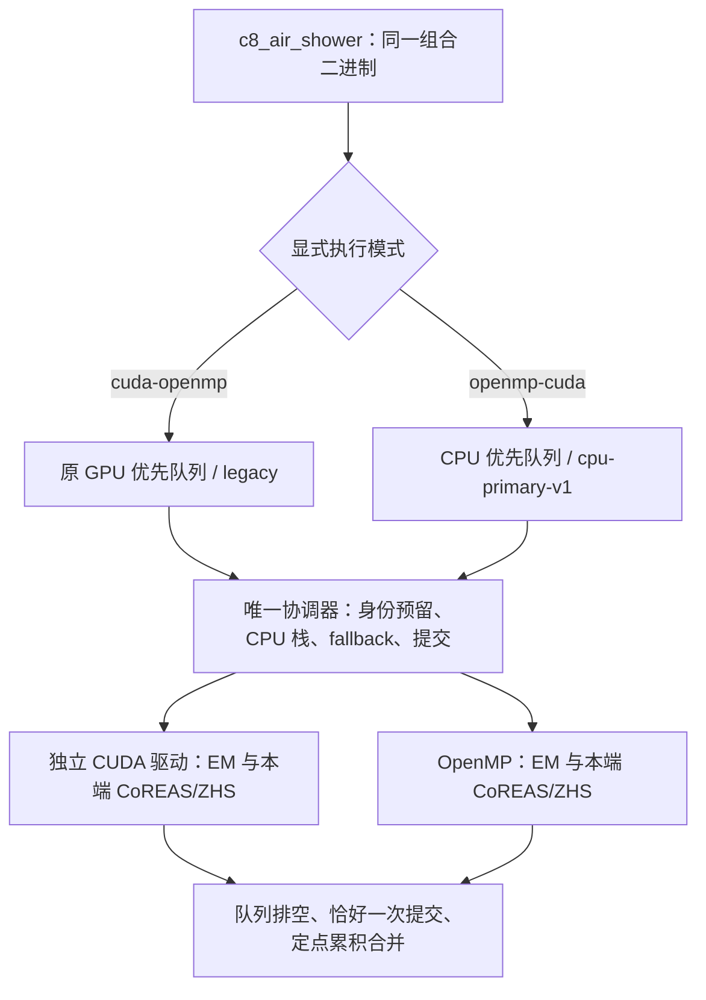

# 独立双端：GPU 优先与 CPU 优先

2026-09-12。实验实现；本地完整短测结束，PSR 第二轮全套验收已启动。
不是生产性能验收通过，也没有证明恢复历史 36 分钟的高能性能。

## 要解决的问题与兼容性

保留原 `cuda-openmp` 默认 legacy 分支，另加 `openmp-cuda` CPU 优先分支。
原分支已按实际输运吞吐做移动平均、主动补队列和安全迁移；不是没有自适应。
本轮不把先前新增的 adaptive-v13 策略设为默认，不改物理、随机数、cut、
thinning、max-weight、PROPOSAL 数据、射电公式或山体应用。

两者都不是“两端必须每批同时结束”。GPU 驱动在独立线程工作，协调器
可以连续推进多段 OpenMP。执行中的设备粒子不能被直接迁移；GPU 尚未接收的
协调器队列可以安全迁移。工作不足或最后只有一端有在途任务时仍可能空闲。

## CPU 优先首版规则

- 保留独立 OpenMP 配置的 arena、min-batch 与跨物种队列预算，不沿用旧双端
  的主机缩小容量。
- 初始 GPU 探针最多 256 个输入；之后以 `CPU_capacity × GPU_rate / CPU_rate`
  决定上限（至少 256、不超过 GPU 容量）。不是固定百分比上限。
- 新输入先满足主机保留量；GPU 配额参考实测吞吐份额。小波前允许只用 CPU。
- CPU 可从未提交的 GPU 待分配队列取工作；设备驻留数据只在安全完成边界迁移。
- 首版轻子批次最多 CPU 64 / GPU 16 个波前，光子仍用原上限；这是控制粒度，
  不是粒子生命周期/物理时间截断。性能需要实测，不能据此承诺最优。
- 复用已验证的有界主机整数 profile 分片及 selected-fallback 合批；只在新
  CPU 优先分支开启，legacy 与单端保留原行为。
- metadata 新增 `cpu-primary-v1`、主辅端、波前上限及每端每物种实际步数。

## 代码位置

| 文件 | 职责 |
|---|---|
| `src/accelerator/em/kokkos/KokkosBackendSelection.cpp` | 仅组合构建接受两种双端名称 |
| `src/accelerator/em/kokkos/KokkosCooperativeBackend.cpp` | 两端 runtime/arena 与策略装配 |
| `corsika/accelerator/em/detail/CpuPrimarySubshowerPolicy.hpp` | 纯主机 CPU 优先配额规则 |
| `corsika/accelerator/em/detail/IndependentSubshowerPump.hpp` | 独立驱动、任务分配、队列所有权、迁移与提交 |
| `applications/detail/air_shower_kokkos/KokkosShowerReport.hpp` | 新模式诊断，不重写物理累积 |
| `validation/accelerator/run_priority_endpoints_acceptance.py` | 冻结二进制、旧新回归、N=32、交替计时 |

## 已完成与剩余验收

已完成：

- 本地 sm89 与 PSR sm75 的独立 Release 构建；原安装未修改。
- 三个调度/亲和性 CTest 两机均通过。
- host-only CUDA/OpenMP/HIP/SYCL/组合选择矩阵：独立构建拒绝双端选择。
  这是选择逻辑测试，**不是 HIP/SYCL 硬件验收**。
- pump ASan/UBSan/leak 检查通过。GPU 被阻塞时 CPU 连续推进、光子/轻子
  所有权唯一、小前沿无需强占 GPU、身份/提交/能量工作记录无丢失或重复。

真实回归与计时状态：

- 两机已通过：固定种子 CPU、单 CUDA、单 OpenMP 的 N=2 物理数组、metadata 和决策轨迹
  新旧逐项比较；help 仅允许新增执行选择及引用日志行号变化。
- 两机已通过：两种双端真实 EM/CoREAS/ZHS fixture、闭合边界能量账本、两端均有实际工作。
- 两机两种模式 N=32 和非法 workers/策略组合门禁通过；PSR 使用第二轮
  完成数据，不把首轮资源冲突中断的 CPU 优先样本计为通过。
- 本地已完成 20 线程、PSR 第二轮使用后 130 核（逻辑 CPU 382–511）各五个 Fe100TeV 种子，
  两种双端及本机主端的独立模式轮换顺序运行。参数与既有 Fe 样本相同，
  emthin=1e-6、默认自动 max-weight、完整射电、GPU 预算 70%。

监控至少保留 4 GiB 系统可用内存；读取实际线程亲和性、CPU 时间、GPU 状态、
RSS、步数和波前。NVML 观测不确定不冒充空闲；已完成样本保留但计时标记无效。
新增独立 `wait()` 退出时间，区分完整子进程时间、shower 内时间和监控总时间。
不把不同调度同 seed 当成同一棵 shower，不用五个种子证明 1% 统计等价。

结果目录：

- 本地：`/mnt/d/CorsikaData/corsika_validation_results/beta5_priority_endpoints_v1_20260912/run`
- PSR：`/data/yhlu/CorsikaData/corsika_validation_results/psr_priority_endpoints_v1_130_20260912/run_r2`
  （首轮完整/中断诊断另保留在 `run`，不混入此次计时。）
- 独立构建：项目父目录 `build/priority-endpoints-v1-20260912` 与服务器
  `build/psr-priority-endpoints-v1-20260912`。从 v13 冻结源码按
  `validation/accelerator/priority_endpoint_overlay.txt` 覆盖本任务文件，
  没有把工作树中其他山体 WIP 混入构建。

本地时间见下方最终短测；两机最终结论须待 PSR 完成后填写。

## 首轮真实结果与服务器资源冲突

两机 CPU/单 CUDA/单 OpenMP 的 N=2 回归通过（每条路径 11 份物理数组及
非计时 metadata 一致，CUDA/OpenMP 决策轨迹一致）。两种模式的真实双端
EM/射电 fixture 均通过；新增模式两次能量相对残差约 5.5e-9，CPU/GPU
均有实际输运，固定工作区在第二个事件不增长。

本地两种模式 N=32 完成：32 个输出均关闭，表/辅助哈希、GPU/CPU 工作区
及 profile 分片大小不变，后续 backend 复用、零队列/定点溢出及零 native
反解失败。GPU 优先/CPU 优先峰值 RSS 分别约 0.774/0.732 GiB；不把这个
固定规模测试称为所有能量下无泄漏的证明。机器可读证据为 `N32_LIFECYCLE_AUDIT.json`。

本地首个 Fe100TeV seed85000001 完整进程时间：单 CUDA 118.806s，原 GPU
优先双端 89.792s，CPU 优先双端 111.603s。CPU 优先约 76.98% 输运步数在
OpenMP，约 23.02% 在 CUDA，符合主辅分配；最后一例存在 NVML 监控缺口，
不能据单例宣布稳定加速。完整五种子对照仍在运行，不替换生产推荐。

PSR 原模式 N=32 完成，但 CPU 优先 N=32 在 74.47s 被 GPU 独占守护停止：
另一项 `c8_terrain_cascade` 测试开始占用同一设备，守护只结束本任务
PID448861，没有停止其他工作。这是资源冲突，不是物理异常或内存不足，
该不完整样本保留且不用于计时。已排队 `run_r2`，等待现有山体工作流
PID449021（校验创建时间）结束且 GPU 连续可观测空闲60秒后重新运行全套。
后台单元：`c8-psr-priority-endpoints-queued-r2-20260912`。排队不等于完成验收。

## 本地五种子最终短测

15 个 Fe100TeV 事件均完成，种子 85000001–85000005；同一归档二进制，
三模式交替运行，未过滤慢事件。完整进程时间从 Popen 开始至独立 wait()
检测退出，不包含启动前空闲等待；同时保留 shower 内部时间。

| 模式 | 完成 | 中位进程时间/s | 平均进程时间/s | 中位 shower 时间/s |
|---|---:|---:|---:|---:|
| 单 CUDA | 5 | 74.139 | 82.828 | 66.039 |
| cuda-openmp：原 GPU 优先 | 5 | 79.527 | 80.652 | 70.834 |
| openmp-cuda：新增 CPU 优先 | 5 | 103.329 | 104.182 | 94.202 |

本地 CPU 优先不适合这批负载：其 GPU 只有 190–323 次提交，CPU 有
572–909 个工作段；GPU 完成至领取累计延迟 61.02–82.53s，长主机工作段
期间辅助 GPU 可能已完成。此延迟与 CPU 工作重叠，不能直接从总时间扣除。
GPU 优先也没有稳定净收益：单 CUDA/双端的中位时间比 0.932，五种子探索性
bootstrap 95% 区间 [0.893,1.323] 包含 1。不能用首个种子的加速替代全样本结论。

CPU 优先前四个事件存在 `nvidia-smi` 查询超时，因此仅 1/5 具备完整 GPU
监控；单 CUDA 和 GPU 优先均 5/5。保留这些事件及监测缺口，不宣布严格
性能通过，也不把缺测期间的 GPU 状态当成零利用率。所有事件的输出关闭、
有限数组、提交/回收、逐端工作量与队列检查通过；不等于 500 例统计等价。

报告和时间图：本地 `run/performance/REPORT_CN.md`、`Fe100TeV_timing.png`。
本轮二进制 SHA-256：
`84792643ef2a9d2d00f423c3106f13bcfcefede0246f5088cec6bc0fb58b4cb2`。

源边界审计在两机均确认 657 个应用/核心源码未变，仅 9 个许可范围内文件
新增或修改；与固定种子回归相互补充，不据哈希检查单独宣布所有物理正确。
新增五种配置的主机选择门禁已通过实际 CMake/CTest，独立 CUDA/OpenMP/HIP/
SYCL 构建拒绝双端名称；这仍不是 HIP/SYCL 硬件测试。

报告守护首次在临时 systemd 单元被回收后停止。现改为：单元消失时仅执行
独立的归档输出验收并明确标记服务退出状态不可再取证，不将默认的 success/0
视为退出证明，不重启模拟。三个主机单元测试覆盖此行为；本地最终报告及
N=32 审计已生成，PSR 报告守护也已更新。验收脚本和模拟二进制没有为此改变。

另增加完成事件的独立重读检查 `audit_priority_completed_events.py`，本地
15 例通过：重新扫描所有物理数组、最终 photon/lepton 队列清零、指定延后
回退 queued/flushed 数量一致、零记录的反解/定点/队列错误。
`COMPLETED_OUTPUT_AUDIT.json` 保留每例不完整能量账本，未把其残差改成通过；
相关四项错误注入/账本保留测试通过。

PSR 等待的山体工作流已结束；排队器记录 GPU 连续可观测空闲 60.72s 后，
在 Unix 时间 1789173248.697 以原 PID456744 exec 第二轮验收。首个标量
PROPOSAL N=2 对照退出0，后续新旧回归、双端 N=32 及五种子计时仍在执行。
没有因等待超时重启任务，没有与山体工作流同时进行 GPU 计时。

第二轮 PSR GPU 优先 / CPU 优先 N=32 分别以 106.710 / 324.888s 完成，
峰值 RSS 约 0.807 / 0.814GiB，监控完整；130 线程亲和性未越出382–511。
CPU 优先的运行中采样达到约129个核当量，但这是包含忙等的核时间，不证明
净加速。`CORRECTNESS_GATES.json` 已写入通过；正式 Fe100TeV 计时开始，
首个纯 OpenMP seed85000001 为139.155s。五种子完整对照尚未结束。

新增 `physics_identity` 重读初级、磁场、实际天线/时间网格与非设备 CLI，
本地15例配置一致；改变 thinning 或天线位置的测试能使身份不同，改变模式、
线程、种子及输出路径不改变该配置身份。结合原队列检查共9个报告/输出测试
通过。两机汇总工具 `compare_priority_hosts.py` 要求两机完整数据及匹配配置，
之后才生成两机图，不把不同设备的秒数直接相除作为受控加速比。

## PSR 首个完整三模式对照（非最终中位结论）

seed85000001：纯 OpenMP130 为139.155s，原 GPU 优先为384.627s，CPU
优先为394.830s，三者 GPU 独占监控均完整。前者75,170,799步，GPU优先
73,761,707步，CPU优先73,065,095步；较慢不是因为总输运步数更大。

CPU 优先实际分工：OpenMP58,679,093步（约80.31%），CUDA14,386,002步。
CPU 调用累计383.572s，GPU调用72.381s，GPU完成至领取累计180.417s。
CPU实际得到大部分工作，但这未转化为相对纯OpenMP的收益。上述调用时段
包含各自的同步/传输且相互重叠，不将其相加或相减当作精确因果分解。
即时抽样中未发现其他显著CPU计算进程，不能据这一抽样证明全程绝无干扰。

CPU 优先还开启已有的profile分片与指定回退合批，所以模式耗时差也不能
全部归因于辅助GPU。剩余四种子继续执行；此时不改变策略、不剔除慢样本，
不据单例宣布整体性能验收通过。

## PSR 第二次资源冲突与只补缺失样本

第二个种子的纯 OpenMP 完成，进程时间150.517s。随后 CPU 优先事件在
125.633s 被显卡独占保护中止：记录到另一项山体 CUDA 测试 PID503535。
退出码为-9，失败原因明确为 `foreign GPU work during diagnostic`；不是
程序自行崩溃或内存溢出。原服务以1退出，4个已完成事件重读验收通过，
中断事件不计入耗时或物理样本。保护没有停止山体测试。

新增 `validation/accelerator/resume_priority_endpoints_acceptance.py`，只在
原服务已结束且冻结二进制没有其他实例运行时接续计时阶段：

- 重算二进制和原守护脚本哈希，检查参数、线程亲和性以及已通过的正确性门禁；
- 重新读取4例已完成输出，按原种子和原轮换顺序跳过这些样本，不挑选快事件；
- 仅允许归档有明确GPU竞争记录的中断尝试，保留其输出、日志和原STATUS；
- 不重跑N=2/N=32及已有计时样本，不改模拟代码、参数、批量和物理表；
- 等待已识别的整个山体测试路径下工作流退出，并持续观察显卡空闲60秒；
  这不是对未来任务的显卡预约，若之后又有竞争，原运行中守护仍会停止本测试。

归档在 `run_r2/continuations/`；已有4例保持原目录。续跑服务为
`c8-psr-priority-endpoints-resume-r3-20260912`，首个已验证存活的PID为512147；
报告服务为 `c8-psr-priority-endpoints-report-r4-20260912`。
本地12项主机报告/续跑测试通过，PSR另外核对了冻结二进制、原守护哈希、
4例原命令和3项续跑单元测试。此时仍为4/15，不把排队或报告脚本成功
当作全部计时完成。

续跑随后达到8/15；第三种子的GPU优先事件运行时，对真实shower进程
PID521989读取了两秒CPU时间及每个线程的亲和性：CPU占用约12,714%，
135个进程线程均限制在382–511范围内，该范围对应130个不同物理核心，
未发现越界线程。RSS约1.24GiB。这是短时间的资源使用证据，不是整个
shower的有效计算利用率或加速证明；其中可能包含运行时忙等。

## 两机v1最终短测完成

PSR的15/15全部完成，包含五种子各三模式；全部15例GPU独占监控完整，
物理输出重读、空队列、fallback提交和累积无溢出检查通过。CPU PROPOSAL、
单CUDA、单OpenMP固定种子回归及两种双端N=32均通过。完整强子能量账本
覆盖仍不完整，不能据这些检查认证完整能量闭合或500例统计等价。

| PSR模式 | 例数 | 中位进程时间/s | 平均进程时间/s | 中位shower时间/s |
|---|---:|---:|---:|---:|
| 纯OpenMP130 | 5 | 108.790 | 117.994 | 100.657 |
| 原GPU优先 `cuda-openmp` | 5 | 384.627 | 368.778 | 374.823 |
| CPU优先v1 `openmp-cuda` | 5 | 273.836 | 268.290 | 263.845 |

CPU优先v1比GPU优先用时少，但仍约为本机纯OpenMP中位时间的2.52倍，
没有服务器净加速。最后一例CPU优先的约5秒采样达到128.95核当量、
135线程均位于382–511、RSS约1.66GiB；高核心占用不是效率通过的替代。

PSR报告器成功结束，63份小型JSON/Markdown/PNG（合计约1.72MB）已同步
到D盘并通过内容checksum比对；原始shower数据未搬入WSL。两机比较先
检查实际物理配置哈希一致、五种子齐全和调度版本均为`cpu-primary-v1`，
没有把本地简化v2与服务器v1混用。

- 服务器报告本地副本：`CorsikaData/corsika_validation_results/psr_priority_endpoints_v1_130_20260912_report/run_r2/performance/REPORT_CN.md`
- 两机对照及已目视检查的图片：`CorsikaData/corsika_validation_results/beta5_priority_endpoints_v1_20260912/two_host_comparison/REPORT_CN.md`

简化v2的服务器128路隔离构建已在v1进程退出且显卡空闲60秒后自动启动。
v2真实验收尚未开始，本轮不更改生产install，不据v1短测替代v2验收。
