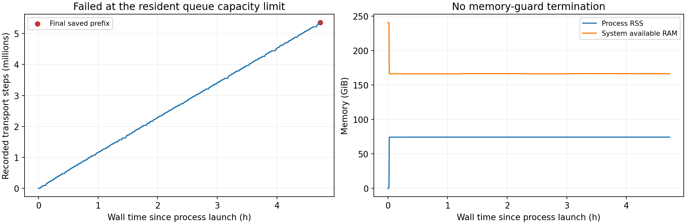
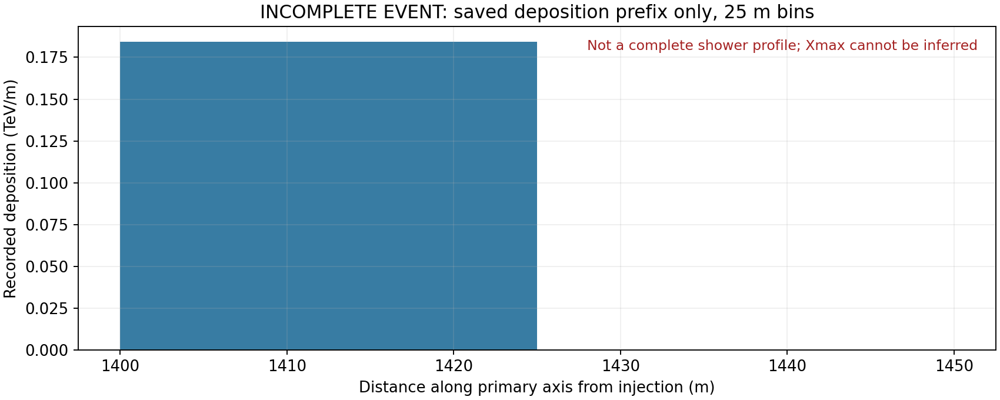

# 1 PeV double bang 验收：未通过，队列容量导致中断

事件 `openmp_SiO2_21CMA80_1PeV_seed22309`。2026-09-15 15:02（北京时间）结束，退出码 1；`complete=false`。成功完成及通过验收均为 **0 例**。种子扫描在首个候选失败后停止，后续候选没有启动。

## 运行与失败原因

- 进程总耗时 **4 小时 43 分 35.8 秒**，包括初始化到报错退出；不是完整 shower 的耗时。
- OpenMP **256 个物理核**绑定通过；峰值 RSS **74.455 GiB**。
- 固定常驻队列上限 **262,144 个活跃 EM 粒子**。某批处理后，未处理粒子与新后继粒子合计将超过上限，因此抛出 `interface resident successors exceed capacity; input retained`。
- 最后一次资源采样仍有约 **166.5 GiB 可用内存、338.1 GiB 空闲磁盘**；监控器没有因资源阈值终止任务。
- `input retained` 指异常发生前尚未消费该批内存中的输入；当前程序没有把它保存为可恢复检查点。异常退出后，不能从这些 CSV 直接续跑。

队列的容量检查发生在消费原批次之前，避免静默丢弃后继粒子。但当前实现没有在满载时自动扩容或转入可继续运行的溢出处理。容量上限不足是运行配置与调度处理的限制，不能靠加强 thinning 或提高粒子截止来掩盖。

左图是已写出记录数随耗时变化，红点为最终保存数；右图是进程内存和系统可用内存。曲线终点表示失败停止。

## 已保存数据的完整性

- 轨迹 **5,353,854 行**；沉积 **4,870,796 行**。4 个 gzip 文件均读取到末尾并通过解压校验，行数与 summary 对应，数值无非有限项，step 连续：**True**。
- CSV 沉积总和 **4606.685480565 GeV**，与 summary 的差为 **9.09e-12 GeV**，保存前缀内部核对：**True**。
- 已保存 τ 运输记录 **0 行**。完整的 CC/τ 衰变顶点及 double bang 选图验收未完成，不能仅凭候选种子或任务名确认事件合格。
- 这些是已完成输出检查点的前缀。抛异常的常驻调用可能还有未写出的缓冲记录，以及未输运的活粒子；`csv_truncated=false` 只表示没有触发 CSV 行数上限。
- 缺少完整终态和活粒子账本，因此**无法验收整事件的能量闭合**。不能把输入能量减去目前沉积，解释成能量丢失；也不能把沉积占比当作完成百分比。

本图只展示已保存的沉积前缀，数据见 [25 m 分箱](partial_deposition_profile.csv)。它不是完整 shower profile，不能据此判断最终 Xmax。事件内不同粒子的处理顺序也不是全局时间排序。

## 射电与观测站

- 输入包含 E/W/N/S 四臂各 20 个站，名称唯一且齐全；实际场景中每站的三维坐标与已核对的输入包逐项一致：**True**。
- 经纬度沿用已验收输入；高度为 **DEM+1 m 的模型高度**，不是重新测得的天线相位中心。
- 本次没有生成最终 `field.csv`、`spectrum.csv` 或矩文件；射电结束后的下载、重建及输出未执行。因此 **80 站信号与 CoREAS/ZHS 一致性均无法验收**。

## 验收结论与后续条件

**未通过。** 物理设置仍为 1 PeV ντ、SiO₂、emthin=1e-6、空气默认截止与 Wmax=0.5；该 Wmax 下单位权重粒子不实际薄化。此次失败首先暴露常驻队列容量处理不足，不能据此评判完整 shower 或射电物理结果。

重跑前应处理队列满载：在既定内存预算内安全扩容，或实现保持粒子及后继状态的溢出调度，并验证恰好一次消费、随机数状态、记录输出和能量账本。简单增大固定上限只能推迟下一次满载，不能作为通用修复。失败时还应输出队列水位及所需后继数，当前记录未保存这些精确值。

本次只进行了验收、已有文件读取与诊断绘图，均在 PSR；没有重启模拟、修改生产程序或删除失败数据。本地仅同步小型报告。二进制校验：**True**；运行库校验：**True**；已记录输入与运行脚本的 SHA256 校验：**True**。

[机器可读验收](acceptance.json) · [完整输入、退出及耗时证据](evidence/)

## 后续清理（按用户要求）

已删除本次未完成事件的 4 个原始 gzip 数据文件，共 **1.005 GiB**；输入、日志、验收数值、部分 profile 和诊断图保留。删除清单与散列见 [cleanup.json](cleanup.json)。上文的读取校验在删除前完成；当前无法重新读取原始轨迹。
