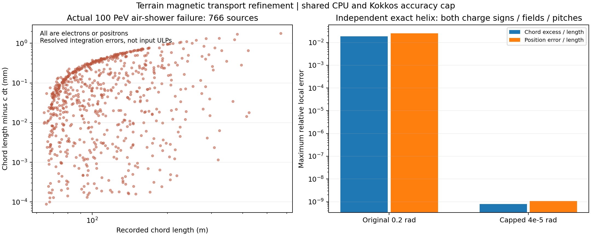
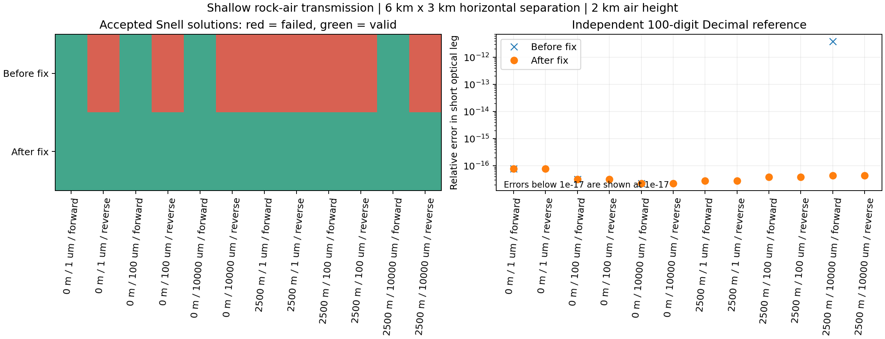
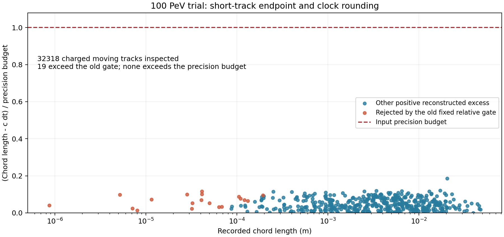
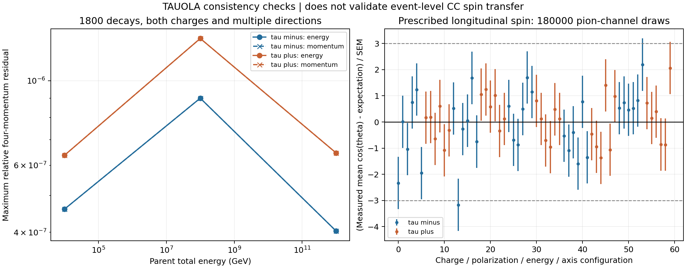
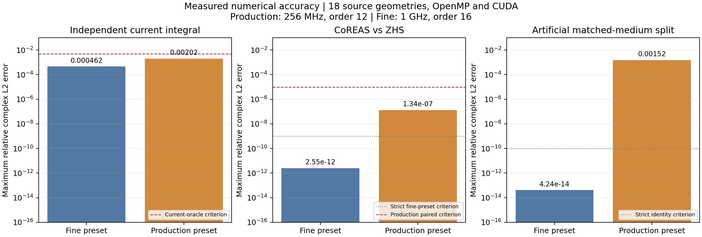
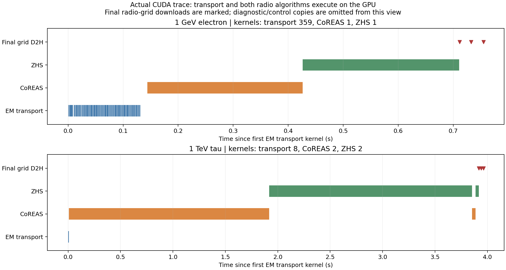

# beta5 穿山 ντ 与射电检查

已完成代码检查、修复及三个 100 PeV 原 seed 的双算法射电复跑。
三个完整事件使用 PSR OpenMP 256 线程；CUDA 另外通过真实小事件的常驻队列及内核记录检查。
修复包括磁场二次轨迹精度、平行磁场消减误差、近界面 Snell 求解和微小源轨迹精度，
并加入保守的地形光路筛选。OpenMP、CUDA 各 12 项自动测试及 8 次完整小事件射电开关对照通过。
高精度射电设置下，18 种规定源几何
×双算法×双后端共 72 次执行通过原严格检查。本批实际射电参数的另 72 次执行
显示可测分段误差，未通过全部严格门槛，详见下图及原始结果。
先看 [图文幻灯片](SLIDES_CN.md)；详细波形见 [结果文件](RESULTS_CN.md)。

只在 PSR 上编译、测试和计算；本地只读源码、编辑脚本、接收结果。
原大气应用和大气射电模块没有因本次工作被修改。

## 三例复跑的实际结果

|seed|本次 τ 衰变|介质|CC–衰变距离|输运步数|CoREAS/ZHS 全频复数谱相对 L2|
|---|---|---|---|---|---|
|946|电子道|air|2.202 km|10,272,798|2.20×10⁻⁹|
|3605|强子道|air|6.943 km|7,813,400|1.85×10⁻⁸|
|158|μ 道对照|air|2.125 km|7,626,165|4.59×10⁻⁹|

三例共独立核对 19,571,928 条运动带电射电源，均与 CPU／设备源计数一致。
全部完成既定输运窗与队列收尾，轨迹和沉积 CSV 没有截断，介质不匹配、射电错误、
接收窗越界均为零。能量账本未解释差额除以初级能量的绝对值均小于 2.4×10⁻¹²。
这两个第二簇射事例与一个 μ 道对照，不能直接解释成三例可分辨的射电双脉冲。

## 本次实际修正了什么

完整 OpenMP 试跑在第 10193878 步后、最终射电检查时失败。
独立扫描 7727280 条运动带电轨迹，发现 766 条空气 e± 的弦长超出 cΔt 和既有精度预算，
最大绝对超出约 1.77 mm；相对精度预算偏差最大的一条超出 0.93 mm。
这是可分辨的磁场积分误差，不能归类为浮点舍入。
失败数据保存在 `failed_runs/openmp_seed946_magnetic_chord`，没有计为成功复跑。

继承的二次 LeapFrog 位置采用 r(s)=r₀+us+qs²，时间采用 s/v，
二次位移的长度却略大于 s。山体 CPU 跟踪器与独立 Kokkos 材料上下文现统一把
最大偏转参数从原上限 0.2 rad 收紧到 4×10⁻⁵ rad。
对该积分公式，舍入前局部弦长超出 s 的比例被限制在约 8×10⁻¹⁰，
并以独立解析螺旋轨迹检查局部位置和方向误差。
该限制与射电开关无关；未修改原空气跟踪器，也未放宽射电源拒绝门槛。
这会改变磁场区域的步数、轨迹和可能的随机数消费顺序，因此需完整重跑，
不能保留旧输运结果后只修改其时钟。

CUDA 的强磁场回归还定位到平行磁场判断中的消减误差：旧公式用
B²−(u·B)² 恢复横向分量，融合乘加可产生假的微小横向动量。
山体现在用 u×B 的范数判断横向分量，并把同一稳定步长限制送入地形求交与输运。
进入直线策略时，复用的底层输运器在该步使用零场副本，避免几何判成直线而传播仍弯曲；
共享材料数据保持原值，原大气模块没有修改。回归包含精确平行和近似平行的方向。

新强磁场队列测试仍逐条比较独立 FIFO 的粒子状态、身份、次级与能量账本；
由于更细步长需要更多波前，测试的运行上限由 10000 增到 1000000，物理判据不变。

左图是完整试跑中实际拒绝的 766 条空气 e± 源，不是人为生成的异常点。
右图将原始步长与修正步长分别对照解析螺旋轨迹。
每个后端覆盖 192 组质量、能量、电荷、磁场和夹角条件，包含平行与近似平行方向；
两套步长共 384 次比较。修正后所测局部位置相对误差最大 1.07×10⁻⁹，
方向误差最大 8.38×10⁻¹⁰，源精度检查拒绝数为零。
这是局部积分精度证据，不能替代完整簇射的 cut、thinning 和步长收敛研究。

左图红色表示求解失败，绿色表示得到有效光路。每一列是一组相同的几何条件，
上排为修正前，下排为修正后。覆盖 1 μm、0.1 mm、1 cm 的近界面源，
原点／2.5 km 平移和正反向传播；有效解从 4/12 增为 12/12。

原因是原求解器通过两个很接近的公里级坐标相减，恢复微米级短光路，丢失了精度。
现在直接求较小的横向坐标，同时保留两侧坐标，并从局部法向／切向构造传播方向。
没有放宽原来的 Snell 残差门槛。右图与独立 100 位 Decimal 二分求根比较，
修正后短光路长度最大相对误差为 7.85×10⁻¹⁷；这是所测几何的数值误差，不是模型的物理精度。

另一个问题是射电透射计算逐条轨迹扫描全部 511488 个山体三角面。
现在先用 Snell 切向连续条件筛选 BVH 节点，只有确定不可能含有解的节点才被排除；
没有截断弱信号、设置幅度阈值或限制候选数量。
每个后端以 256 条双向、不同深度的真实 DEM 查询对照全部 130940928 个候选面：
保留 181187 个候选，找到 114 条可见光路及 80 条被遮挡的驻值光路，漏路、重复及不收敛均为零。
这一有限覆盖的对照与保守判据共同支持优化，不能替代所有地形和参数的验证。

保留的磁场步长修正前 CUDA 小事件有 6 条带电轨迹，用于单独比较 BVH 筛选：
两种射电内核总时间由约 12.86 s 降至 1.65 s。
这里只报告这组相同源的内核时间，不能据此推算修正后完整高能簇射的加速比。

这张图来自保留的首次 100 PeV CUDA 试跑。逐条检查 32318 条运动带电轨迹后，
发现 19 条被旧射电模块的固定相对速度门槛误拒绝：公里级位置和绝对时钟相减，
给微米级短轨迹带来约 10⁻¹³ m 的重建误差。
图中纵轴为“重建弦长超出 cΔt 的部分／输入精度预算”；全部低于红色虚线，最大为 0.185。
这说明异常可以由输入数值精度解释，不能把这些点读成真实的超光速粒子。

射电现在根据端点和时钟的 ULP 计算误差界，并读取源输运器显式声明的弦长精度；
山体适配器保留原来的 10⁻⁹ 相对弦长容差，独立理想轨迹的默认值为零。
仅在该合并精度预算内将重建 β 规范化到光速；
`roundoff_limited_tracks` 单独记录数量。若越界超出此界，或运动轨迹时间间隔非正，仍拒绝该源。
回归覆盖两条捕获的微小轨迹、一条约 176 m 的实际弯曲输运轨迹、
正常亚光速轨迹、超出声明精度的异常轨迹与零时间间隔。
上述射电源规范化本身保留输入坐标、输运时间和粒子能量；这一处理反映短轨迹可分辨的数值精度，
不能替代更低 cut／更小 thinning 的射电收敛研究。

首次 CUDA 试跑已停止并保存在 PSR 的 `failed_runs/cuda_seed946_short_source_roundoff`，
未计入成功事件。完整高能复跑采用 OpenMP 256 线程；CUDA 另外验证共同源、数值与常驻队列。

## 原来的三例究竟是什么

|seed|初级|旧 τ 衰变|旧衰变介质|分类|
|---|---|---|---|---|
|158|100 PeV ντ|μ⁻ + ντ + 反νμ|rock|μ 道对照，不能叫典型第二簇射|
|946|100 PeV ντ|e⁻ + ντ + 反νe|air|电子型第二簇射|
|3605|100 PeV ντ|3 个带电 π + π⁰ + ντ|air|强子型第二簇射|

这是从实际 daughters 记录确认的，不是根据两处能量峰猜测。
两次顶点存在与射电双脉冲可分辨是不同的问题。
三个 seed 是此前筛选后的展示事例，不构成无偏事件率样本。

磁场步长修正后，同一个 seed 不保证与旧版本逐轨迹相同。
例如 3605 的本次 CC–衰变距离为 6.943 km，旧记录为 3.383 km；
本次 τ 衰变能量为 72.658 PeV，仍为空气中的强子道。
158 则从旧记录的岩内 μ 衰变变为本次空气中的 μ 衰变，距离从约 0.290 km 变为 2.125 km。
本报告的剖面和波形均采用新输出，不能沿用旧衰变顶点解释新波形。

## 均匀山体与缓变大气中的光路近似

**如果指射电波的传播，答案是：岩石内采用直线段，大气内也采用直线段近似。**

|区域|当前光路几何|传播时间的处理|
|---|---|---|
|均匀岩石内部|直线段；本批岩石折射率固定为 n=2|t=nL/c|
|折射率随高度缓变的大气|仍使用直线段，不沿折射率梯度弯曲|沿该直线积分 t=∫n(h(s))ds/c|
|岩石–空气界面|在 DEM 三角面上按界面两侧局部折射率满足 Snell 条件；两侧各为一条直线段|分别计算两段光程并相加，同时施加 Fresnel s/p、展宽、吸收与遮挡处理|

因此，当前模型保留了大气折射率随高度变化对光程和到达时间的影响，
但没有求解由折射率梯度产生的连续弯曲光线，也没有计算这种弯曲带来的完整聚焦／散焦。
同介质直达路径的几何展宽采用 1/L，跨界面路径使用现有两直线段的射线束展宽模型。
“折射率缓变”本身不能保证任意传播距离、尤其近水平长光路的误差足够小；
此前直线光路上的积分对照未验证忽略光线弯曲的误差。

这里需与**带电粒子输运**区分：空气中的带电粒子仍按磁场弯曲轨迹步进，
不是把整个粒子历史固定为直线；本批岩石 B=0，但相互作用和散射仍可改变粒子方向。
射电源计算再把每个已记录输运段的两个端点连接成有限直线源段。

实现见 [Propagation.hpp](../../../corsika/modules/radio/interface/Propagation.hpp) 的
`directPath`、`transmittedPath` 和 `opticalLength`。

## 衰减怎么处理，100 m 代表什么

当前对每条射电光路的电场乘以介质吸收因子

$$A_{\rm abs}=\exp\!\left(-\frac{\ell_{\rm rock}}{L_{E,\rm rock}}-\frac{\ell_{\rm air}}{L_{E,\rm air}}\right).$$

这里的 L_E 是**电场幅度降至 1/e 的长度**；仅考虑该吸收时，功率乘以 exp(-2ℓ/L_E)，
因此功率的 1/e 长度为 L_E/2。几何展宽、Fresnel s/p 透射与地形遮挡另行计算。
介质吸收是 s、p 共用的标量；两个分量的不同界面透射由 Fresnel 系数处理。
CoREAS 和 ZHS 使用相同的光路吸收模型。

本批显式设置 `radio.rock_attenuation_length_m: 100.0`，空气吸收长度保持无穷大。
岩石的 L_E 在空间和频率上都是常数；没有从 SiO₂、密度或实折射率 n=2 推导损耗，
也没有按复介电常数计算频率相关吸收／色散或显式模拟裂隙散射。
该配置项缺省为无穷大，旧的 `geometry.attenuation_length_m` 不会自动代替它。

|岩内光路长度（L_E=100 m）|仅介质吸收后的电场比例|
|---|---|
|100 m|0.368|
|300 m|0.0498|
|1 km|4.54×10⁻⁵|

这是岩内实际光路长度，不是源的垂直埋深，也不是完整源–天线距离。
该表不包含几何展宽和界面透射，不能直接当作总接收电场。

**不存在所有山体通用的衰减长度。** 下表将公开资料的 dB/m 按
L_E=20 log₁₀(e)/a≈8.686/a 换算为与代码一致的电场幅度长度。

|岩体参考|资料中的 a（dB/m）|换算的 L_E|
|---|---|---|
|石灰岩，EPA 工程参考范围|0.4–1|约 9–22 m|
|花岗岩，EPA 工程参考范围|0.01–1|约 9–870 m|
|Stripa 花岗岩，SKB 报告代表值|约 0.3|约 29 m|

前两行来自 [EPA 的 GPR 工程资料](https://archive.epa.gov/esd/archive-geophysics/web/html/ground-penetrating_radar.html)，
是宽泛岩性参考范围，不是本场址 50–100 MHz 的标定值。含水、盐分、黏土及岩体不均匀性
都会影响传播损耗。第三行来自 [SKB TR91-43](https://skb.se/publikation/5946/TR91-43_OCR.pdf)
第 4 节；该报告开展了中心频率 60 MHz 及高于 100 MHz 的天线试验，
其约 0.3 dB/m 是岩体代表值，不应读成精确的逐频谱测量。
这些不同来源的数据不是同频、同含水状态下的受控对照。

例如专门测量的 Cote Blanche 岩盐在 150 MHz 的电场衰减长度为 93±7 m，
在 300 MHz 为 63±3 m，说明频率也不能省略；岩盐数据不能直接替代普通山体参数。
参见 [Connolly 等的原始测量](https://arxiv.org/abs/0806.2042)。

本批 100 m 相当于约 0.0869 dB/m，只是诊断假设；对于上述较高损耗岩体会高估透过信号。
目前没有这座山在目标频段的损耗测量，因此不能把它称为典型值或据此确定可探测率。
雷达可探测深度还取决于往返路径、反射强度与仪器动态范围，不能直接等同于 L_E。

## 山体 shower 中的 LPM 效应

**当前山体电磁输运已包含 LPM 抑制；这批三个 100 PeV 事件使用的常驻 Kokkos 路径也包含它。**
不是在计算射电时再对波形补乘一个 LPM 系数。

- 电子／正电子制动辐射调用 `bremsLpmSuppressionFactor`。
- 光子产生 e⁺e⁻ 调用 `photonPairLpmSuppressionFactor`。
- 相应参数从 PROPOSAL 导出到各介质的辅助参数表；计算时还传入当前顶点的局部质量密度。
- 候选相互作用按抑制概率作接受／拒绝抽样。被拒绝时不生成该次级末态，母粒子继续输运，
  在常驻路径中作为 `Continuation` 留在队列。CPU PROPOSAL 路径也调用 `CheckForLPM`。

调用链见 [InterfaceEmStep.hpp](../../../corsika/modules/transport/detail/InterfaceEmStep.hpp)、
[LeptonFinalStateStep.hpp](../../../corsika/accelerator/em/detail/LeptonFinalStateStep.hpp)、
[PhotonFinalStateStep.hpp](../../../corsika/accelerator/em/detail/PhotonFinalStateStep.hpp)；
CPU 实现见 [InteractionModel.inl](../../../corsika/detail/modules/proposal/InteractionModel.inl)。
该处理与射电开关无关，OpenMP 与 CUDA 的独立接口调用同一套标量物理实现。

LPM 抑制高能制动辐射和成对产生，可延长电磁簇射发展尺度并改变纵向涨落，
因而会间接改变实际轨迹生成的射电信号。以本批 SiO₂、ρ=2.65 g/cm³ 作数量级估计，
取质量辐射长度约 27.05 g/cm²，则长度约 10.2 cm；按 PDG 的
E_LPM≈(7.7 TeV/cm)×(X₀/ρ)，特征能量约 79 TeV，即 0.08 PeV。
这说明本批高能电磁分支可能远高于该尺度，LPM 不能忽略；它不是一个统一硬阈值，
实际抑制还依赖次级能量分配。这一数值是独立量级估计，不是读取辅助缓存得到的参数。
来源：[PDG 粒子穿过物质综述](https://pdg.lbl.gov/2024/reviews/rpp2024-rev-passage-particles-matter.pdf)、
[PDG SiO₂ 材料表](https://pdg.lbl.gov/2013/AtomicNuclearProperties/HTML_PAGES/245.html)。

这里确认的是实际调用链与运行所用实现。当前山体事件摘要没有单列 LPM 拒绝次数，
本批也没有做 LPM 开／关的簇射纵向分布统计对照，因此不在此报告具体拉长倍数或射电幅度变化比例。

## 代码检查的物理范围

|环节|核对内容|证据及限制|
|---|---|---|
|ν–核子 CC/NC|能量相关 CTW 总截面、A 缩放、CC+NC 距离竞争、实际 Pythia CC/NC 末态、NC 女儿再入栈|当前四组山体中微子／τ 测试；总截面与 Pythia 微分末态不是统一 PDF 模型，不能称完整弱物理认证|
|τ 产生、飞行和衰变|τ 明确留在输运栈，原生寿命竞争；PROPOSAL 能损；TAUOLA 高能条件参考系、已知质量 boost、质量作用域恢复|正反 τ、多能量和方向的四动量检查及 RNG 检查；不通过末态归一化掩盖误差|
|山体和空气|实际 DEM、介质边界切换、连续时间／身份；空气使用参考位置 IGRF14/2027 算出的均匀 B，岩石 B=0；两侧使用对应材料参数|六种接口测试涵盖不同材料、交换区域编号和磁场；完整事件另外核对实际中点介质。本配置没有逐点更新空间变化的 IGRF|
|射电源|已完成带电轨迹的有符号电荷和权重；设备 e± 与 CPU μ、τ、强子等共同贡献|两个算法源计数与独立 CSV 逐行计数比较；射电开关比较轨迹、沉积、存活粒子、τ/ν 记录|
|辐射和传播|有限轨迹电流、CoREAS 端点与 ZHS 区间；Cherenkov 有限轨迹极限；直达／单次透射、Fresnel s/p、射线束展宽、幅度吸收、地形遮挡、实际大气 n(h) 积分|增加独立电流积分参考；两个算法共用光学与部分正则化，互相吻合不等于独立物理证明|
|能量账本|生成器净交换 G、薄化跳变量 T、cut 静质量、连续能损、沉积、窗末存活与世界出口分别计账|要求未解释差额足够小；G 包括靶交换等，代数闭合不能验证所有强子／核模型|

相关实现：

- [MountainNeutrinoInteraction.hpp](../../../corsika/modules/neutrino/MountainNeutrinoInteraction.hpp)
- [ConditionedTauolaDecay.hpp](../../../corsika/modules/neutrino/ConditionedTauolaDecay.hpp)
- [TerrainTauDecay.hpp](../../../applications/detail/mountain/TerrainTauDecay.hpp)
- [InterfaceEmStep.hpp](../../../corsika/modules/transport/detail/InterfaceEmStep.hpp)
- [InterfaceMagneticPolicy.hpp](../../../corsika/modules/transport/detail/InterfaceMagneticPolicy.hpp)
- [TerrainMagneticAccuracy.hpp](../../../corsika/geometry/terrain/TerrainMagneticAccuracy.hpp)
- [TerrainEnergyLedger.hpp](../../../applications/detail/mountain/TerrainEnergyLedger.hpp)
- [CoreasEndpoints.hpp](../../../corsika/modules/radio/interface/CoreasEndpoints.hpp)
- [ZhsIntervals.hpp](../../../corsika/modules/radio/interface/ZhsIntervals.hpp)

## τ 衰变的独立检查

左图检查 1800 次正／负 τ 衰变的四动量残差，覆盖 10⁴、10⁸、10¹² GeV 和多个方向，
最大相对残差为 1.29×10⁻⁶，在现有 TAUOLA 测试的 2×10⁻⁶ 数值门槛内。
这里保留 Fortran REAL*4 的实际误差，不靠重新归一化女儿能量隐藏残差。
右图来自 18 万次 πν 道抽样，比较给定纵向极化下的平均衰变角和解析期望；
误差棒为一个均值标准误，最大偏差为 3.17 个标准误（共 60 种配置）。
这检验的是给定极化的衰变实现，并未验证事件级 CC 自旋传递或 τ 能损退极化。

## 射电参数的实际数值误差

每组柱子比较两套已经实际运行的参数；越低越好。每套覆盖 18 种规定源几何、
OpenMP 和 CUDA，共 72 次双算法执行。
左图与独立电流积分比较绝对复数谱，不拟合幅度、时间平移或相位。
细参数最大误差 0.0462%，本批实际参数最大误差 0.2024%；该比较不包含 Nyquist 单点。
中图为两算法差异，本批最大 1.34×10⁻⁷，低于预设的生产检查门槛 10⁻⁵，
但没有通过细参数测试使用的 10⁻⁹ 门槛。

右图专门检查两侧相同介质时，人工拆开一条轨迹是否改变结果。
细参数误差约 4.24×10⁻¹⁴，本批参数为 0.1522%，没有通过原严格恒等检查。
这反映有限分段近似的可测依赖，不能把它改名为“精确相消”。
原始严格检查的失败状态和数据完整保留在 `optical_oracle_run_resolution`，
图表只报告误差，没有修改原测试门槛。
两套设置同时改变采样率、矩阶数及分段精度，因而不能单独归因于其中一个参数。
本批参数下后端间最大相对差异 8.58×10⁻¹⁴。

这些标准源检查量化的是所测几何的数值误差，不能视为完整高能簇射幅度误差上限，
也没有验证当前几何光学模型忽略的波动物理。

## Kokkos 调度核对

这张图来自修正后 CUDA 小事件的 CUPTI 实测时间线。
蓝色为输运核，橙色为 CoREAS，绿色为 ZHS，红色三角为最后三次射电矩阵下载。
上图 358 条运动带电源对应 359 次输运核；下图为 14 条带电源的 τ 事件。
两个射电算法依次执行，三个矩阵在最后才下载。横轴从第一个输运核计时，
不包括约一分钟的模型初始化，也不显示诊断／控制数据下载。

完整日志另核对了续存粒子和射电源不往返主机、矩阵不重新上传、队列在设备端追加；
这些检查均通过。新电子对照的输运记录因步长变细而改变，射电开／关之间仍完全一致；
τ 对照的输运记录与旧对照相同。旧矩阵差异原样保留在 `controls_*.json`，
没有把修改前后的粗／细输运强行视为相同事件。

设备队列按 FIFO 保留续存粒子及 EM 次级；只有新进入的 CPU EM 粒子需要上传。
每个波前在设备端验证记录、计算次级数量，再检查容量，最后提交续存状态。
容量不足时明确报错，不能静默丢粒子；测试核对失败前后输入仍在队列内。

CPU 回退在已经选中的真实顶点完成指定相互作用，不重新走连续轨迹。
连续段已由设备计入射电，回退仅生成末态并走原 secondaries 链，因此需要特别检查重复源。
诊断记录在检查点下载；这不等于把续存粒子下载、重新输运。

CoREAS 与 ZHS 共用源队列和光学数据，分别累加三个总矩阵：
CoREAS 电场矩、CoREAS 极限辅助矩、ZHS 势矩。
完成设备粒子排空和 CPU 尾部源上传后才最终下载并在 CPU 做输出/FFT。
CUDA 的两个射电核在同一执行流顺序运行。“两个一起算”指同一事件默认输出两种算法，
不表示两个 CUDA 核同时执行，也不表示 ν/τ/强子全部在 GPU 上计算。

已有 12 项／后端门禁包括队列溢出、零权重、稳定身份／顺序、混合末态、
实际材料／磁场、续存与参考逐步结果、CPU 回退和多波前检查点。
另用 CUPTI 记录实际 GPU 内核、源缓冲和最后三次矩阵下载，不只看 backend 字符串。

## 本批复跑参数

沿用三个旧 seed、100 PeV、自然 CC/NC 和自然 τ 衰变，以及旧注入位置／方向。
保留 EM cut 100 MeV、强子 cut 10 GeV、μ/τ cut 0.3 GeV、emthin=0.01、
max-weight=50000、100 μs 输运窗口。采用 resident 队列，PSR 256 个逻辑 CPU。
磁场轨迹使用本次验证的 4×10⁻⁵ rad 偏转参数上限和稳定平行场判断；
更细输运可能改变后续随机轨迹，事件分类以新衰变记录为准。

射电默认 CoREAS + ZHS，不使用已移除的 --radio-algorithm 参数。
接收者为原阵列 E01、E20、N10；独立三角面插值核实三者均在 DEM 表面上方 1 m。
256 MHz 采样，131072 点，接收窗 [-1, 511) μs，moment order=12。
射电子分段频率 256 MHz，Fraunhofer limit=0.025，透射分段上限 0.1 m，最大深度 20。

岩石 n=2，电场幅度衰减长度显式取 100 m；这是诊断模型假设，未作为实测山体参数。
不是把 geometry 中的旧字段默认为当前射电已经读取。
三站选择用于受控复跑，不代表本轮重新计算了整个 80 站阵列。

**旧 cut 和 thinning 对射电较粗，本轮原参数复跑不能替代低 cut、小权重及更细输运步长的射电收敛研究。**
缺少收敛证据时，不把绝对幅度、可探测性或双脉冲识别率称为已验证。

## 仍然不能宣称完整的物理

- 10 TeV 以下次级中微子的弱反应未包含；当前是保留其能量继续传播，不是认为真实截面为零。
- 未从 CC 末态传递事件级自旋密度矩阵，也未做能损退极化／横向自旋输运。
- 未包含完整核修正、低 Q² 统一模型、ν–e 等全套弱反应。
- 沿用 C7 跟踪粒子集合并加入 τ；集合外的不稳定粒子由生成器衰变，
  未单独验证超高能重味强子的飞行和再相互作用。
- 射电采用直线光路段与单次透射近似；未包含完整弯曲大气光线、反射、绕射、
  多次穿界面、倏逝波或完整近场／界面过渡辐射。
- 射电源采用输出端点之间的直线弦段；细分这些弦段不会恢复未输出的弯曲粒子轨迹。
  岩石 B=0 是忽略岩内地磁偏转的近似。
- 正确的 τ 末态、能量账本、队列计数与两算法一致性，只分别支持这些检查项，不能合并成“所有物理均已证明正确”。

外部物理依据：[CTW 2011](https://arxiv.org/abs/1102.0691)、
[端点辐射推导](https://arxiv.org/abs/1007.4146)、
[高能 τ 退极化](https://arxiv.org/abs/2205.05629)。

PSR 原始目录：
`/data/yhlu/CorsikaData/corsika_validation_results/beta5_doublebang_radio_audit_20260912`。

本次独立补丁见 [audited_changes.patch](audited_changes.patch)，
源码范围及二进制校验值见 [provenance_check.json](provenance_check.json)。
本次涉及的 19 个生产代码与测试文件的本地／PSR 快照匹配记录见
[local_snapshot_match.json](local_snapshot_match.json)，没有不一致项。
[evidence](evidence) 保留自动测试日志、检查结果、实际配置及事件摘要；
完整轨迹 CSV 和未滤波射电数据的 PSR 路径见 [remote_artifacts.json](remote_artifacts.json)。
