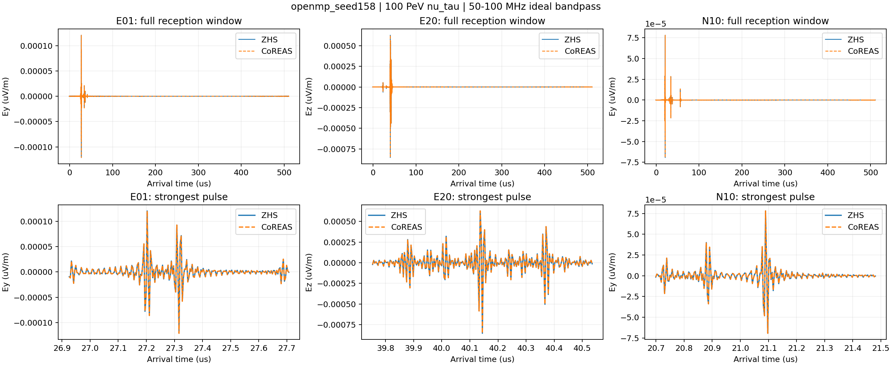
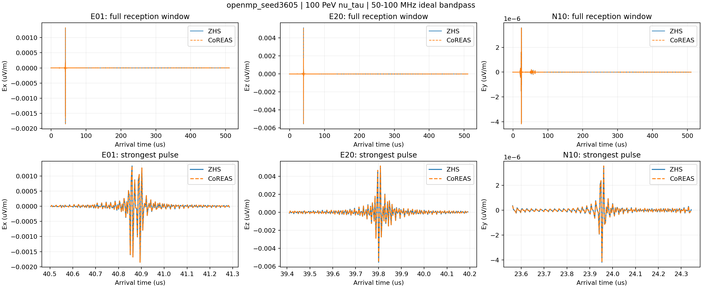
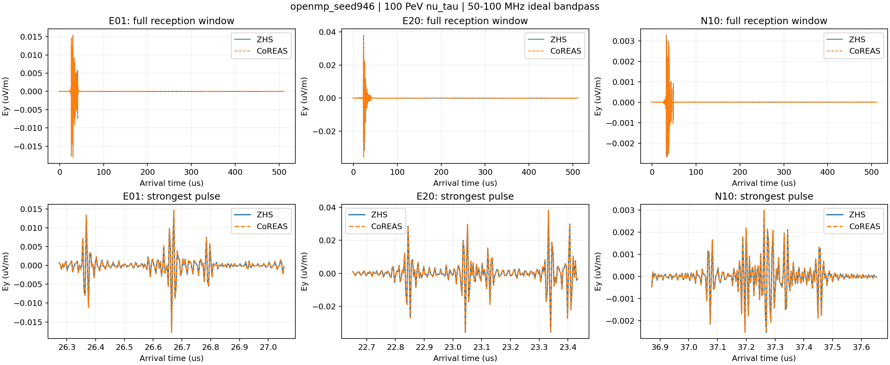

# 100 PeV 穿山 ντ：当前代码审计与射电复跑

图片中的两个算法使用同一批真实输运轨迹。上排是完整接收窗，下排放大最强脉冲；画出该脉冲最强的笛卡尔分量，采用 50–100 MHz 理想带通。不同站点可能选择不同分量，幅度是电场，不是天线电压。各站纵轴量程独立，比较强弱需读刻度及科学计数法倍率。

**不能把两条算法曲线重合解读为完整物理已验证，也不能把两个产生顶点直接称为可分辨的双脉冲。** 原 cut/thinning 较粗，本批首先用于原配置复跑和接线审计。

## openmp_seed158

τ 末态：muonic / air。CoREAS/ZHS 全频复数谱相对 L2 差异：4.59e-09。

看下排实线与虚线是否重合；看上排是否有时间上分离的信号。零信号或被遮挡站点也保留，不据此制造第二个峰。

## openmp_seed3605

τ 末态：hadronic / air。CoREAS/ZHS 全频复数谱相对 L2 差异：1.85e-08。

看下排实线与虚线是否重合；看上排是否有时间上分离的信号。零信号或被遮挡站点也保留，不据此制造第二个峰。

## openmp_seed946

τ 末态：electronic / air。CoREAS/ZHS 全频复数谱相对 L2 差异：2.2e-09。

看下排实线与虚线是否重合；看上排是否有时间上分离的信号。零信号或被遮挡站点也保留，不据此制造第二个峰。

