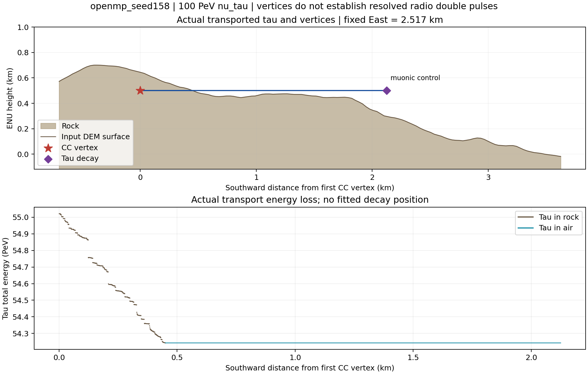
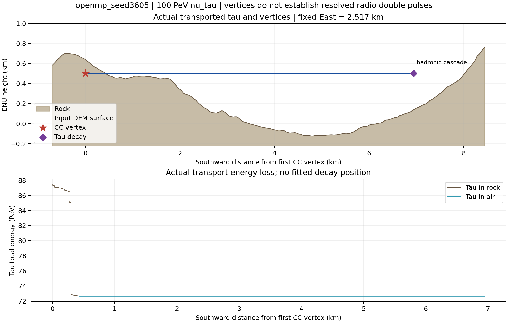
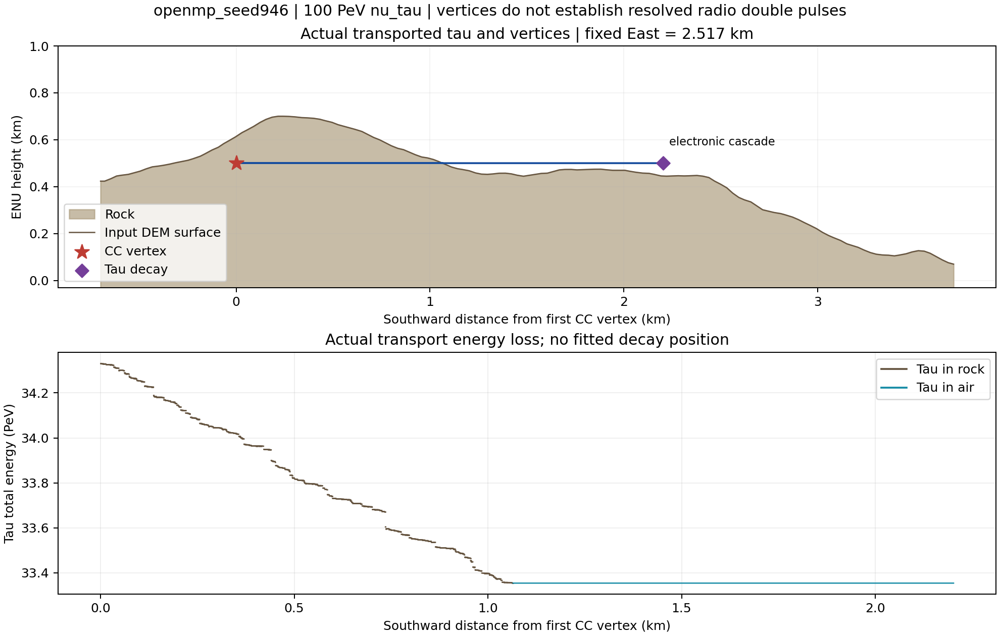

# 100 PeV 穿山 ντ：检查与射电复跑

PSR · OpenMP 256 线程 · 每个事件默认 CoREAS + ZHS

三例均按原 cut / thinning、自然 CC/NC 和自然 τ 衰变完成。

图展示实际模拟；两个产生顶点不自动等于可分辨的两个射电脉冲。

版本说明：本报告图使用当时的 SiO₂ 配置。2026-09-13 的[统一材料接口](../../mountain_material_models_CN.md)
已改用文件中的二氧化硅 SiO₂ 基准（S0，n=√5），并更新材料密度效应及山体强子能损；本页后的旧图属于旧版本结果。

[详细代码检查与物理限制](AUDIT_CN.md) · [逐例结果](RESULTS_CN.md)

---

# 当前射电光路：岩石与大气都用直线段

|区域|光路几何|传播时间|
|---|---|---|
|均匀岩石|直线段，本批 n=2|t=nL/c|
|缓变大气|直线段近似|沿直线积分 t=∫n(h(s))ds/c|
|岩石–空气界面|按局部 Snell 条件连接两条直线段|两段光程相加|

大气 n(h) 影响光程，但当前没有求解连续弯曲光线及其完整聚焦／散焦。

带电粒子输运另有磁场弯曲；射电源按每个记录段的端点构造有限直线源段。

缓变条件不能直接保证长光路误差很小；忽略弯曲的误差尚未由本批检查量化。

---

# 衰减：本批 100 m 是电场幅度长度

每条光路乘以 A=exp(−ℓrock/LE,rock−ℓair/LE,air)，几何展宽和 Fresnel s/p 另算。

本批岩石 LE=100 m，空气不计吸收；岩石吸收不随频率变化。

岩内光路 100 m、300 m、1 km：电场分别剩 36.8%、4.98%、0.00454%。

功率按电场比例的平方衰减；100 m 不是功率的 1/e 长度。

公开参考：石灰岩约 9–22 m；花岗岩范围很宽，约 9–870 m。不是本站 50–100 MHz 标定值。

[EPA 工程参考表](https://archive.epa.gov/esd/archive-geophysics/web/html/ground-penetrating_radar.html) 的 dB/m 经 LE=8.686/a 换算。

100 m 是诊断假设；岩性、含水和频率均会改变实际损耗，尚不能据此确定可探测率。

---

# 山体 shower：已包含 LPM 抑制

CPU PROPOSAL 与常驻 Kokkos 路径均处理制动辐射、光子成对产生的 LPM 抑制。

用所在介质参数和局部密度计算接受概率；被抑制的候选相互作用保留母粒子继续输运。

LPM 作用于簇射发展，随后由真实轨迹生成射电；不对最终波形另乘一个 LPM 系数。

按本批 SiO₂ 密度估算，E_LPM 约 0.08 PeV，高能电磁分支需要考虑这一效应。

[PDG 量级公式](https://pdg.lbl.gov/2024/reviews/rpp2024-rev-passage-particles-matter.pdf) · [SiO₂ 辐射长度](https://pdg.lbl.gov/2013/AtomicNuclearProperties/HTML_PAGES/245.html)

本批未做 LPM 开／关的纵向分布统计对照，尚不报告具体拉长倍数。

---

# 修复：磁场中位置与时间的一致性

左：真实试跑的 766 条异常源。右：收紧磁场积分步长后，与解析螺旋轨迹比较。

同时修正了平行磁场判断中的 CPU / GPU 消减误差；异常源拒绝门槛没有放宽。

---

# 修复：近界面光路的数值精度

看左图：所测几何的有效解从 4/12 增为 12/12。看右图：与独立高精度求根一致。

---

# 修复：极短源轨迹的坐标与时钟精度

真实试跑中旧规则误拒绝了 19 条轨迹；图中均落在输入精度预算内。越界错误仍拒绝。

---

# τ 衰变：守恒与给定极化

左：1800 次衰变四动量检查。右：18 万次 πν 抽样；误差棒为均值的一个标准误。

仅验证给定纵向极化；未包含事件级 CC 自旋传递和能损退极化。

---

# 射电参数：误差究竟有多大

当前参数的标准源最大电流积分误差 0.20%；人工拆段依赖 0.15%。

本批参数未通过全部严格门槛；细参数组通过。标准源误差不是完整簇射误差上限。

---

# CUDA：实际内核与最终下载

蓝色输运，橙色 CoREAS，绿色 ZHS；红色三角是最终矩阵下载。初始化与诊断传输未画出。

完整 CUPTI 日志另核对设备续存队列、源缓冲及矩阵的传输，检查通过。

---

# Seed 158：山体剖面与真实 τ 轨迹

muonic control / air，距离 2.125 km，τ 衰变能量 54.24 PeV。

星号为 CC，菱形为 τ 衰变；下图的能量断口对应连续段之间的离散过程。

---

# Seed 158：实际双算法波形

上排：完整接收窗；下排：最强脉冲。50–100 MHz 理想带通，显示最强笛卡尔分量。

实线 ZHS、虚线 CoREAS；各站纵轴独立，比较强弱需看刻度。未加入天线响应或噪声。

---

# Seed 3605：山体剖面与真实 τ 轨迹

hadronic cascade / air，距离 6.943 km，τ 衰变能量 72.66 PeV。

星号为 CC，菱形为 τ 衰变；下图的能量断口对应连续段之间的离散过程。

---

# Seed 3605：实际双算法波形

上排：完整接收窗；下排：最强脉冲。50–100 MHz 理想带通，显示最强笛卡尔分量。

实线 ZHS、虚线 CoREAS；各站纵轴独立，比较强弱需看刻度。未加入天线响应或噪声。

---

# Seed 946：山体剖面与真实 τ 轨迹

electronic cascade / air，距离 2.202 km，τ 衰变能量 33.35 PeV。

星号为 CC，菱形为 τ 衰变；下图的能量断口对应连续段之间的离散过程。

---

# Seed 946：实际双算法波形

上排：完整接收窗；下排：最强脉冲。50–100 MHz 理想带通，显示最强笛卡尔分量。

实线 ZHS、虚线 CoREAS；各站纵轴独立，比较强弱需看刻度。未加入天线响应或噪声。

---

# 三例完成后的读法

|seed|实际 τ 衰变|介质|CC–衰变距离|步数|CoREAS/ZHS 复数谱相对 L2|
|---|---|---|---|---|---|
|158|muonic control|air|2.125 km|7,626,165|4.59e-09|
|3605|hadronic cascade|air|6.943 km|7,813,400|1.85e-08|
|946|electronic cascade|air|2.202 km|10,272,798|2.2e-09|

μ 衰变道用作对照：μ 随后仍可通过能损产生次级簇射，不能等同于直接第二簇射。

更细磁场步长允许后续随机历史改变；同 seed 不保证新旧逐轨迹相同，分类和距离取自本次输出。

保留了原粗 cut / thinning；绝对幅度、可探测性与双脉冲识别率尚未完成收敛验证。

完整高能事件为 OpenMP；CUDA 的常驻输运、双射电内核及最终下载另外由 CUPTI 实测核对。
