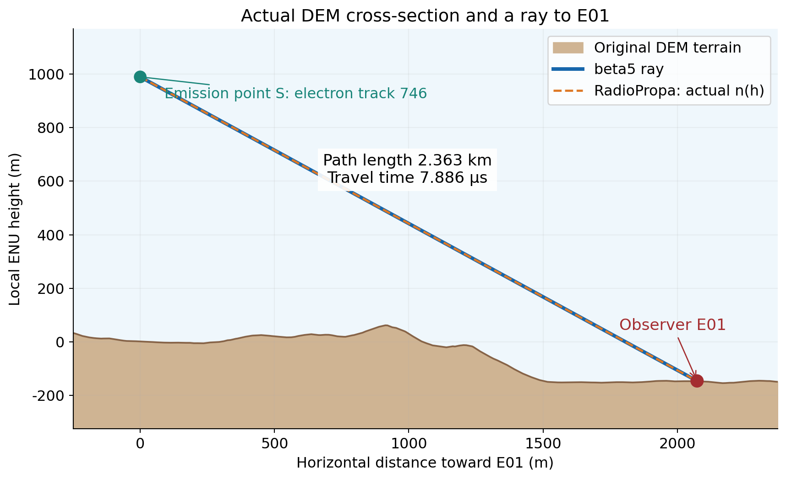
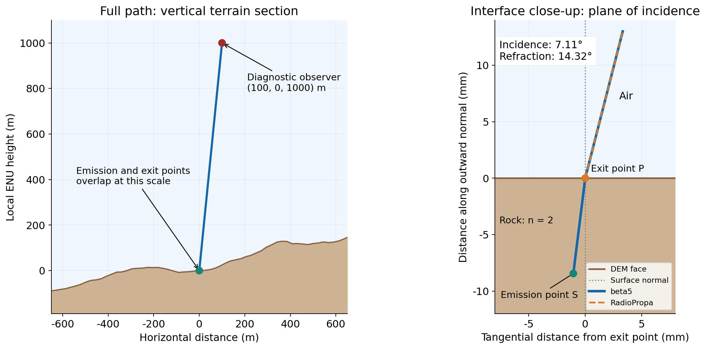
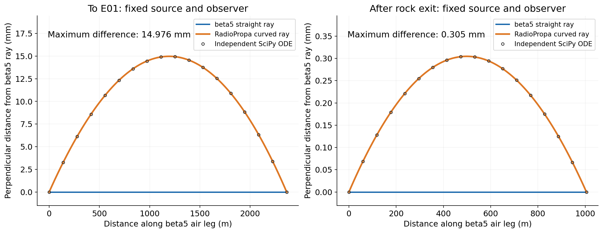
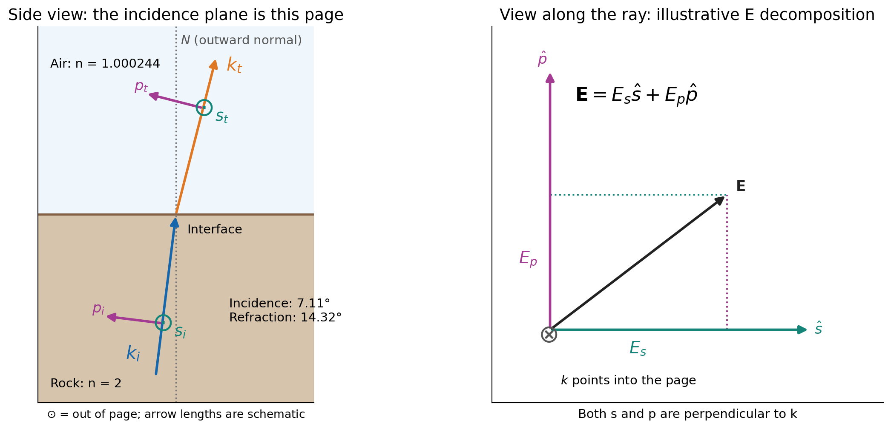
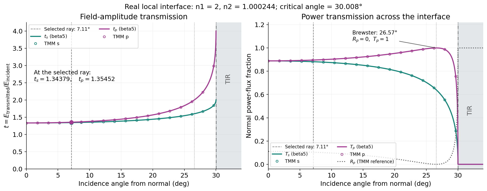
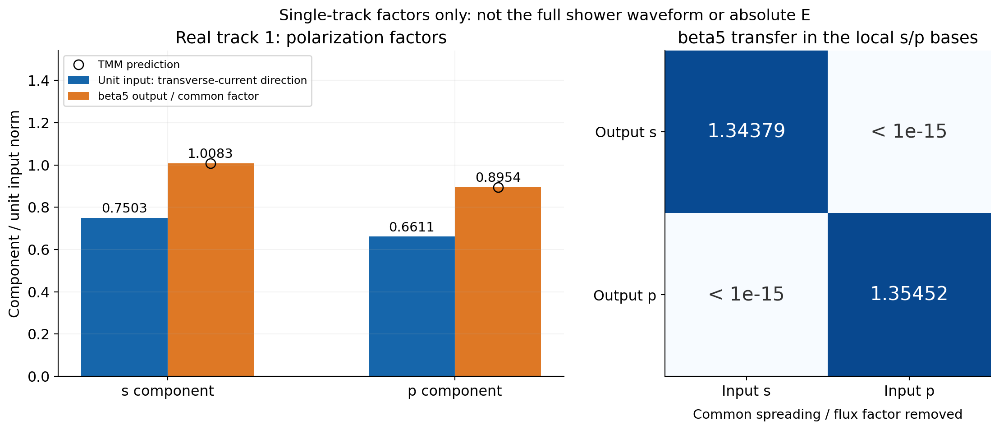
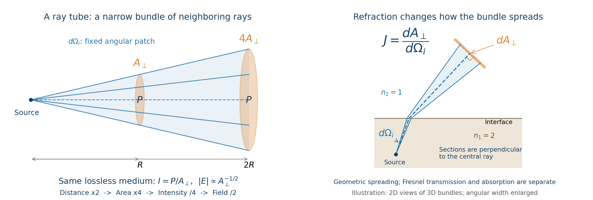
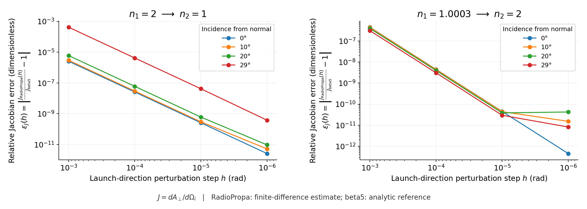
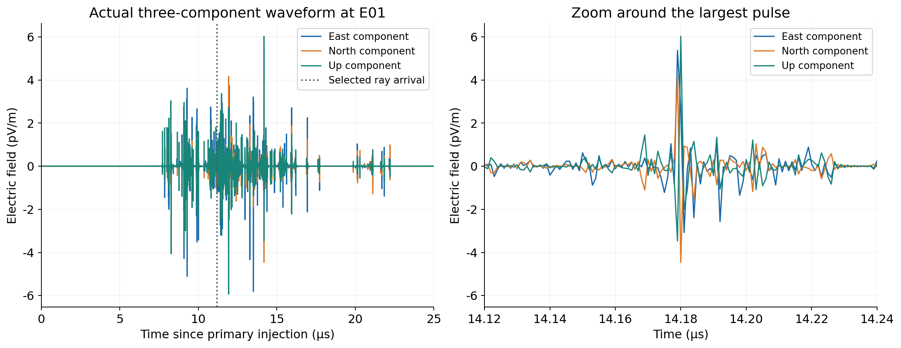
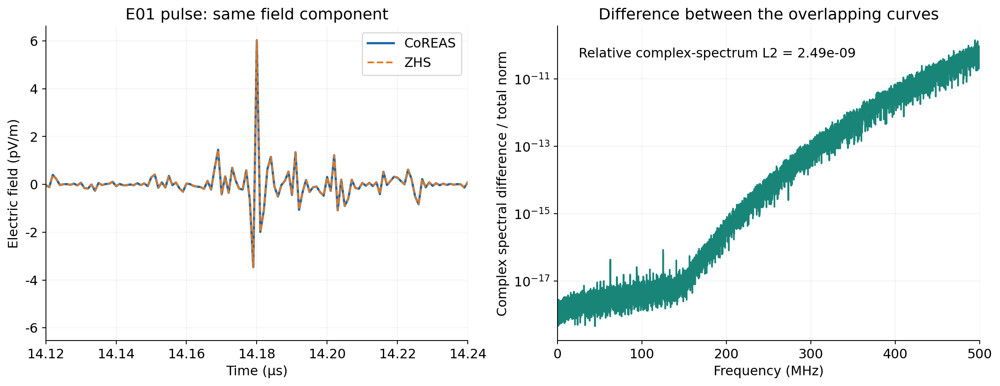

# 1. 从真实模拟中取一条光路，看它怎样到达 E01

怎么看：棕色是实际 DEM 山体，绿点是电子轨迹第 746 段的中点，红点是 E01；连线由传播程序重放得到。  
蓝色 beta5 与橙色 RadioPropa 在全景中几乎重合，毫米级差异放在第 3 图。

---

# 2. 再看一条岩石内部发射、穿出山面的光路

怎么看：左图看整条路径；右图转到真正的入射平面，用毫米尺度看折射，角度均相对山面法线。  
原始发射点距该出射面约 **8.44 mm**；入射 **7.11°**、出射 **14.32°**，RadioPropa 与 beta5 的折射方向重合。

---

# 3. 和外部库比较：把路径差异放大到毫米

怎么看：固定同一发射点、同一观测点，蓝线是 beta5 直线，橙线显示实际大气 n(h) 下的弯曲偏离量。  
这两个案例最大差异约 **15 mm / 0.305 mm**；黑圈是独立积分核对，不代表 beta5 已计算了弯曲射线。

---

# 4. s/p：相对于入射面的两个电场方向

怎么看：左图的光线与山面法线构成入射面；绿色 s 垂直纸面，紫色 p 位于纸面内。  
两者都垂直各自的传播方向 k；p 并不平行光线，s/p 也不固定等于东西或竖直分量。

---

# 5. s/p 的透射不同：振幅系数与功率要分开看

怎么看：左图 t 表示振幅，右图 T 表示功率；t 大于 1 不等于能量增加，空心点是 TMM 对照。  
Brewster 角处 p 反射为零，临界角后无传播透射光；灰色 R_p 仅作物理参考，当前模块不计算反射波。

---

# 6. 真实轨迹的 s/p 分量怎样经过界面

怎么看：左图是轨迹 1 的归一化偏振因子，橙柱已除去公共几何/通量因子；它不是整场簇射波形。  
右图只有对角项：各向同性界面分别作用于 s/p，再转回 ENU 叠加；定义、公式和易混点见 [s/p 简短复习](SP_NOTES_CN.md)。

---

# 7. Ray tube 是什么：同一小束辐射铺开多大面积

怎么看：蓝线围住一小束辐射，橙色是垂直于中心光线的截面。同一无吸收介质中，束内功率不变；距离翻倍，面积 ×4，单位面积功率 ÷4，**电场幅度 ÷2**。

右图看折射怎样改变束的展开。**J=dA⊥/dΩᵢ** 表示发射小立体角对应的接收截面积；均匀介质中 J=R²，因此场幅回到 1/R。图为三维束的二维示意。

---

# 8. 这张图怎么读：它检查面积 J 的数值误差

横轴：发射方向扰动步长 $h$（rad），向右更小；图例：相对于界面法线的入射角。

纵轴（无量纲）：$\varepsilon_J(h)=\left|\frac{J_{\mathrm{RadioPropa}}(h)}{J_{\mathrm{beta5}}}-1\right|$，越小表示面积计算越一致。

RadioPropa 为邻近射线的中心差分估计，beta5 为解析参考；$h=10^{-6}$ rad 时最大差 **3.79×10⁻¹⁰**。临界角附近的敏感性及右端误差平台见 [详细读图说明](RAYTUBE_NOTES_CN.md)。

---

# 9. 吸收衰减：在几何扩散之外再损失多少

怎么看：左图灰线为 **1/R**，蓝线再乘 **exp(−R/100 m)**；空心点是解析核对。右图检查时延 **nR/c**。

本页为 **n=1.33、场幅衰减长度 L_E=100 m** 的均匀介质控制算例。单独的吸收因子每经过 100 m 降至约 **37%**；电场平方对应的功率因子降至约 **14%**。材料取值接着看下一页。

---

# 10. 换山体材料：衰减长度怎样影响信号

怎么看：横轴是**材料内路径长度**，纵轴只画吸收 **E/E₀=exp(−ℓ/L_E)**；越陡，吸收越强。几何扩散与界面透射另算。

材料卡取值：SiO₂ **100 m**、CaCO₃ **14.48 m**、图示十元素花岗岩 **86.86 m**。这些是所选模型参数，现场取值仍需材料测量。

---

# 11. 完成 s/p、扩散和吸收后，E01 收到什么

怎么看：左图看脉冲出现的时间，右图放大最大脉冲；颜色表示共同 ENU 坐标下的电场方向，单位 pV/m。各条光路的贡献按到达时间相干叠加。

本图回到 **1 GeV 电子、seed 67101、旧岩石 n=2** 事例。虚线 **11.192 μs** 是所选空气光路的到达时刻；第 6 页的 s/p 光路则通向 diagnostic_offset，两者不是同一条光路。

---

# 12. CoREAS 和 ZHS 是否算出同样的结果

怎么看：左图同一电场分量的两条波形几乎重合；右图把复频谱差异放大，数值越低表示越一致。没有人为平移时间或拟合幅度。

本例全复频谱相对差约 **2.49×10⁻⁹**。两算法共用传播模块，这是同一近似下的一致性；光学独立核对仍看前面的 RadioPropa/TMM。数据与复现说明见 [README](README.md)。
