<!-- _class: title -->

# beta5 山体跨介质射电
## 物理效应 · 数值实现 · 验证证据

**CoREAS 与 ZHS 默认同时计算**

公开库 RadioPropa / TMM 对照，以及完整簇射的时域与频域诊断

2026 年 9 月 12 日｜16:9 幻灯片 Markdown

<!--
讲述目标：明确当前独立模块做了什么、如何计算，以及在什么条件下验证过。
报告以 beta5 已验收的 c4 物理内核与 p1 默认双算队列为对象。
所有补充编译、数值计算、绘图和幻灯片导出均在 PSR；本地只编辑、查看和归档。
-->

---

# 先回答三个核心问题

**考虑了什么？**  
带电粒子有限轨迹的相干辐射，直达 / 单次透射，折射、偏振、几何扩散、衰减和地形遮挡。

**怎么算？**  
同一批轨迹、同一光学模型，分别累积 CoREAS 端点电场矩和 ZHS 矢势矩。

**凭什么认为算对？**  
解析极限、独立电流积分、公开光学库、数值收敛、完整簇射和实际 GPU 记录逐层检查。

<div class="callout">证据支持的是当前明确近似下的实现；还不能据此声称任意介质中的完整 Maxwell 解。</div>

---

# 报告对应哪个版本？

| 对象 | 当前状态 | 证据来源 |
| --- | --- | --- |
| 发射与传播物理 | c4 共同光路端点适配 + 已有 ZHS | 固定源、收敛、原空气算法对照 |
| 山体应用 | p1：开启射电后固定同时计算两算法 | 4 组 OpenMP / CUDA 完整簇射 |
| 本次新增 | 当前 beta5 光学函数对 RadioPropa / TMM | 642 组角度与介质组合、射线束 |
| 原空气模块 | 本任务未修改 | 受保护源码哈希检查 |

输出：`radio/CoREAS/`、`radio/ZHS/`。  
启用：`--radio` 或 `radio.enabled: true`；没有算法选择开关。

<div class="source">代码与产物索引见本目录 README.md、data/source_provenance.json；旧 mountain 仅作为设计与测试思路参考。</div>

---

<!-- _class: small -->

# 物理效应①：发射源与相干叠加

| 效应 | 如何进入计算 | 当前含义 |
| --- | --- | --- |
| 电荷过剩 / Askaryan 贡献 | 每条轨迹保留带符号电荷和权重 | 由实际粒子组成产生，不另加参数化脉冲 |
| 磁场导致的辐射 | 输运先产生弯曲运动的分段轨迹 | 射电读取轨迹，不再次施加洛伦兹力 |
| 时间相干与干涉 | 按绝对到达时间叠加三分量电场 | 保留正负号与复频谱相位 |
| 切伦科夫时间压缩 | 折射率进入到达时间跨度 | 可处理正、负和近零 Doppler 因子 |
| 穿越介质边界 | 输运先切段，每段使用自己的源介质 | 不是完整过渡辐射的额外全波项 |
| e± 以外的带电来源 | CPU 轨迹按批送入同一射电模块 | μ、τ、带电强子等只计一次 |

<div class="source">实现：<a href="../../../corsika/modules/radio/interface/Types.hpp">Track</a>、<a href="../../../corsika/modules/radio/interface/CoreasEndpoints.hpp">CoreasEndpoints.hpp</a>、<a href="../../../corsika/modules/radio/interface/ZhsIntervals.hpp">ZhsIntervals.hpp</a>。</div>

<!--
中性粒子没有直接电荷源；其产生的带电次级粒子通过轨迹参与。
输运中的相互作用、LPM、能损和 thinning 等会改变源轨迹，它们不是射电模块内新实现的物理。
本模块不计算辐射反作用，也不把输出的射电能量反馈给粒子输运。
权重在线性场幅上使用；统计 thinning 的噪声仍须独立控制。
-->

---

<!-- _class: small -->

# 物理效应②：介质、偏振与传播

| 效应 | 实现 | 限定 |
| --- | --- | --- |
| 两侧介质 | 分别指定折射率与场幅衰减长度 | 当前通用接口是两个光学区域 |
| Snell 折射 | 在平面 / 有限三角面求驻相折射点 | 直线分段、至多一次透射 |
| Fresnel 偏振 | s/p 电场系数 + 偏振基变换 | 实数、各向同性、非磁性光学介质 |
| 射线管扩散 | Jacobian 与功率通量归一化 | 与 Fresnel 合用，避免重复修正 |
| 非均匀折射率 | 径向表、分层光程积分 | 光路仍为直线，不求弯曲射线 |
| 振幅吸收 | 沿每段乘指数衰减 | 常数衰减长度；当前无频散 |
| DEM 遮挡 | 完整 BVH + 有限面归属 / 可见性细分 | 没有棱边绕射补偿 |

<div class="source">生产函数：<a href="../../../corsika/modules/radio/interface/Propagation.hpp">Propagation.hpp</a>；场景适配：<a href="../../../applications/detail/mountain/TerrainRadioConfig.hpp">TerrainRadioConfig.hpp</a>。</div>

---

# 当前没有接入的效应

| 范围 | 当前 beta5 |
| --- | --- |
| 反射、多次穿界与多层干涉 | 未生成这些光学分支 |
| 绕射、倏逝波、焦散的全波处理 | 未实现 |
| 完整近场、界面过渡辐射 Green 函数 | 未实现 |
| 弯曲大气射线 / firn 转向射线 | 未实现 |
| 复介电常数、频散、双折射、Faraday 旋转 | 未实现 |
| 天线有效长度、电子学、噪声与电压输出 | 未接入此独立模块 |

旧 mountain 的某些研究模块包含更丰富的传播模型，**不能据此推断这些能力已经移植到 beta5**。

---

# 一条带电轨迹怎样变成波形？

<div class="flow">
<div class="box">输运轨迹<br><strong>电荷 / 权重 / 时间</strong></div>
<div>→</div>
<div class="box">传播与细分<br><strong>可见光路 / 传递矩阵</strong></div>
<div>→</div>
<div class="box">双算法累积<br><strong>CoREAS + ZHS</strong></div>
<div>→</div>
<div class="box">最终下载<br><strong>FFT / 输出</strong></div>
</div>

- CUDA 轨迹通过设备内复制进入射电队列；CPU 来源只上传一次。
- 两算法共用光学数据和输入，使用各自的发射累积内核。
- CoREAS 保存两份矩数组，ZHS 保存一份；三份数组联合检查内存预算。

<div class="source">调度：<a href="../../../corsika/modules/radio/interface/KokkosAccumulator.hpp">KokkosAccumulator&lt;Space, true&gt;</a>；接入：<a href="../../../src/transport/InterfaceEmSession.cpp">InterfaceEmSession.cpp</a>。</div>

---

# 单个子段的共同物理量

子段长度为 $L$、持续时间为 $\Delta t$，速度为 $\boldsymbol\beta c$：

$$
\boldsymbol\beta_\perp
=\boldsymbol\beta-(\boldsymbol\beta\cdot\hat{\boldsymbol k})\hat{\boldsymbol k},
\qquad
\boldsymbol A_{\rm area}
=\frac{q\,w}{4\pi\epsilon_0 c}\,
\mathbf T\boldsymbol\beta_\perp\,\Delta t
$$

$\mathbf T$ 包含偏振变换、距离扩散、Fresnel 和衰减；$q$ 是实际电荷，$w$ 是权重。

$$
\tau_m=t_m+t_{\rm optical},\qquad
\Delta\tau=(1-n\boldsymbol\beta\cdot\hat{\boldsymbol k})\Delta t
$$

最后一式用于均匀介质；变折射率时用子段两端的光学时延差。

<div class="source">SI 单位；这里的中点光路和一阶到达时间展开是两种发射表示的共同近似。</div>

---

<!-- _class: small -->

# CoREAS 和 ZHS 为什么应该一致？

**ZHS**：累积有限到达时间区间的矢势面积，最后求导：

$$
\widetilde{\boldsymbol E}_{\rm ZHS}(\omega)
=-i\omega\boldsymbol A_{\rm area}
e^{-i\omega\tau_m}
\operatorname{sinc}\!\left(\frac{\omega\Delta\tau}{2}\right)
$$

**CoREAS**：在相同光路上累积一对端点冲量：

$$
\boldsymbol J_-=-\frac{\boldsymbol A_{\rm area}}{\Delta\tau},\quad
\boldsymbol J_+=+\frac{\boldsymbol A_{\rm area}}{\Delta\tau},\quad
\tau_\pm=\tau_m\pm\frac{\Delta\tau}{2}
$$

端点对的 Fourier 变换给出同一表达式。约定为 $e^{-i\omega t}$，$\operatorname{sinc}x=\sin x/x$。

**相同轨迹、相同光路、相同近似**下，两者差异应随数值精度提高而收敛。

<div class="source">理论背景：<a href="https://arxiv.org/abs/1007.4146">James et al., endpoint formalism</a>；本页具体表达式对应 beta5 的 radiation-only 共同光路实现。</div>

---

<!-- _class: figure -->

# 为什么不能直接搬用空气端点公式？

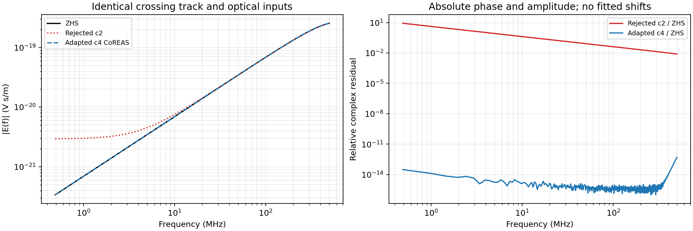

分别给两个端点使用不同的几何幅度，同时省略近场项，会破坏本模型应有的低频相消。  
被否决的 c2 实现出现明显差异；c4 使用与 ZHS 一致的共同中点光路后通过对照。

<div class="source">历史诊断：c4 / algorithm-comparison-c4 / boundary_before_after.npz；同一穿界轨迹，无幅度或时间拟合。</div>

<!--
这不是否定一般端点形式，而是指出：把两个不同近似体系中的组成项拼接，会产生不自洽结果。
本模块选择与有限轨迹 ZHS 相同的远场电流模型；c2 数据保留作反例，没有作为当前正确性证据。
-->

---

<!-- _class: figure -->

# 近切伦科夫方向：有限源不能被小分母毁掉

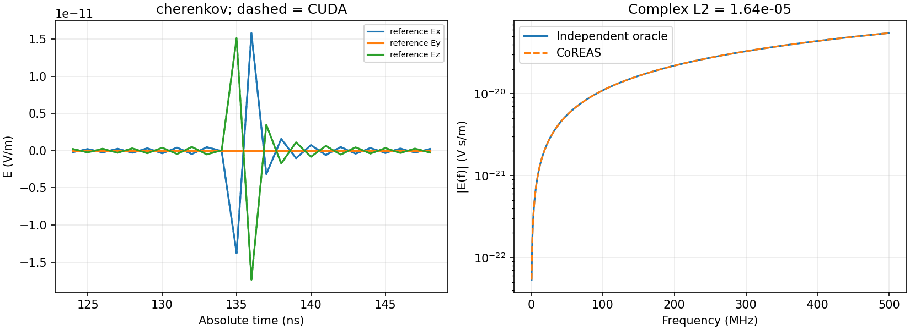

$\Delta\tau\to0$ 时使用有限电流极限；同一采样格的端点对采用稳定差商，零阶矩成对相消。  
本例相对独立电流积分的复频谱 L2 为 **$1.64\times10^{-5}$**。

<div class="source">c4 / oracle-c4 / cherenkov.npz；<a href="https://arxiv.org/abs/1301.2132">CoREAS 近切伦科夫处理背景</a>。</div>

<!--
此例触发辅助矩路径，CoREAS 与 ZHS 的极限计算共享区间矩实现。
因此两算法在这里完全一致不能单独构成独立验证；必须看图中的独立电流积分参考。
-->

---

<!-- _class: small -->

# 连续时间矩：保留采样格内的位置

不是把整个轨迹信号放到最近的采样点。每个单元保存局部矩：

$$
M_p(k)=\int_{\mathrm{cell}\,k}
g(t)\frac{[f_s(t-t_k)]^p}{p!}\,dt
$$

$$
\widetilde g(\omega)\simeq
\sum_{k,p}M_p(k)e^{-i\omega t_k}
\left(\frac{-i\omega}{f_s}\right)^p
$$

| 数组 | 物理量 / 单位 | 最终处理 |
| --- | --- | --- |
| CoREAS 主矩 | 电场冲量矩，V·s/m | 直接合成电场 |
| CoREAS 辅助矩、ZHS 主矩 | 矢势面积矩，V·s²/m | 乘 $-i\omega$，只求导一次 |

默认 $P=12$；保留绝对时间相位，Nyquist 的实波形处理与连续复频谱分开。

<div class="source">实现：<a href="../../../src/radio/interface/Output.cpp">Output.cpp</a>。最终电场为 V/m，连续频谱为 V·s/m。</div>

---

# 几何细分怎样控制误差？

每个子段同时限制几何变化与相位曲率：

$$
\max\left[
\frac{L}{R},\;
\frac{2\pi f L^2(1-\cos^2\theta)}{cR}
\right] < \varepsilon
$$

- 直达轨迹在 DEM 阴影边界处分割。
- 透射轨迹检查有限三角面的合法性，并按空间分辨率细分。
- 共享边只归属一个共面三角形，避免把同一支光路重复相加。
- 越窗、非有限值、求解未收敛或达到细分上限，都报告失败。

<div class="callout">减小采样间隔、增加矩阶数和缩短几何子段，控制的是不同误差，不能相互替代。</div>

---

<!-- _class: figure -->

# 非均匀大气：先把光程算准确

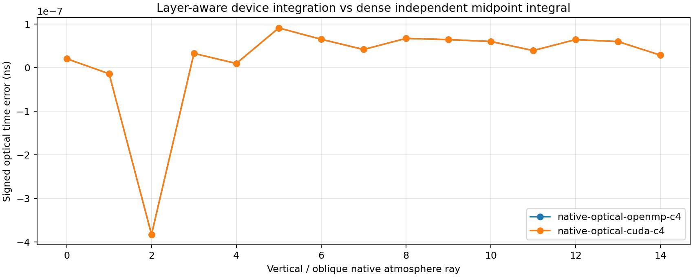

统一使用海平面密度参考：$n(h)-1=[n_{\rm sea}-1]\rho(h)/\rho_{\rm sea}$。  
在球形层边界处分段，再做复合 Gauss 光程积分；**仍未弯曲射线**。

<div class="source">c4 / native-optical-c4；当前适配器只读取原生大气密度，没有改写原空气类。</div>

---

# “验证正确”需要哪些不同的证据？

| 层次 | 对照对象 | 能回答的问题 |
| --- | --- | --- |
| 发射表示 | CoREAS vs ZHS | 两种数值表示是否一致 |
| 发射绝对量 | 独立沿轨迹电流积分 | 幅度、相位和有限轨迹近似误差 |
| 光学模块 | RadioPropa / TMM / 解析极限 | 折射、偏振系数、射线管是否正确 |
| 离散误差 | $P$、子段、光程积分收敛 | 误差是否随控制参数收敛 |
| 完整接入 | 同轨迹簇射、源数、冻结输运 | 是否漏源、重复计数或改变输运 |
| 设备执行 | CUPTI 实际 kernel 与复制记录 | 是否真的在 GPU 累积并保持常驻 |

**CoREAS/ZHS 共用传播模型；两者一致不能排除共同的传播错误。**

---

# 本次公开库对照怎样保证独立？

- 当前 beta5：直接编译并调用生产 `Propagation.hpp`，不在脚本里重写待测公式。
- RadioPropa：使用公开源码的固定 revision **544a2d6…**，不修改库。
- TMM **0.2.0**：使用独立的 `interface_t`、`interface_r`、`T_from_t`。
- 两套 C++ 探针独立生成 CSV；Python 在 PSR 比较结果并绘图。

<div class="callout">RadioPropa 对照射线几何；TMM 对照平面波界面系数。它们都没有替我们模拟完整的带电簇射源。</div>

<div class="source"><a href="https://github.com/nu-radio/RadioPropa/tree/544a2d6c4e284e3d724cb741dc481245a0f633d7">RadioPropa 固定源码</a> · <a href="https://github.com/sbyrnes321/tmm">TMM 官方源码</a> · tools/beta5_optics_probe.cpp、tools/radiopropa_plane_probe.cpp。</div>

<!--
只在 PSR 编译和运行。RadioPropa 使用与旧 mountain 对照相同的固定公开 revision，
这是可复现的版本选择，不表示它是最新发布版。报告中不把该版本的局部幅度差异推广到其他版本。
-->

---

<!-- _class: figure -->

# RadioPropa：折射方向与透射分类

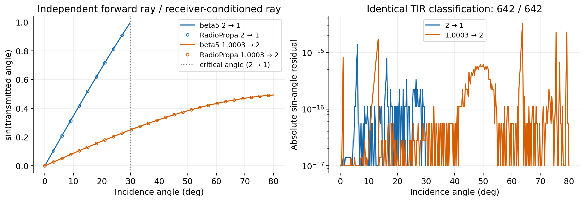

两介质顺序：$2\to1$、$1.0003\to2$；入射角 $0^\circ\!:\!0.25^\circ\!:\!80^\circ$。  
**642 / 642** 透射分类一致；$\sin\theta_t$ 最大绝对差 **$3.28\times10^{-15}$**。

<div class="source">数据：data/beta5_plane.csv、data/radiopropa_plane.csv。TIR 检查的是给定入射方向的平面支路，不是完整点源场。</div>

---

<!-- _class: figure -->

# TMM：Fresnel 电场系数与功率归一化

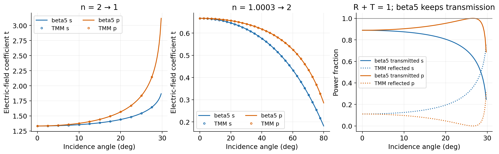

原始电场系数 $t_s,t_p$ 最大相对差 **$6.00\times10^{-15}$**。  
验证 $T=\frac{n_t\cos\theta_t}{n_i\cos\theta_i}|t|^2$；beta5 只保留透射场，不传播图中的反射支路。

<div class="source">数据：data/external_arrays.npz。定义依据：<a href="https://arxiv.org/abs/1603.02720">Byrnes, Multilayer optical calculations</a>。</div>

<!--
图中反射功率来自 TMM，用于能量守恒核对，不能把它误读为 beta5 已生成反射射线。
原始场系数、功率归一化系数、点源射线管扩散是三种不同量；本报告逐层核对。
-->

---

<!-- _class: figure -->

# RadioPropa 射线束：独立检查几何扩散


对中心入射方向施加两个正交小扰动，用外部折射方向计算接收屏上的面积 Jacobian。  
在 $h=10^{-6}$ rad 时，8 组介质 / 角度组合的最大相对差 **$3.79\times10^{-10}$**。

<div class="source">源距界面 100 m，接收点高度 300 m；角度 0°、10°、20°、29°。data/radiopropa_beam.csv。</div>

<!--
beta5 使用解析 ray-tube Jacobian；外部参考使用 RadioPropa 的折射方向和有限差分射线束。
因此不是把 beta5 的 Jacobian 公式再写一遍。减小扰动时先收敛，之后可能受浮点差分舍入限制。
-->

---

<!-- _class: figure -->

# 外部库也需要检查：幅度存在已知差异

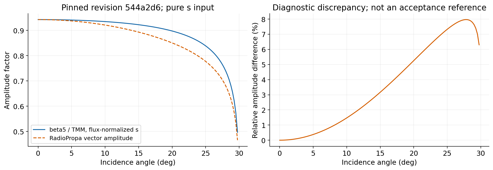

固定 revision 的纯 s 向量幅度与 TMM / beta5 的通量归一化结果存在角度相关差异，扫描最大约 **7.97%**。  
因此本报告使用其几何 / 射线束结果，**不将该幅度作为验收真值**。

<div class="source">固定版 <a href="https://github.com/nu-radio/RadioPropa/blob/544a2d6c4e284e3d724cb741dc481245a0f633d7/radiopropa/src/module/Discontinuity.cpp">Discontinuity.cpp</a> 的偏振分解使用未归一化叉积；data/report_metrics.json 保留差异。</div>

<!--
这里没有修改 RadioPropa，也没有拟合修正因子。该结论仅针对给定 revision、给定纯 s 输入和调用方式。
代码检查与旧 mountain 的诊断相符，但本图来自本次在 PSR 重新运行的公开库与当前 beta5。
-->

---

<!-- _class: figure -->

# 弯曲射线：这是当前模型的明确边界

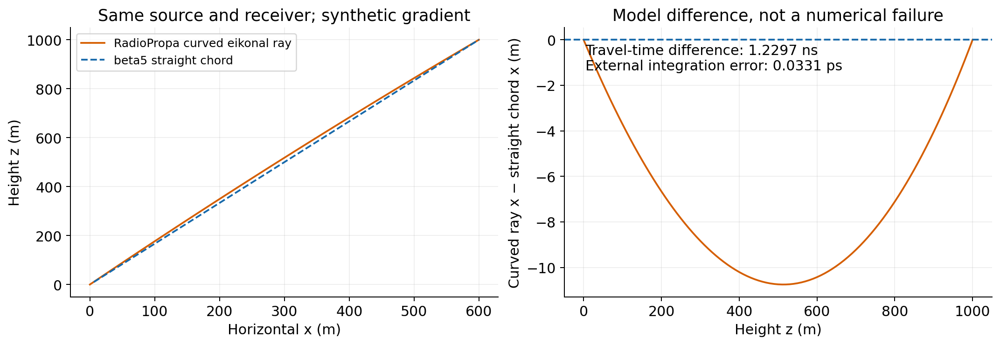

合成梯度 $n(z)=2-2\times10^{-4}z$，固定端点 $(0,0,0)\to(600,0,1000)$ m。  
路径最大偏离 **10.75 m**，时延差 **1.2297 ns**；不能用更密的直线积分补偿弯曲路径。

<div class="source">RadioPropa 解 eikonal 方程；beta5 使用 R=10¹⁰ m 的径向表近似平面梯度。此数值不是实际 21CMA 大气误差估计。</div>

<!--
外部弯曲射线对独立解析/数值 Fermat 解的时延误差为 0.0331 ps；
beta5 直线光程对同一梯度的直线积分误差为 0.0046 ps。
二者都正确解各自的问题，但它们的问题不同。此图专门展示建模误差与积分误差的区别。
-->

---

<!-- _class: figure -->

# 几何扩散、衰减与时延

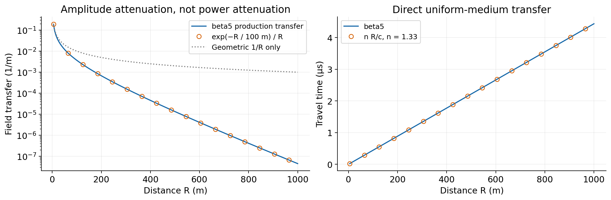

受控均匀介质：$n=1.33$，场幅衰减长度 $L_{\rm att}=100$ m。  
直接检查 $e^{-R/L_{\rm att}}/R$ 和 $nR/c$；幅度最大相对差 **$2.22\times10^{-16}$**。

<div class="source">data/beta5_attenuation.csv。当前衰减长度是输入参数；本图不代表实测岩石材料标定。</div>

---

<!-- _class: figure tall -->

# 发射：18 类固定轨迹的误差结构

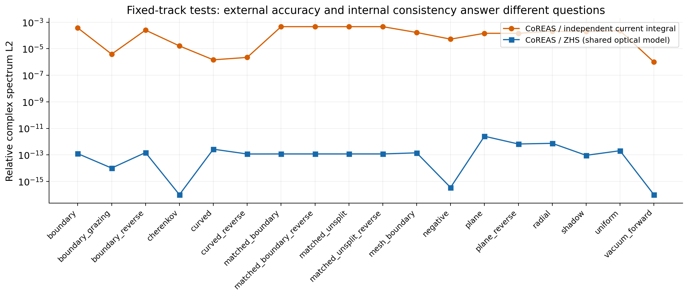

独立电流积分最大 L2：**$4.62\times10^{-4}$**；CoREAS/ZHS 最大 L2：**$2.55\times10^{-12}$**。  
后者更小，说明“两算法一致”与“相对独立参考准确”必须分别报告。

<div class="source">c4：18 类场景 × 2 后端 × 2 算法 = 72 次固定源运行；图显示 CUDA，每组完整判定保存在 data/ 的历史证据副本。</div>

<!--
覆盖均匀介质、正负 Doppler、近切伦科夫、真空前向、两向透射、正反穿界、
同介质界面抵消、掠射、有限 DEM 遮挡/共享边、径向折射率和正反弯曲轨迹。
独立参考对实际电流沿轨迹积分；几何中点近似的有限精度并没有被 CoREAS/ZHS 的内部一致性掩盖。
-->

---

<!-- _class: figure -->

# 数值收敛：提高矩阶数会发生什么？

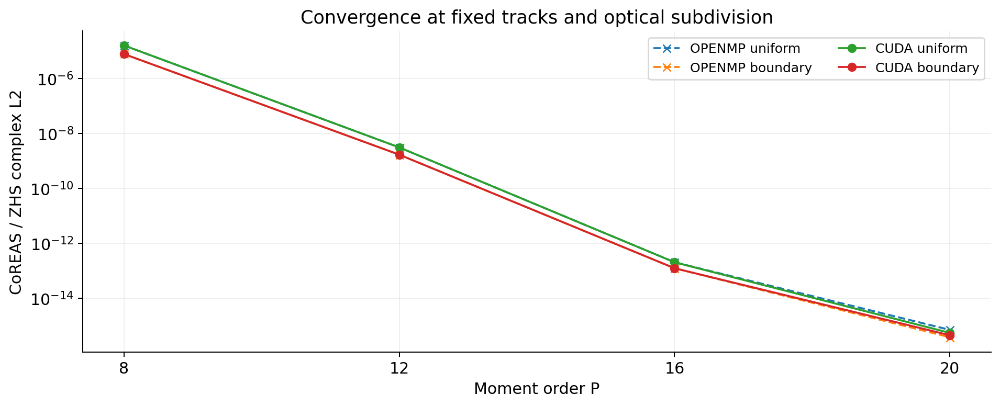

固定轨迹、几何细分和介质，只改变 $P=8,12,16,20$。  
均匀 / 穿界案例中，两表示差异从约 $10^{-5}$ 降至约 $10^{-15}$；OpenMP 与 CUDA 趋势一致。

<div class="source">c4 / precision-c4 / summary.json；32 次额外运行。该图验证时间矩截断，不宣称几何近似同步改善。</div>

---

<!-- _class: figure -->

# 原空气 CoREAS：只在共同适用条件下比较

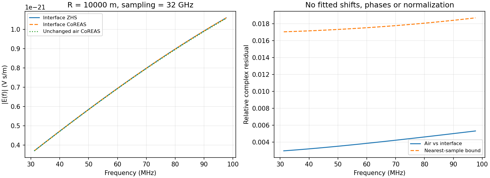

均匀空气 $n=1.0003$、距离 10 km、采样 32 GHz、30–100 MHz：  
原空气输出与新模块 L2 为 **0.00451**；未量化端点参考间的几何近似差异约 **$9.03\times10^{-5}$**。

<div class="source">18 组空气内核对照，直接调用未修改的 accumulateCoREAS；c4 / air-comparison-c4。没有把空气内核用于穿界。</div>

<!--
空气旧算法的采样格处理不同。既要看有限距离几何近似，也要看时间量化误差。
原空气实现与其独立采样端点参考的 L2 约 5.69e-13，且跨距离/采样率检查了收敛。
-->

---

<!-- _class: small -->

# 完整簇射展示：先说明输入条件

| 参数 | 电子案例 | 中微子案例 |
| --- | --- | --- |
| 初级 | 1 GeV $e^-$ | 10 TeV $\nu_e$，强制 CC 顶点 |
| 初始位置 / 方向 | $(0,0,-0.01)$ m / $+z$ | 同左 |
| 磁场配置 | 空气 IGRF14，岩石默认零场 | 无磁场 |
| EM thinning | $10^{-6}$ | $0.1$ |
| 采样 | 1 GHz × 65,536 点 | 128 MHz × 196,608 点 |
| 主要展示观测点 | ENU $(0,0,1000)$ m | 同左 |
| 岩石光学 | $n=2$，未启用吸收 | 同左 |

均使用真实 DEM、原生大气折射率、seed 67101 和 $P=12$。  
**中微子案例采用较强 thinning，是功能与一致性诊断；这些单事例幅度不是实验灵敏度预测。**

<div class="source">当前 p1 / app-cuda-p1 / acceptance.json 与场景文件；完整命令保存在 data/report_metrics.json。</div>

---

<!-- _class: figure -->

# 1 GeV 电子：有符号波形与频谱

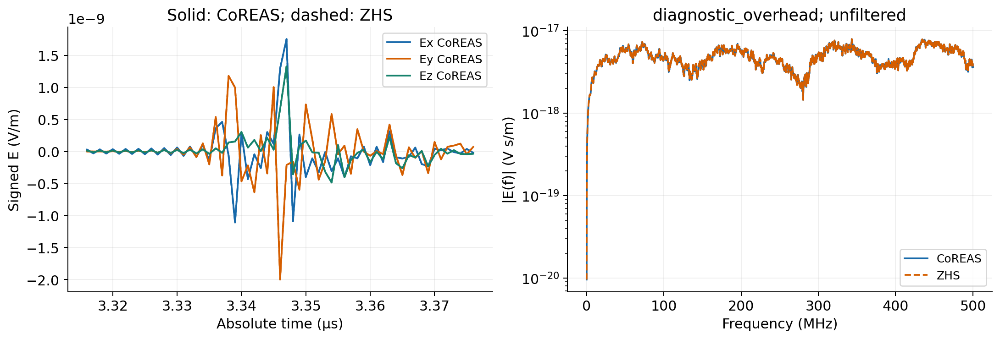

实线为 CoREAS，虚线为 ZHS；使用相同绝对时间、幅度和观测点，没有对齐或缩放。  
三分量合成峰值约 **$2.47\times10^{-9}$ V/m**，出现在 **3.346 μs**。

<div class="source">当前双算 CUDA 输出；原始未带通电场。展示峰值附近时间窗，完整数据在 data/electron_rock_waveforms.npz。</div>

---

<!-- _class: figure -->

# 10 TeV $\nu_e$：包括 CPU 带电来源

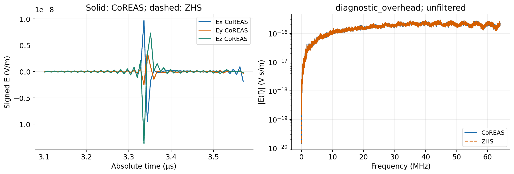

188,064 条设备来源 + 28,954 条 CPU 来源，两算法读取同一组带权轨迹。  
观测点合成峰值约 **$1.70\times10^{-8}$ V/m**；本例频谱只覆盖 **0–64 MHz**。

<div class="source">当前 p1 双算 CUDA 输出；128 MHz 采样、未带通。data/nue_forced_waveforms.npz。</div>

<!--
这里不能将频谱范围与上一页的 0–500 MHz 混为一谈。
宽采样窗用于保留晚到达来源；报告没有为了得到漂亮窄脉冲而裁掉晚到信号。
-->

---

<!-- _class: figure -->

# 两条线重合还不够：检查复数残差

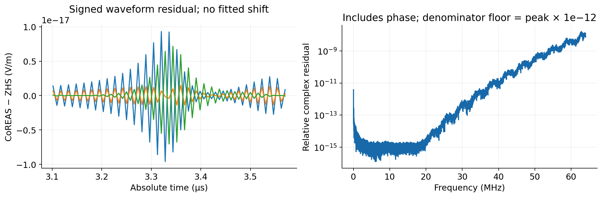

当前四组完整簇射中，CoREAS/ZHS 复频谱最大 L2 为 **$2.022\times10^{-9}$**。  
双算与此前单独运行的各算法矩数组最大 L2 为 **$5.224\times10^{-16}$**。

<div class="source">复数比较包含幅度与相位；频率逐点残差的分母下限在图中注明。电子残差另见 figures/11_electron_rock_residual.png。</div>

<!--
整体 L2 使用未加地板的参考范数；地板仅用于逐频率诊断图，防止频谱零点处比值发散。
结果不依赖整体幅度拟合、常数相位补偿或时间平移。
完整随机簇射的比较在相同轨迹条件下完成；跨后端的一致性另由固定轨迹测试验证。
-->

---

<!-- _class: figure -->

# 来源介质分解：先相干叠加，再看幅度

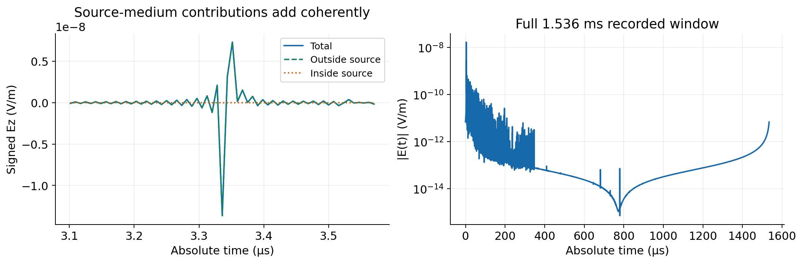

“outside / inside”标记**发射轨迹所在介质**，不等于 CPU / GPU 来源，也不等于观测点介质。  
总场是各贡献的有符号和；右图保留完整 **1.536 ms** 记录窗及有限带宽 FFT 重建效应。

<div class="source">当前 p1 / nue_forced_resident / radio / CoREAS / field.csv；未施加天线响应、噪声或显示带通。</div>

<!--
完整窗的低幅尾部包含有限带宽和周期 FFT 的重建效应，不能只凭其包络辨认晚到粒子。
判断某个尾部结构的来源，应返回轨迹时间、光学时延与原始矩数组，而非从显示曲线反推。
-->

---

<!-- _class: figure -->

# GPU 常驻：检查实际执行，而非只看配置名

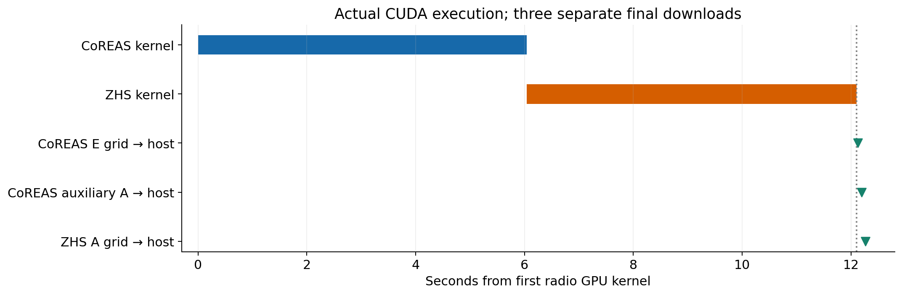

两个实际 CUDA 内核之后，三份矩数组各下载一次；设备输运轨迹直接 D2D 入队。  
交错来源测试中，5 条 CPU 轨迹总共上传 **520 字节**，供两算法共同使用。

<div class="source">p1 / residency.json 与实际 CUPTI trace；完整电子簇射三矩下载合计 368,050,176 字节。</div>

<!--
常驻的是输运/射电工作数据与累计数组。CPU 仍协调波前、处理指定物理回退并做最终 FFT。
不是一个永不退出的 CUDA kernel，也不是整套程序完全不再使用 CPU。
图中的两个射电内核采用同一执行流顺序执行；不能把“两算法同时计算”理解为两个 kernel 必须时间重叠。
-->

---

# 验证结果应该怎样解读？

| 证据 | 已支持的结论 | 不应推出的结论 |
| --- | --- | --- |
| RadioPropa / TMM 对照 | 所测光学子问题与独立实现相符 | 完整簇射场已被外部库验证 |
| 独立电流积分 | 固定源的幅度和相位在给定误差内 | 任意频率 / 距离都具有相同精度 |
| CoREAS / ZHS 收敛 | 同一物理近似的两表示一致 | 共同的近似误差已经消失 |
| 完整簇射与源账本 | 无漏源、重复计数和输运回归 | 单事例 thinning 噪声可忽略 |
| CUPTI 常驻证据 | 数据生命周期与设备执行符合设计 | GPU 必然快于 256 线程 OpenMP |

原物理验收还保留 16 组完整簇射对照；当前默认双算版本另通过 4 组完整簇射和两后端各 8 项回归。

---

# 后续物理完善，应优先补什么？

1. **非均匀介质中的弯曲射线**：先明确适用地形，再与 RadioPropa / 解析分层介质逐例比较。
2. **真实材料响应**：测量 / 建模 $n(f)$ 与吸收；当前常数 $n$ 与 $L_{\rm att}$ 不足以代表全部岩石。
3. **界面与边缘的全波参考**：在受控小尺度上用 Meep / 类似 Maxwell 求解器检查近场、TIR 倏逝场和绕射。
4. **物理结果的统计收敛**：多 seed、thinning、输运步长、频段和观测点扫描。

<div class="callout">这些是进一步验证与扩展方向；本报告没有把旧 mountain 的全波研究结果列为当前 beta5 的已接入能力。</div>

<div class="source">外部范围依据：<a href="https://arxiv.org/abs/1810.01780">RadioPropa 论文</a>；<a href="https://meep.readthedocs.io/en/latest/">Meep 官方文档</a>。</div>

---

<!-- _class: small -->

# 如何复现与追溯？

| 文件 | 内容 |
| --- | --- |
| `REPORT_SLIDES_CN.md` | 本幻灯片源文件；Marp 16:9 |
| `figures/` | 诊断 PNG 与新图的 PDF |
| `data/report_metrics.json` | 本次数值指标、场景、完整运行命令 |
| `data/figure_manifest.json` | 每张图的原始来源 |
| `data/source_provenance.json` | 当前源码、外部库与历史证据的版本关系 |
| `tools/` | 外部库探针、PSR 运行与绘图脚本 |

原始大型簇射轨迹与矩数组保留在 PSR 的 `psr-interface-resident-20260911` 下。  
所有新增编译、计算、绘图与导出均在 PSR；本地没有运行物理测试。

<div class="source">完整目录说明、依赖获取与导出命令见 README.md；data/ 中同时提供便于重画的 NPZ 与关键历史判定 JSON。</div>

---

<!-- _class: small -->

# 参考文献与公开代码

1. James et al., **General description of electromagnetic radiation processes based on instantaneous charge acceleration in endpoints**. [arXiv:1007.4146](https://arxiv.org/abs/1007.4146)
2. Huege et al., **Simulating radio emission from air showers with CoREAS**. [arXiv:1301.2132](https://arxiv.org/abs/1301.2132)
3. Winchen, **RadioPropa — A Modular Raytracer for In-Matter Radio Propagation**. [arXiv:1810.01780](https://arxiv.org/abs/1810.01780)
4. Byrnes, **Multilayer optical calculations**. [arXiv:1603.02720](https://arxiv.org/abs/1603.02720)
5. [RadioPropa 固定公开源码](https://github.com/nu-radio/RadioPropa/tree/544a2d6c4e284e3d724cb741dc481245a0f633d7)；[TMM 官方源码](https://github.com/sbyrnes321/tmm)
6. Zas, Halzen & Stanev, **Electromagnetic pulses from high-energy showers**. [Phys. Rev. D 45, 362 (1992)](https://journals.aps.org/prd/abstract/10.1103/PhysRevD.45.362)
7. 本地设计参考：`corsika8-mountain/external_validation/` 及其外部传播验证说明。

本报告图表来自实际运行或已有 PSR 验收产物；未使用生成式示意波形。

---

<!-- _class: small -->

# 附录：当前启用方式、内存与输出

```sh
c8_terrain_cascade --scene scene.yaml --output new_output \
  --em-backend kokkos --em-scheduler resident --radio \
  --threads 256 --device-memory-MiB 512 [其余初级粒子参数]
```

场景中设置 `radio.memory_MiB: 384` 是本报告案例的配置，不是普适内存需求。

$$
M_{\rm moments}=3\times8\times N_t\times N_{\rm obs}
\times6\times(P+1)\ \mathrm{bytes}
$$

另计队列、几何与光学数据；三份矩数组在分配前统一检查预算。  
两个输出目录都包含配置、原始矩、时域电场与复频谱；CoREAS 另有辅助矩文件。

<div class="source">FFT 与文件输出仍在 CPU。旧的 --radio-algorithm / radio.algorithm 应移除。</div>
