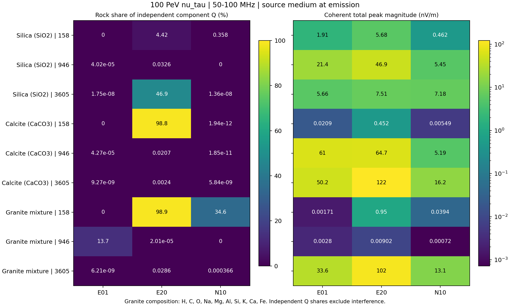
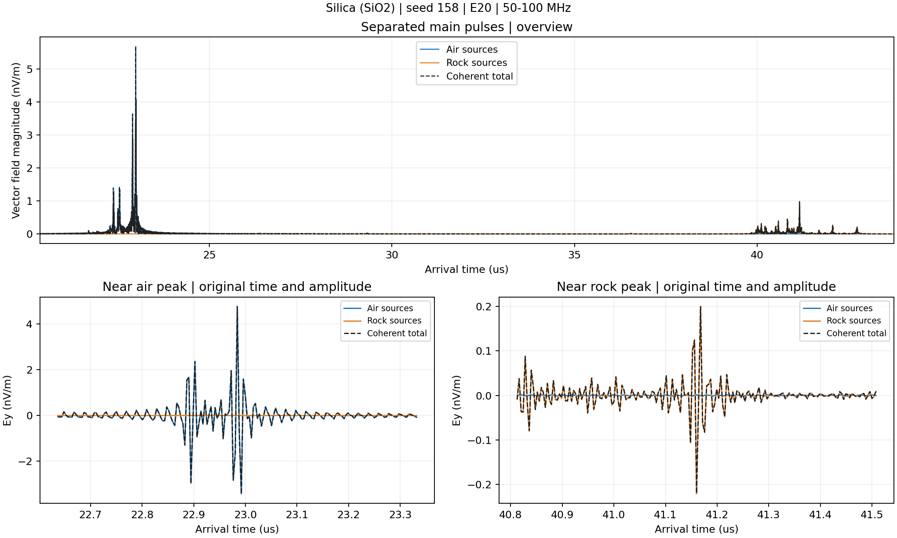
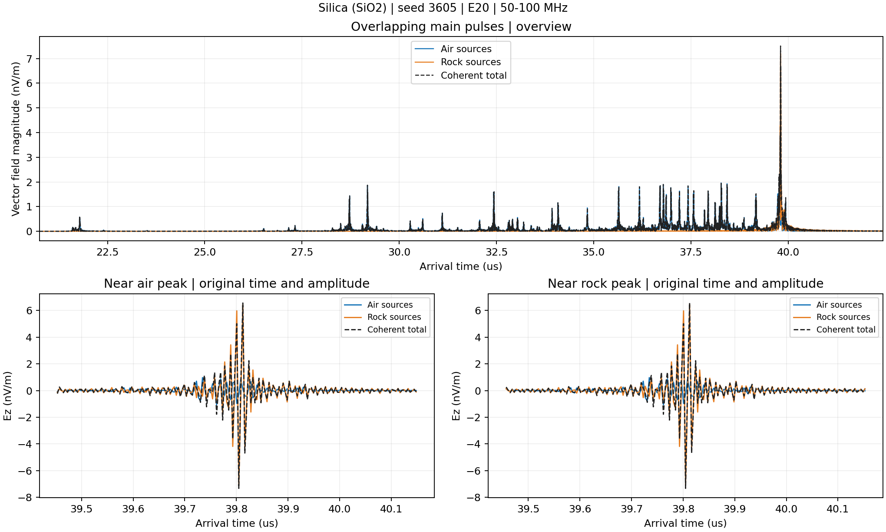
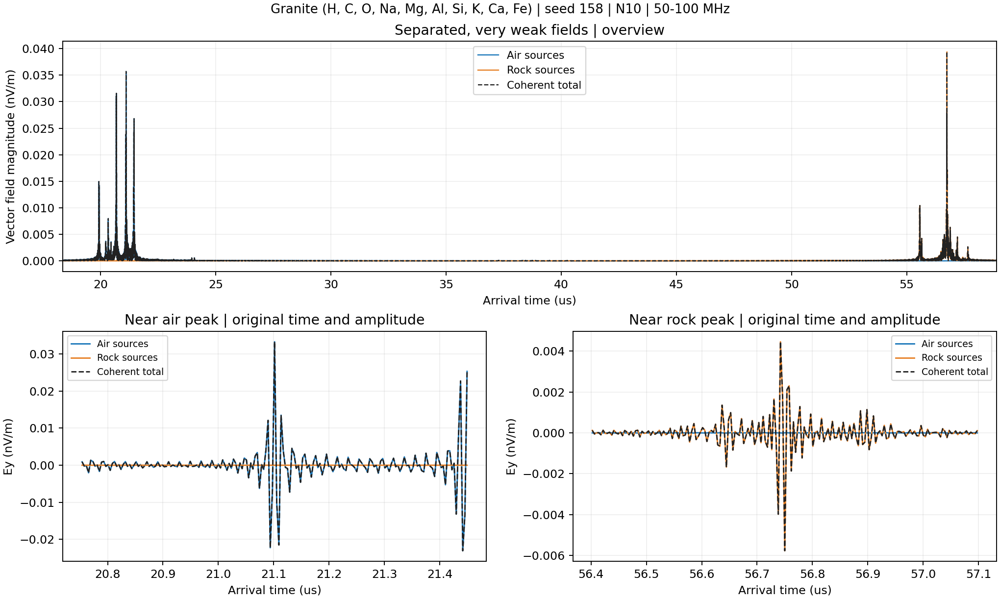
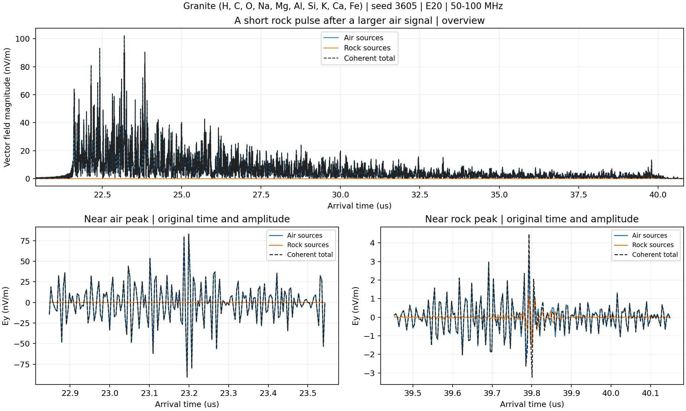

# 可以在模拟中分开；实际波形能否分开要逐例看

九组模拟已全部完成。这里统计三个接收站的 **50–100 MHz** 电场，沿用之前报告的频带。所有接收站都在大气区域。

`inside` 是山体内轨迹产生、传播到接收站的电场；`outside` 是大气中轨迹产生的电场。二者都已包含当前模型的传播和损耗。它们不是“光路有多少在山体中”的分类，也不等同于第一、第二个 bang。

$\mathbf E_{\rm total}=\mathbf E_{\rm air}+\mathbf E_{\rm rock}$

$Q_i=\int |\mathbf E_i(t)|^2dt,\quad Q_{\rm total}=Q_{\rm air}+Q_{\rm rock}+2\int\mathbf E_{\rm air}\cdot\mathbf E_{\rm rock}\,dt$

**图表的山体占比 = Q_rock / (Q_air + Q_rock)**，大气占比为余下部分；干涉项另列。Q 是接收电场平方积分，不是山体或空气产生的总射电能量。

---

# 看贡献，也看绝对信号强度

左图是山体源占比；大气源占比为 100% 减去该值。右图是总电场峰值，单位 nV/m，色标为对数。高占比不等于强信号。零值只表示当前模型在该站得到的山体源分量为零，不表示山体没有产生辐射。

---

# E20 站：定量贡献

| 材料 | seed | 山体 Q 占比 | 大气 Q 占比 | 干涉 / Q_total |
|---|---:|---:|---:|---:|
| SiO₂ | 158 | 4.42048% | 95.5795% | -0.000425% |
| SiO₂ | 946 | 0.03261% | 99.9674% | +0.02215% |
| SiO₂ | 3605 | 46.8833% | 53.1167% | -2.484% |
| CaCO₃ | 158 | 98.8291% | 1.17085% | +0.0006641% |
| CaCO₃ | 946 | 0.0206745% | 99.9793% | +0.002201% |
| CaCO₃ | 3605 | 0.00240472% | 99.9976% | +0.0003763% |
| 花岗岩十元素混合物 | 158 | 98.9139% | 1.08611% | -0.0007658% |
| 花岗岩十元素混合物 | 946 | 2.01046e-05% | 100% | +6.146e-06% |
| 花岗岩十元素混合物 | 3605 | 0.028625% | 99.9714% | +0.02248% |

花岗岩组分：H、C、O、Na、Mg、Al、Si、K、Ca、Fe。表中前两个占比采用独立分量之和为分母；干涉采用相干总量为分母，不能直接把三列相加。

---

# Separated main pulses

蓝色：大气源；橙色：山体源；黑色虚线：相干总电场。上图为三维电场模，下图画同一个笛卡尔分量；未归一化或平移时间，下图各面板纵轴刻度独立。

大气主峰约 22.984 μs，山体主峰约 41.160 μs，相隔 18.176 μs；在无噪声模拟中主脉冲可以按时间分开。山体峰值约 0.990 nV/m，大气峰值约 5.679 nV/m。

---

# Overlapping main pulses

蓝色：大气源；橙色：山体源；黑色虚线：相干总电场。上图为三维电场模，下图画同一个笛卡尔分量；未归一化或平移时间，下图各面板纵轴刻度独立。

山体与大气主峰约在 39.805、39.801 μs，只差 3.906 ns，即一个采样点。主峰处两者叠加，不能用简单时间窗完整分开。山体 Q 占 46.88%、大气占 53.12%；干涉 / Q_total 为 −2.48%。大气分量还有较早到达的信号。

---

# Separated, very weak fields

蓝色：大气源；橙色：山体源；黑色虚线：相干总电场。上图为三维电场模，下图画同一个笛卡尔分量；未归一化或平移时间，下图各面板纵轴刻度独立。

大气主峰约 21.102 μs、山体主峰约 56.750 μs，主脉冲在时间上分开。但峰值只有约 0.0357、0.0394 nV/m，是否能被真实探测器识别，需要噪声和天线响应。

---

# A short rock pulse after a larger air signal

蓝色：大气源；橙色：山体源；黑色虚线：相干总电场。上图为三维电场模，下图画同一个笛卡尔分量；未归一化或平移时间，下图各面板纵轴刻度独立。

空气主峰约 23.195 μs，山体主峰约 39.801 μs。山体分量的积分占比仅约 0.0286%，但它是较短的脉冲，峰值约 8.00 nV/m；不能把积分占比直接当成峰值比。

---

# 怎样理解“可分辨”

**模拟来源分解：可以。** 两套算法都按轨迹产生位置分别累计；重加后恢复总场，相对 L2 残差最大 5.29e-16。山体／大气分量分别比较 CoREAS 与 ZHS，最大相对 L2 差异 1.68e-09。

**时间上分辨：部分事件可以看到分离的主脉冲，部分重叠。** 两个峰的时间差不是完整判据，还要看持续时间、弱分量幅度和重叠背景。图中分开的峰也不能脱离模型直接认定来自哪种介质。

**实验上辨识来源：当前结果尚不能保证。** 本批电场尚未加入天线有效长度、接收机响应、噪声和触发。仅有总电场无法唯一恢复两个任意未知分量，需要利用传播／shower 模板、多站时延和偏振等额外约束。

当前仍采用已说明的直线光路腿、最多一次透射，无反射或绕射；保留原截断、thinning 与有限输运窗。不能将这几组事件解释为材料的统计优劣。

[全部 27 个事件—站点的数值表](source_components/contributions.csv) · [定义、相干项和核对结果](source_components/contributions.json)。分量核对和绘图均在 PSR 完成，无需重跑 shower。
