# 相同入射条件，更换山体介质

已完成并通过检查：**9 / 9**。仅展示完成的真实模拟。

[山体源／大气源贡献及分辨诊断](RADIO_COMPONENTS_CN.md)

沿用此前 100 PeV ντ 的 seed 158、946、3605，入射位置、方向、粒子截断、thinning、100 μs 输运窗和 E01/E20/N10 接收站。每例 OpenMP 256 个物理核，常驻队列，同时计算 CoREAS 与 ZHS。

材料为 SiO₂、CaCO₃、花岗岩混合物（H、C、O、Na、Mg、Al、Si、K、Ca、Fe）；密度、折射率和电场衰减长度按所给材料文件。SiO₂ 为 2650 kg/m³、n=√5、L_E=100 m。LPM 开启。

相同种子不固定 τ 衰变通道或位置；每种材料每个种子仅一个事件，不能据此推断统计上的材料优劣。保留原模型的有限输运窗、截断和 thinning，未进行这些参数的收敛扫描。

射电常数是所选材料模型值，不是当地实测值。ν 核反应仍采用原自由核子近似，未包含核遮蔽；低能次级 ν 的适用域限制与原算例相同。

---

# seed 158：shower 能量沉积

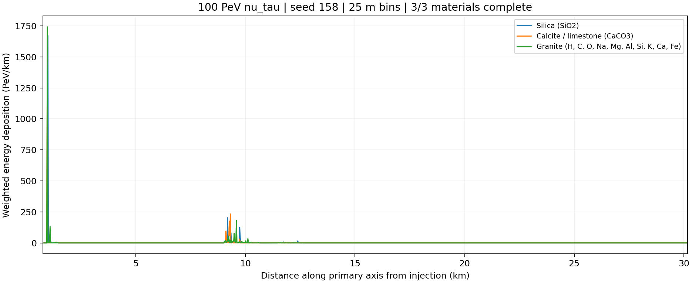

横轴沿入射方向；纵轴为每公里的加权能量沉积，分箱 25 m。比较峰的位置、宽度和沉积能量；这不是粒子数曲线。

| 材料 | 本次 τ 衰变 | CoREAS/ZHS 谱相对 L2 差异 |
|---|---|---:|
| Silica (SiO2) | muonic / air | 1.95e-09 |
| Calcite / limestone (CaCO3) | muonic / air | 5.51e-09 |
| Granite (H, C, O, Na, Mg, Al, Si, K, Ca, Fe) | muonic / air | 6.25e-09 |

---

# Silica (SiO2)，seed 158

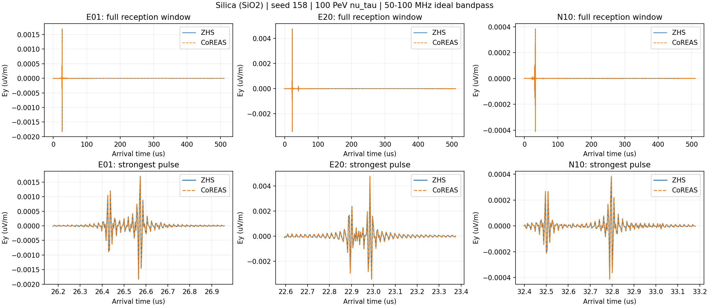

上排为完整接收窗，下排放大最强脉冲。实线 ZHS、虚线 CoREAS；两条线应重合。每站画最强脉冲处最强的笛卡尔分量，50–100 MHz 理想带通，未归一化或平移时间。

纵轴是电场而非天线电压；各面板刻度独立，比较幅度要读倍率。零信号或无第二峰如实保留；不能仅凭双顶点就宣称有可分辨双脉冲。

---

# Calcite / limestone (CaCO3)，seed 158

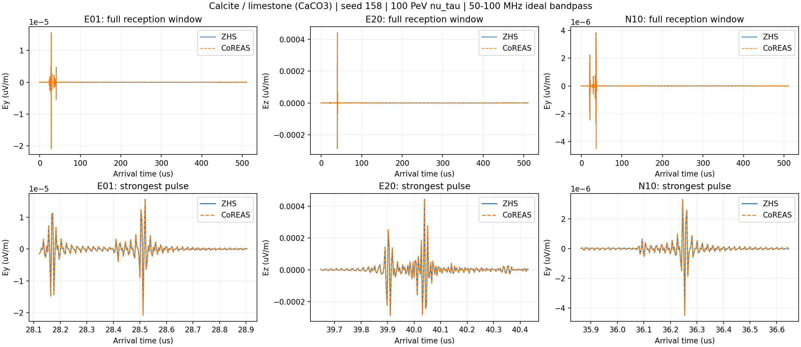

上排为完整接收窗，下排放大最强脉冲。实线 ZHS、虚线 CoREAS；两条线应重合。每站画最强脉冲处最强的笛卡尔分量，50–100 MHz 理想带通，未归一化或平移时间。

纵轴是电场而非天线电压；各面板刻度独立，比较幅度要读倍率。零信号或无第二峰如实保留；不能仅凭双顶点就宣称有可分辨双脉冲。

---

# Granite (H, C, O, Na, Mg, Al, Si, K, Ca, Fe)，seed 158

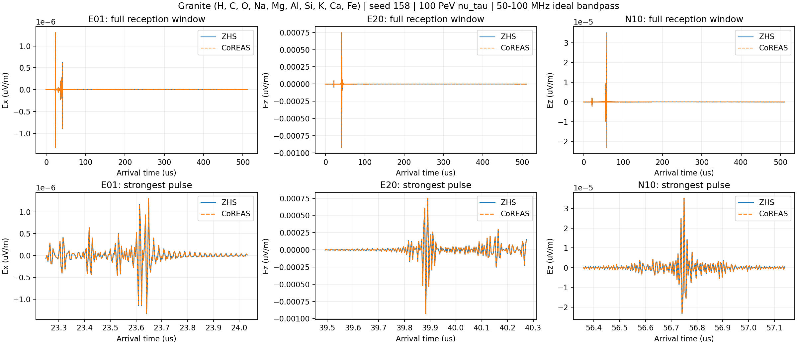

上排为完整接收窗，下排放大最强脉冲。实线 ZHS、虚线 CoREAS；两条线应重合。每站画最强脉冲处最强的笛卡尔分量，50–100 MHz 理想带通，未归一化或平移时间。

纵轴是电场而非天线电压；各面板刻度独立，比较幅度要读倍率。零信号或无第二峰如实保留；不能仅凭双顶点就宣称有可分辨双脉冲。

---

# seed 946：shower 能量沉积

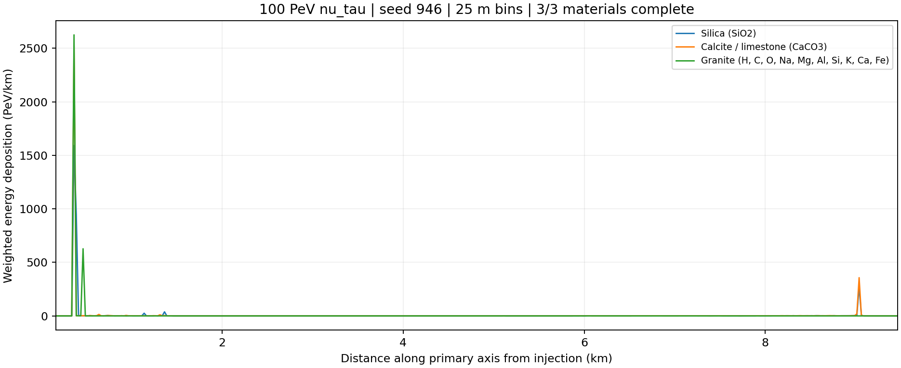

横轴沿入射方向；纵轴为每公里的加权能量沉积，分箱 25 m。比较峰的位置、宽度和沉积能量；这不是粒子数曲线。

| 材料 | 本次 τ 衰变 | CoREAS/ZHS 谱相对 L2 差异 |
|---|---|---:|
| Silica (SiO2) | electronic / air | 2.2e-09 |
| Calcite / limestone (CaCO3) | electronic / air | 2.71e-09 |
| Granite (H, C, O, Na, Mg, Al, Si, K, Ca, Fe) | electronic / rock | 1.81e-09 |

---

# Silica (SiO2)，seed 946

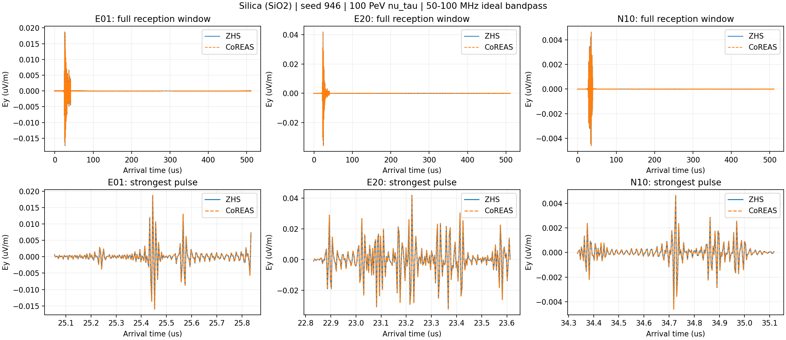

上排为完整接收窗，下排放大最强脉冲。实线 ZHS、虚线 CoREAS；两条线应重合。每站画最强脉冲处最强的笛卡尔分量，50–100 MHz 理想带通，未归一化或平移时间。

纵轴是电场而非天线电压；各面板刻度独立，比较幅度要读倍率。零信号或无第二峰如实保留；不能仅凭双顶点就宣称有可分辨双脉冲。

---

# Calcite / limestone (CaCO3)，seed 946

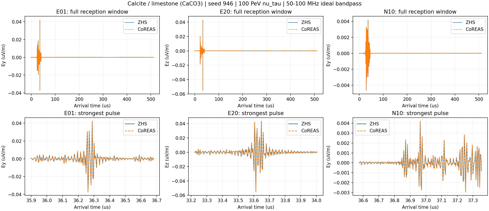

上排为完整接收窗，下排放大最强脉冲。实线 ZHS、虚线 CoREAS；两条线应重合。每站画最强脉冲处最强的笛卡尔分量，50–100 MHz 理想带通，未归一化或平移时间。

纵轴是电场而非天线电压；各面板刻度独立，比较幅度要读倍率。零信号或无第二峰如实保留；不能仅凭双顶点就宣称有可分辨双脉冲。

---

# Granite (H, C, O, Na, Mg, Al, Si, K, Ca, Fe)，seed 946

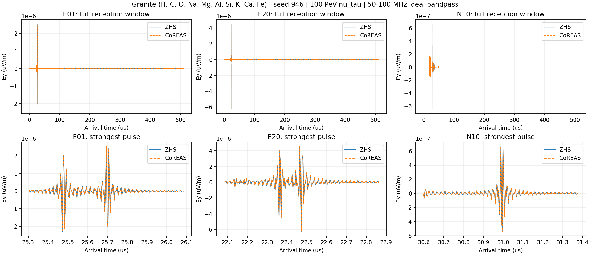

上排为完整接收窗，下排放大最强脉冲。实线 ZHS、虚线 CoREAS；两条线应重合。每站画最强脉冲处最强的笛卡尔分量，50–100 MHz 理想带通，未归一化或平移时间。

纵轴是电场而非天线电压；各面板刻度独立，比较幅度要读倍率。零信号或无第二峰如实保留；不能仅凭双顶点就宣称有可分辨双脉冲。

---

# seed 3605：shower 能量沉积

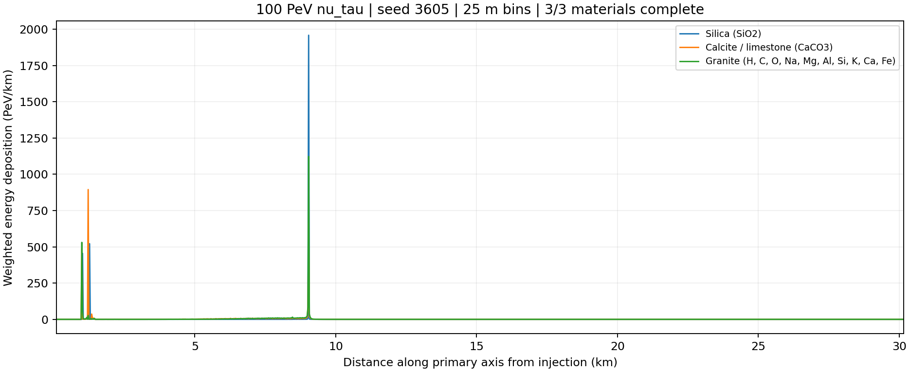

横轴沿入射方向；纵轴为每公里的加权能量沉积，分箱 25 m。比较峰的位置、宽度和沉积能量；这不是粒子数曲线。

| 材料 | 本次 τ 衰变 | CoREAS/ZHS 谱相对 L2 差异 |
|---|---|---:|
| Silica (SiO2) | hadronic / air | 4.67e-09 |
| Calcite / limestone (CaCO3) | hadronic / air | 2.65e-09 |
| Granite (H, C, O, Na, Mg, Al, Si, K, Ca, Fe) | hadronic / air | 2.56e-09 |

---

# Silica (SiO2)，seed 3605

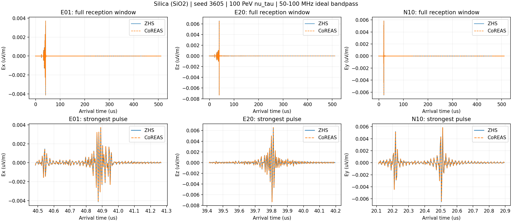

上排为完整接收窗，下排放大最强脉冲。实线 ZHS、虚线 CoREAS；两条线应重合。每站画最强脉冲处最强的笛卡尔分量，50–100 MHz 理想带通，未归一化或平移时间。

纵轴是电场而非天线电压；各面板刻度独立，比较幅度要读倍率。零信号或无第二峰如实保留；不能仅凭双顶点就宣称有可分辨双脉冲。

---

# Calcite / limestone (CaCO3)，seed 3605

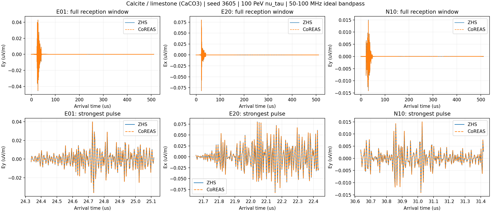

上排为完整接收窗，下排放大最强脉冲。实线 ZHS、虚线 CoREAS；两条线应重合。每站画最强脉冲处最强的笛卡尔分量，50–100 MHz 理想带通，未归一化或平移时间。

纵轴是电场而非天线电压；各面板刻度独立，比较幅度要读倍率。零信号或无第二峰如实保留；不能仅凭双顶点就宣称有可分辨双脉冲。

---

# Granite (H, C, O, Na, Mg, Al, Si, K, Ca, Fe)，seed 3605

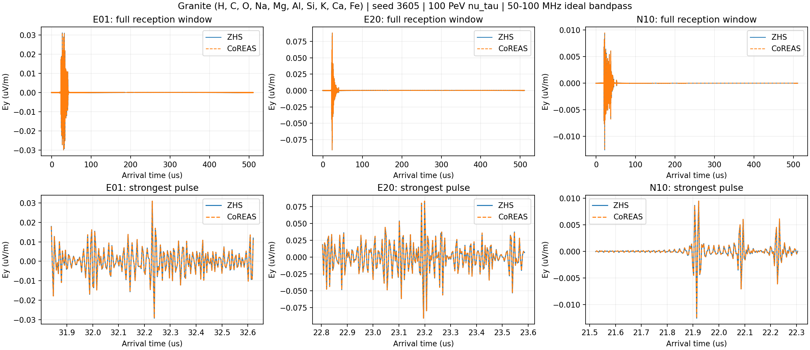

上排为完整接收窗，下排放大最强脉冲。实线 ZHS、虚线 CoREAS；两条线应重合。每站画最强脉冲处最强的笛卡尔分量，50–100 MHz 理想带通，未归一化或平移时间。

纵轴是电场而非天线电压；各面板刻度独立，比较幅度要读倍率。零信号或无第二峰如实保留；不能仅凭双顶点就宣称有可分辨双脉冲。

---

# 结果位置与检查

服务器：`/data/yhlu/CorsikaData/corsika_validation_results/beta5_material_doublebang_openmp256_20260913`。

`runs/<完整材料名和种子>/output/terrain/` 保存 tracks.csv 和 deposits.csv；`output/radio/{CoREAS,ZHS}/` 保存原始时域电场与复数谱。

每例保留输入、实际 256 核绑定、能量账本、介质及 LPM 参数、队列清空、完整轨迹来源和算法一致性检查。通过这些检查表示实现和数值一致，不代表全部物理模型已获独立实验验证。
