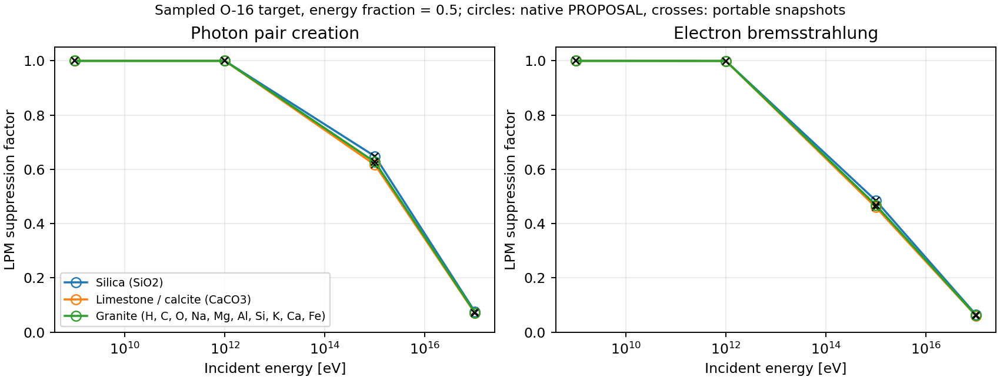
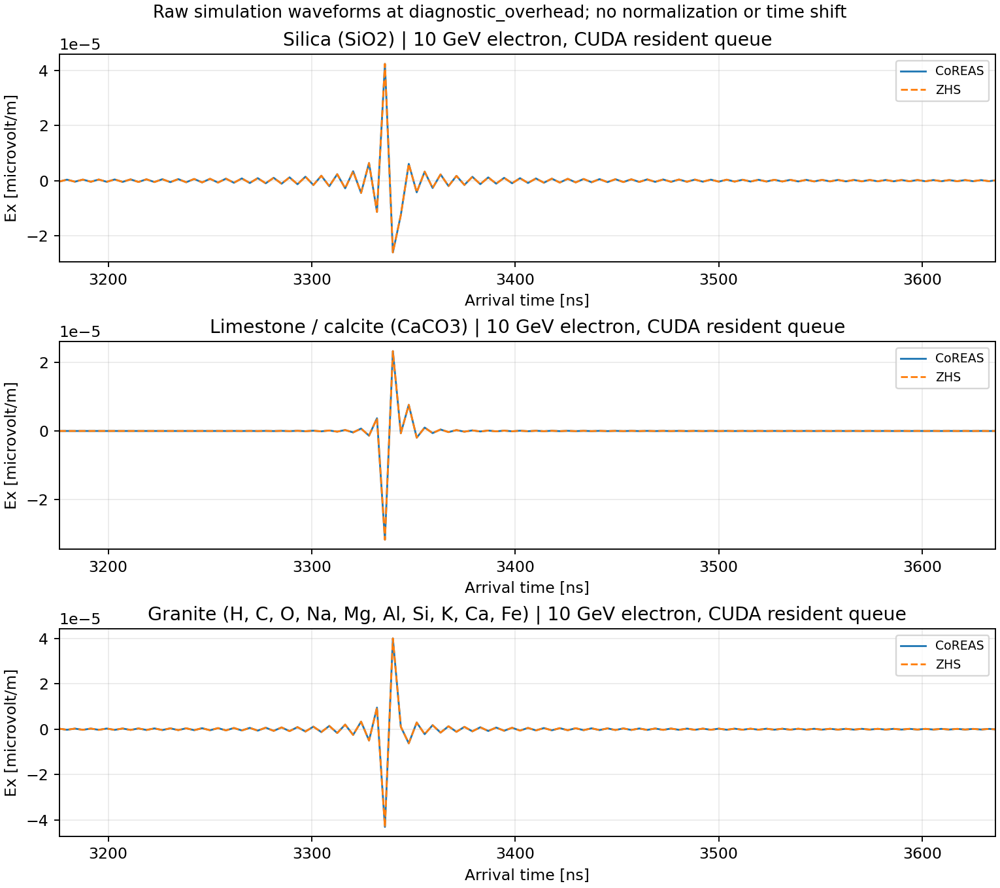
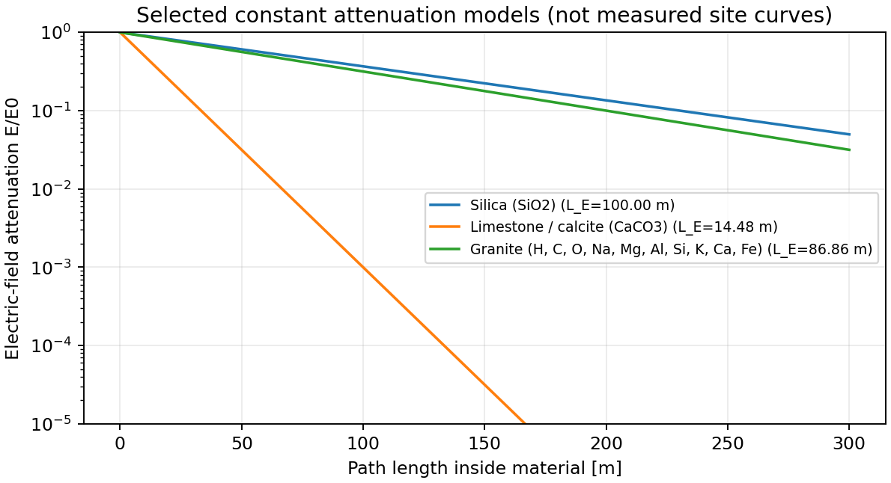

# 山体材料：同一份参数接入 shower 与射电

| 材料 | 密度 kg/m³ | n | 电场衰减长度 |
|---|---:|---:|---:|
| 二氧化硅 SiO₂（基准） | 2650 | √5 | 100 m |
| 石灰岩／方解石 CaCO₃ | 2710 | √6 | 14.48 m |
| 花岗岩十元素参考混合物 | 2729 | √5 | 86.86 m |

花岗岩组分：H、C、O、Na、Mg、Al、Si、K、Ca、Fe；核数分数见[材料说明](../../mountain_material_models_CN.md)。

参数按提供文件封装，射电常数属于研究模型，不是当地岩石实测值。
PSR 上 19 个短时输运算例通过；三种材料均确认实际 GPU 输运和射电计算。

---

# 看 LPM：原生计算器与可移植实现是否重合

空心圆是原生 PROPOSAL，黑色叉号是可移植实现。重合说明转换一致；连线只引导读图。
纵轴越低，LPM 抑制越强。图中是 O-16 靶核、能量分数 0.5；数值检查还覆盖其他组分和参数。

---

# 看波形：CoREAS 与 ZHS 是否重合

真实 10 GeV 电子算例，CUDA 常驻队列；同一天线、同一事件的原始幅度和到达时间。
实线与虚线应重合。不同材料各一个事件，不能据此确定统计上的幅度排序。

---

# 看衰减：路径每增加一个 L_E，电场剩下约 37%

这是材料模型的 `exp(-l/L_E)` 曲线，未包含几何扩散和界面透射。
功率按电场平方衰减。石灰岩／方解石曲线降得快，是所选 14.48 m 模型的结果。
